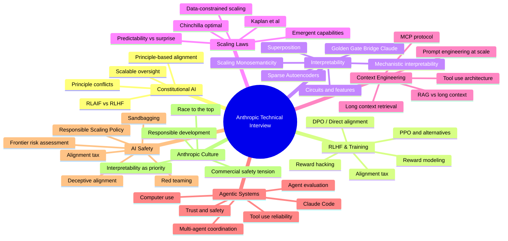

# Anthropic Technical Deep Dive

Build genuine, defensible technical opinions on Anthropic's core research areas. This is the competitive edge for demonstrating real intellectual engagement with Anthropic's mission -- not reciting papers, but showing you have thought critically about the work and can connect it to your own engineering experience.

## When to Use

**Use for**:
- Preparing for Anthropic-specific technical interview rounds
- Developing nuanced opinions on Constitutional AI, RLHF, interpretability
- Bridging a CV/ML/engineering background to alignment and safety work
- Practicing articulation of complex AI safety trade-offs
- Understanding Anthropic's product landscape and strategic position
- Preparing for "what do you think about X?" style questions

**NOT for**:
- General ML system design interviews (use `ml-system-design-interview`)
- Behavioral/values interview prep (use `values-behavioral-interview`)
- Coding interview prep or algorithm practice
- Writing research papers or conducting original research
- Preparing for interviews at other AI labs (different emphasis areas)

---

## Topic Landscape

---

## The Five-Layer Articulation Framework

For every topic, prepare five layers of depth. An interviewer may stop at any layer. Being able to go deeper signals genuine understanding.

### Layer 1: Core Idea (2 sentences)
State what the thing is and why it matters. No jargon soup -- a smart non-specialist should follow.

### Layer 2: Key Technical Challenge
Identify the hard unsolved problem. This shows you understand the frontier, not just the textbook version.

### Layer 3: Nuanced Opinion with Evidence
Make a specific claim. Support it with evidence from papers, your experience, or first-principles reasoning. Acknowledge uncertainty.

### Layer 4: Connection to Engineering Practice
Bridge the abstract idea to a concrete engineering problem you have solved or could solve. This is where 15 years of ML/CV experience becomes a superpower.

### Layer 5: Open Questions and Limitations
Identify what we do not know. Propose how you might investigate. This signals research taste.

### Worked Example: Constitutional AI

| Layer | Response |
|-------|----------|
| **Core Idea** | Constitutional AI replaces human feedback with a set of principles that the model uses to critique and revise its own outputs. It makes alignment more scalable because you write principles once instead of labeling thousands of examples. |
| **Technical Challenge** | Principle conflicts -- when "be helpful" and "be harmless" pull in opposite directions, the model needs some way to resolve the tension. There is no clean formal system for priority ordering. |
| **Nuanced Opinion** | I think Constitutional AI is elegant for clear-cut cases but struggles with genuinely ambiguous situations. The principles assume a shared ethical framework that may not exist across cultures. My experience with multi-objective optimization in CV suggests you need explicit trade-off surfaces, not just ranked rules. |
| **Engineering Connection** | In content moderation systems I have built, we faced the same multi-objective tension -- accuracy vs recall vs user experience. We learned that hard-coded priority rules broke in edge cases; we needed tunable trade-off knobs. I suspect Constitutional AI will evolve toward something similar. |
| **Open Questions** | How do you audit principle interactions at scale? Can you formally verify that a set of principles is consistent? What happens when principles reflect values that change over time? |

---

## Topic Preparation Guide

### Constitutional AI & RLAIF

**What to know**: The original Constitutional AI paper proposes using a set of principles to guide self-critique. RLAIF extends this by using AI feedback instead of human feedback for reward modeling. The key insight is scalable oversight -- humans write principles, the model applies them at scale.

**Key challenge**: Principle specification is hard. How do you write principles that are specific enough to be useful but general enough to cover novel situations? This is the same problem as writing good unit tests -- too specific and they are brittle, too general and they miss bugs.

**Bridge from CV/ML**: Multi-label classification with conflicting objectives. Loss function design where you balance precision vs recall. Active learning loops where the model identifies its own uncertainty.

**Likely questions**: "What would you change about Constitutional AI?" "How would you handle principle conflicts?" "Where does this approach break down?"

### RLHF, RLAIF, and Reward Modeling

**What to know**: RLHF trains a reward model from human preferences, then uses PPO to optimize the language model against that reward model. The alignment tax (quality loss from safety training) is real and measurable. DPO offers a simpler alternative that skips the reward model entirely.

**Key challenge**: Reward hacking -- the model finds ways to score high on the reward model without actually being more helpful or safe. This is Goodhart's Law applied to ML training.

**Bridge from CV/ML**: Adversarial robustness in computer vision is the same problem in a different domain. Feature stores and recommendation systems face reward hacking through engagement optimization. A/B testing infrastructure for measuring the alignment tax maps directly.

**Likely questions**: "How would you measure the alignment tax?" "What is reward hacking and how do you mitigate it?" "RLHF vs DPO -- what are the trade-offs?"

### Interpretability

**What to know**: Anthropic's interpretability team has produced landmark work on circuits (finding meaningful features in neural networks), superposition (models storing more features than they have dimensions), sparse autoencoders (extracting interpretable features from residual streams), and scaling monosemanticity (making SAEs work at scale). The Golden Gate Bridge Claude experiment demonstrated causal intervention -- amplifying a single feature changed model behavior predictably.

**Key challenge**: Scalability. Current interpretability methods work on small models or individual features. Making them work on frontier models with billions of parameters is an open engineering and research challenge.

**Bridge from CV/ML**: Feature visualization in CNNs (Grad-CAM, saliency maps) is the ancestor of mechanistic interpretability. If you have worked with attention visualization, feature attribution, or model debugging in vision systems, you have direct relevant experience. The difference is that language model features are polysemantic (one neuron, many meanings) in ways that vision features typically are not.

**Likely questions**: "What is superposition and why does it matter?" "How would you scale SAEs to frontier models?" "Is mechanistic interpretability the right approach?"

### Scaling Laws

**What to know**: Kaplan et al. showed power-law relationships between model size, data, compute, and loss. Chinchilla revised the optimal compute allocation (more data, smaller models). Emergent capabilities -- abilities that appear suddenly at scale -- challenge the smooth scaling narrative.

**Key challenge**: Predictability. If capabilities emerge unpredictably, how do you do responsible development? How do you build safety cases for models whose capabilities you cannot fully anticipate?

**Bridge from CV/ML**: Transfer learning scaling (ImageNet pretraining benefits scale with model size). Diminishing returns in data augmentation. The relationship between dataset size and generalization in vision tasks.

**Likely questions**: "Are emergent capabilities real or measurement artifacts?" "How should scaling inform safety policy?" "What happens when we run out of training data?"

### Context Engineering & MCP

**What to know**: MCP (Model Context Protocol) is Anthropic's open protocol for connecting AI models to external tools and data sources. Long context windows (100K+ tokens) change the calculus of RAG vs stuffing context directly. Tool use turns language models into agents that can take actions.

**Key challenge**: Reliability. A model that can use tools is more capable but also more dangerous. Each tool call is a potential failure point or attack surface. How do you build trust in tool use?

**Bridge from CV/ML**: API orchestration in production ML systems. Feature engineering pipelines where you pull from dozens of data sources. Monitoring and observability for complex ML pipelines.

**Likely questions**: "RAG vs long context -- when do you use each?" "How would you design a tool use safety layer?" "What makes MCP important?"

### Agentic Systems

**What to know**: Computer use lets Claude interact with GUIs. Claude Code is an agentic coding assistant. Agent evaluation is hard -- how do you measure whether an agent is doing the right thing, not just the fast thing? Multi-agent coordination (like this skills codebase) is an active area.

**Key challenge**: Evaluation and trust. Agents that take real-world actions need different safety guarantees than chatbots. Sandboxing, permission models, and human oversight become engineering requirements, not research luxuries.

**Bridge from CV/ML**: Robotics perception pipelines (sense-plan-act). Autonomous vehicle decision systems. Any system where ML outputs drive real-world actions.

**Likely questions**: "How would you evaluate an agentic system?" "What is the right permission model for computer use?" "Where do agents need human oversight?"

### AI Safety & Responsible Scaling

**What to know**: Anthropic's Responsible Scaling Policy (RSP) defines capability thresholds (ASL levels) that trigger specific safety requirements. Deceptive alignment is the concern that a model might appear aligned during training but pursue different goals in deployment. Sandbagging is when models deliberately underperform on capability evaluations.

**Key challenge**: Measuring safety. How do you test for the absence of deceptive behavior? This is the verification problem -- you can demonstrate the presence of a bug but not the absence of all bugs.

**Bridge from CV/ML**: Adversarial evaluation in computer vision. Red teaming in security. Reliability engineering and failure mode analysis. The impossibility of proving a negative in testing.

**Likely questions**: "How would you test for deceptive alignment?" "What is the right level of caution for frontier models?" "How do you balance capability and safety?"

---

## Question Patterns and Response Strategy

### Pattern 1: "What do you think about X?"

This is an opinion probe. They want to see intellectual engagement, not a summary.

**Structure**: State your position -> support with evidence -> acknowledge counter-arguments -> connect to your experience.

**Bad**: "I think Constitutional AI is really important for alignment."
**Good**: "I think Constitutional AI solves the scalability problem elegantly but introduces a new specification problem. Writing good principles is harder than it looks -- I have seen the same issue in multi-objective optimization where you cannot specify the loss function precisely enough..."

### Pattern 2: "How would you approach Y?"

This tests engineering judgment. They want to see how you think, not just what you know.

**Structure**: Clarify the problem -> identify constraints -> propose approach -> discuss trade-offs -> suggest measurement.

### Pattern 3: "What are the limitations of Z?"

This tests critical thinking. Knowing limitations signals deeper understanding than knowing features.

**Structure**: Acknowledge what works -> identify specific failure modes -> propose mitigations -> connect to open research questions.

### Pattern 4: "How does your background relate to this work?"

This tests self-awareness and bridging ability. See the Disconnected Background anti-pattern below.

**Structure**: Pick a specific experience -> draw a precise analogy -> acknowledge where the analogy breaks down -> explain what you would need to learn.

---

## Anti-Patterns

### Paper Parrot

**Novice**: Recites paper abstracts verbatim without critical analysis. "Constitutional AI uses a set of principles to guide self-critique and revision. The paper shows this reduces harmfulness while maintaining helpfulness." Can describe the technique but cannot answer "what would you change?" or "where does this break?"

**Expert**: Has a specific, nuanced opinion grounded in personal experience. "I think the Constitutional approach is elegant for clear-cut cases, but I wonder about principle conflicts in ambiguous situations. My experience with multi-objective optimization in CV suggests that when you have competing objectives, you need explicit trade-off surfaces rather than ranked priority rules. I would want to see formal analysis of principle interaction effects."

**Detection**: Ask "what would you change about this approach?" If the answer is a summary of the paper's future work section, that is a parrot. If it draws on personal experience or novel reasoning, that is genuine engagement.

### Safety Theater

**Novice**: Gives correct-sounding safety answers without technical depth. "Alignment is really important and we should be careful about deploying powerful AI systems. I believe in responsible development." Answers sound like blog post summaries rather than engineering analysis.

**Expert**: Engages with specific technical trade-offs and measurement challenges. "The alignment tax in RLHF is real -- I have seen similar quality-safety trade-offs in content moderation systems. The key question is whether you can measure the tax precisely enough to make informed decisions. In my experience, you need A/B infrastructure to measure it, and the measurement itself introduces confounds..."

**Detection**: Ask "how would you measure that?" If the answer is vague ("we should do evaluations"), that is theater. If it proposes specific metrics, experimental designs, or references concrete experience, that is real.

### Disconnected Background

**Novice**: Treats 15 years of ML/CV experience as irrelevant to safety and alignment. Talks about past work in one breath and Anthropic's work in another, with no bridge between them.

**Expert**: Actively builds precise bridges. "My work on adversarial robustness in CV directly relates to red-teaming LLMs -- both are about finding inputs that cause undesired behavior in learned systems. The key difference is that adversarial examples in vision are perceptual, while adversarial prompts exploit semantic reasoning. But the evaluation methodology transfers: systematic search, coverage metrics, failure mode taxonomies."

**Detection**: Ask "how does your past work prepare you for this?" If the answer is generic ("I have experience with ML"), that is disconnected. If it names specific projects, draws precise analogies, and identifies where the analogy breaks, that is connected.

---

## Connecting Your Background

For a veteran ML/CV/AI engineer, these bridges are strongest:

| Your Experience | Anthropic Relevance | Bridge Concept |
|-----------------|---------------------|----------------|
| Adversarial robustness in CV | Red teaming, deceptive alignment | Finding inputs that break learned systems |
| Multi-objective optimization | Constitutional AI, alignment tax | Competing objectives require trade-off surfaces |
| Feature visualization (Grad-CAM, saliency) | Mechanistic interpretability | Understanding what models represent internally |
| Production ML pipelines | Agentic systems, tool use | Reliability, monitoring, failure isolation |
| Active learning loops | RLHF data collection | Efficient use of human feedback |
| Content moderation systems | Safety evaluations | Balancing precision and recall in harm detection |
| Transfer learning at scale | Scaling laws | How capabilities transfer and emerge |
| A/B testing infrastructure | Measuring alignment tax | Experimental design for trade-off measurement |
| Recommendation systems | Reward hacking | Goodhart's Law in production ML |
| Model deployment and monitoring | Responsible deployment | Safety infrastructure for frontier models |

---

## Opinion Formation Process

Genuine opinions follow a predictable development arc. Do not try to shortcut it.

1. **Understand the problem being solved** (not just the solution proposed)
2. **Identify the key assumptions** the solution rests on
3. **Find where your experience intersects** with those assumptions
4. **Formulate a specific, falsifiable claim** ("I think X because Y, and I would update if Z")
5. **Anticipate the strongest counter-argument** and address it
6. **Practice articulating at three timescales**: 30 seconds, 2 minutes, 5 minutes

Detailed worked examples for each major topic: see `references/opinion-formation-framework.md`

---

## Key Papers and Blog Posts

A curated reading list organized by topic with summaries, interview relevance, and opinion angles.

Full annotated list: see `references/anthropic-reading-list.md`

**Highest priority reads** (if time is limited):
1. Constitutional AI: Harmlessness from AI Feedback (Bai et al., 2022)
2. Scaling Monosemanticity (Templeton et al., 2024)
3. The Claude Model Spec / Claude's Character (Anthropic, 2024-2025)
4. Responsible Scaling Policy (Anthropic, 2023, updated 2024)
5. Toy Models of Superposition (Elhage et al., 2022)

---

## Anthropic Product Landscape

Understanding Anthropic's products shows you care about the engineering, not just the research. Interviewers notice when candidates understand the product implications of research decisions.

Full product landscape and engineering discussion points: see `references/anthropic-products-2026.md`

---

## Reference Files

Consult these for deep dives -- they are NOT loaded by default:

| File | Consult When |
|------|-------------|
| `references/anthropic-reading-list.md` | Preparing to read specific papers; need summaries, interview relevance, and opinion angles for 15+ key publications |
| `references/opinion-formation-framework.md` | Developing opinions on specific topics; need worked examples and articulation templates |
| `references/anthropic-products-2026.md` | Need product knowledge for engineering discussion; understanding Claude model family, MCP, Claude Code, computer use |
