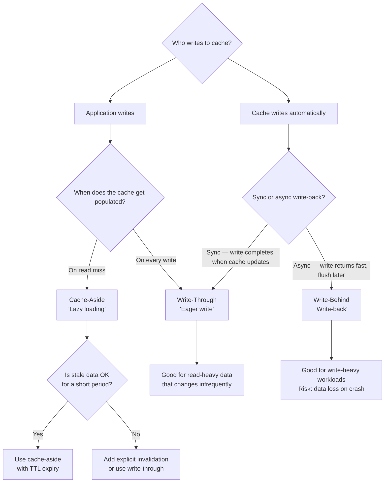
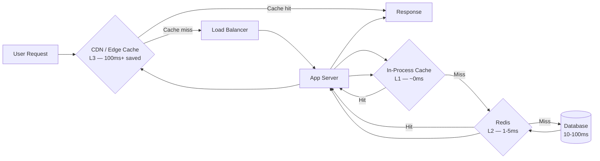

# Caching Strategies

Caching is the most commonly misapplied performance technique. The failure mode is not "cache too little" — it is "cache without an invalidation strategy and then discover the problem in production six months later when users complain about stale data that you cannot explain."

## When to Use

✅ Use for:
- Choosing which caching pattern fits a use case (cache-aside, write-through, write-behind)
- Designing TTL values for different data freshness requirements
- Implementing Redis caching patterns: sorted sets, pub/sub invalidation, Lua scripts
- Configuring Cache-Control headers, ETags, and CDN behavior
- Preventing cache stampedes via locking, probabilistic early expiry, or background refresh
- Cache warming strategies for cold-start scenarios
- Multi-tier cache design (in-memory L1, Redis L2, CDN L3)

❌ NOT for:
- Database-internal query plan caching (handled by the database)
- Python `functools.lru_cache` / JavaScript memoize utilities (pure function memoization)
- CPU branch prediction or hardware cache tuning
- Session storage (use dedicated session skill)

---

## Which Caching Pattern?



---

## Multi-Tier Cache Architecture



| Tier | Technology | Latency | Capacity | Shared? |
|---|---|---|---|---|
| L1: In-process | Node.js Map, Python dict, LRU-cache | ~0ms | Small (MB) | No — per instance |
| L2: Distributed | Redis, Memcached | 1-5ms | Large (GB) | Yes — all instances |
| L3: Edge/CDN | Cloudflare, Fastly, CloudFront | 10-100ms | Massive | Yes — globally |

**Rule**: Data mutates in one place first. Invalidation flows outward: DB → Redis → CDN. Never skip tiers in invalidation.

---

## Cache-Aside Pattern (Most Common)

Application manages cache explicitly. On read: check cache, if miss fetch from DB, populate cache, return. On write: update DB, delete cache entry.

```typescript
class UserCache {
  private redis: Redis;
  private readonly TTL_SECONDS = 300; // 5 minutes

  async getUser(userId: string): Promise<User> {
    const key = `user:${userId}`;

    // 1. Check cache
    const cached = await this.redis.get(key);
    if (cached) return JSON.parse(cached);

    // 2. Cache miss — fetch from source
    const user = await db.users.findById(userId);
    if (!user) throw new NotFoundError('User', userId);

    // 3. Populate cache
    await this.redis.setex(key, this.TTL_SECONDS, JSON.stringify(user));

    return user;
  }

  async updateUser(userId: string, data: Partial<User>): Promise<User> {
    const user = await db.users.update(userId, data);

    // 4. Invalidate — delete, don't update
    // Updating in cache risks race conditions; let the next read repopulate
    await this.redis.del(`user:${userId}`);

    return user;
  }
}
```

**When invalidation deletes vs overwrites**: Delete is almost always correct. Overwriting in cache after a write creates a race: another request may have fetched the old value between your DB write and your cache write. Delete forces the next reader to fetch fresh.

---

## Write-Through Pattern

Every write goes to cache and DB synchronously. Cache is always populated. Good for data that is written once and read many times.

```typescript
async function createProduct(data: CreateProductInput): Promise<Product> {
  // Write to DB first (source of truth)
  const product = await db.products.create(data);

  // Immediately populate cache — no future cache miss for this product
  const key = `product:${product.id}`;
  await redis.setex(key, 3600, JSON.stringify(product));

  // Also invalidate list caches that include this product
  await redis.del('products:list:*'); // pattern delete via SCAN, see redis-patterns.md

  return product;
}
```

**Trade-off**: Higher write latency (two writes per operation). Wasted cache space for items that are never read again after creation. Best for data with high read:write ratio.

---

## TTL Design

TTL is not a cache invalidation strategy — it is a staleness budget. Design TTLs based on data volatility and acceptable staleness:

| Data Type | TTL | Rationale |
|---|---|---|
| User session token | Match session expiry | Security requirement |
| User profile (name, avatar) | 5-15 minutes | Changes rarely; short enough for responsiveness |
| Product catalog | 1-4 hours | Changes occasionally; acceptable lag |
| Inventory counts | 30 seconds | Changes frequently; short but not zero |
| Exchange rates | 60 seconds | Regulatory; must not be too stale |
| Static config / feature flags | 60 seconds + pub/sub invalidation | Needs push invalidation on change |
| Computed aggregates (daily stats) | Until next computation | Explicit invalidation on recalculate |

**TTL jitter**: When many keys have the same TTL, they expire simultaneously, causing a thundering herd. Add random jitter:

```typescript
const jitter = Math.floor(Math.random() * 60); // 0-60 seconds
await redis.setex(key, baseTtl + jitter, value);
```

---

## Cache Stampede Prevention

A stampede (also: dog-pile, thundering herd) occurs when many requests simultaneously miss an expired cache key and all rush to compute or fetch the value.

### Strategy 1: Probabilistic Early Expiry (XFetch)

Re-fetch before expiry with probability proportional to how close the key is to expiring:

```typescript
async function getWithEarlyExpiry<T>(
  key: string,
  fetcher: () => Promise<T>,
  ttlSeconds: number,
  beta = 1.0
): Promise<T> {
  const entry = await redis.get(key + ':meta');
  if (entry) {
    const { value, expiresAt, fetchDurationMs } = JSON.parse(entry);
    const now = Date.now();
    const ttlRemaining = expiresAt - now;
    // Fetch early if within probabilistic window
    const shouldRefetch = ttlRemaining < beta * fetchDurationMs * Math.log(Math.random());
    if (!shouldRefetch) return value;
  }

  // Fetch and cache
  const start = Date.now();
  const value = await fetcher();
  const fetchDurationMs = Date.now() - start;
  const expiresAt = Date.now() + ttlSeconds * 1000;

  await redis.setex(key + ':meta', ttlSeconds, JSON.stringify({ value, expiresAt, fetchDurationMs }));
  return value;
}
```

### Strategy 2: Mutex Lock on Miss

Only one worker recomputes the value; others wait on the lock or return stale data:

```typescript
async function getWithLock<T>(
  key: string,
  fetcher: () => Promise<T>,
  ttl: number
): Promise<T> {
  const cached = await redis.get(key);
  if (cached) return JSON.parse(cached);

  const lockKey = `lock:${key}`;
  const lockAcquired = await redis.set(lockKey, '1', 'NX', 'PX', 5000); // 5s TTL

  if (!lockAcquired) {
    // Another worker is computing — poll briefly then return stale or throw
    await sleep(100);
    const retried = await redis.get(key);
    if (retried) return JSON.parse(retried);
    throw new Error('Cache unavailable');
  }

  try {
    const value = await fetcher();
    await redis.setex(key, ttl, JSON.stringify(value));
    return value;
  } finally {
    await redis.del(lockKey);
  }
}
```

Consult `references/redis-patterns.md` for the Lua-atomic version of this lock (prevents lock release by wrong client).

---

## Anti-Patterns

### Anti-Pattern: Cache Everything Forever

**Novice**: "Caching makes things fast. Set TTL to 0 (no expiry) or a year to maximize cache hit rate."

**Expert**: Unbounded caches are memory leaks with extra steps. They also guarantee stale data — users see prices, permissions, and content from months ago. Production incidents traced to "why is this user seeing the old plan limit" are almost always cache-forever bugs.

```typescript
// Wrong — no expiry means the cache grows forever
await redis.set(`user:${id}`, JSON.stringify(user)); // no TTL

// Right — every cache entry has a maximum lifetime
await redis.setex(`user:${id}`, 300, JSON.stringify(user)); // 5 minutes
```

**Python equivalent**:
```python
# Wrong
redis.set(f"user:{id}", json.dumps(user))

# Right
redis.setex(f"user:{id}", 300, json.dumps(user))
```

**Detection**: `redis.set(key, value)` without `EX`/`PX`/`EXAT` options. Redis `TTL key` returning -1 for cache keys. Memory growth over time with no plateau.

**Timeline**: This has always been wrong, but the Redis default of no-expiry makes it easy to do accidentally. Redis 7.0 (2022) introduced key eviction policies as default, reducing severity — but you still get stale data.

---

### Anti-Pattern: No Invalidation Strategy

**Novice**: "I'll set a short TTL and the stale data problem solves itself."

**Expert**: TTL-only invalidation means every change to data has a propagation delay equal to the TTL. For some data (user roles, permissions, prices after a sale ends) that lag is unacceptable. Worse: this creates an implicit contract that is never documented, and teams later increase the TTL for performance without realizing they just made the staleness window much larger.

```typescript
// Problem: user loses admin role, but can still access admin routes for 5 minutes
await redis.setex(`user:permissions:${id}`, 300, JSON.stringify(permissions));

// Right: invalidate explicitly on change
async function revokeAdminRole(userId: string) {
  await db.userRoles.delete(userId, 'admin');
  await redis.del(`user:permissions:${userId}`); // immediate invalidation
  // Also publish to notify other app instances to clear L1 caches
  await redis.publish('permissions:invalidated', userId);
}
```

**LLM mistake**: LLMs frequently omit invalidation logic in code generation because it is invisible in simple cache-aside examples. Every tutorial shows "set on write," few show "delete on update."

**Detection**: Cache sets with no corresponding deletes in write paths. TTL as the only eviction mechanism for user-controlled data (roles, permissions, settings). No `DEL`, `UNLINK`, or pub/sub events in the codebase's update handlers.

---

## References

- `references/redis-patterns.md` — Consult for Redis-specific patterns: sorted sets for leaderboards, Lua atomic operations, pub/sub cache invalidation, SCAN-based key deletion, pipeline batching
- `references/http-caching.md` — Consult for browser caching: Cache-Control directives, ETags, Vary headers, CDN configuration, service worker caching strategies
