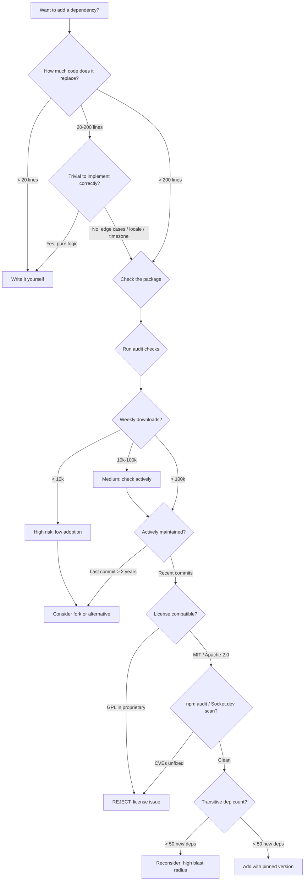
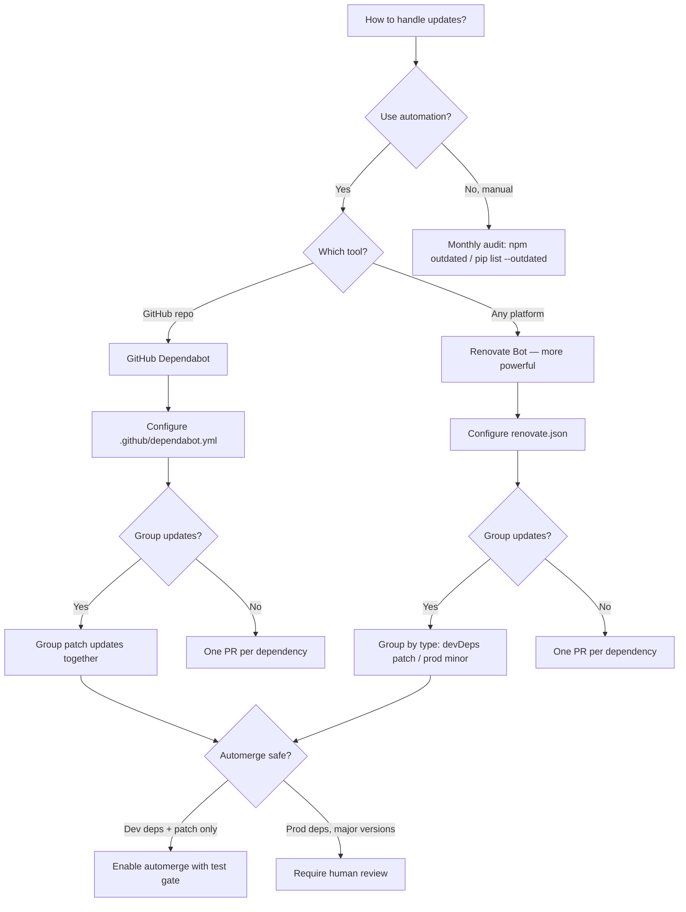

# Dependency Management

Third-party dependencies are simultaneously the most powerful and most dangerous part of modern software. A single mismanaged dependency caused log4shell. Left-pad took down thousands of builds in 11 minutes. Supply chain attacks through dependency confusion hit major enterprises. This skill covers the full lifecycle: choosing, pinning, auditing, updating, and removing dependencies with production discipline.

## When to Use

**Use for**:
- Deciding whether to add a new dependency
- Version pinning strategy (exact vs range vs lockfile-only)
- Setting up automated update workflows (Renovate, Dependabot)
- Security auditing with `npm audit`, `pip audit`, Snyk, Socket.dev
- License compliance scanning (MIT/Apache/GPL compatibility)
- Generating Software Bills of Materials (SBOM)
- Resolving peer dependency conflicts and npm overrides
- Responding to security advisories and CVEs
- Detecting typosquatting and dependency confusion attacks

**NOT for**:
- Internal monorepo package management (use `monorepo-management`)
- Publishing your own packages to npm, PyPI, crates.io
- Package manager configuration beyond dependency management (workspace config, etc.)
- Vendoring and air-gapped environments (mention these exist but they're outside scope)

---

## Core Decision: Should I Add This Dependency?



---

## Version Pinning Strategy

### Semver Semantics Recap

```
^1.2.3  = >= 1.2.3, < 2.0.0   (minor + patch updates allowed)
~1.2.3  = >= 1.2.3, < 1.3.0   (patch updates only)
1.2.3   = exactly 1.2.3        (locked)
*       = any version           (never use)
```

### When to Use Each

| Strategy | Where | Reasoning |
|----------|-------|-----------|
| Exact pinning (`1.2.3`) | Production apps | Reproducible builds; lockfile provides flexibility |
| Tilde (`~1.2.3`) | Libraries you publish | Patch safety; minor versions may break consumers |
| Caret (`^1.2.3`) | Dev tooling only | Acceptable churn for formatters, linters |
| Lockfile as truth | All production | `npm ci`, `pip install --frozen`, `cargo build` |
| Never `*` | Anywhere | Catastrophic: installs whatever is latest at build time |

### Anti-Pattern: Caret in Production App Dependencies

**Novice**: "I use `^` so I always get bug fixes automatically. That's safer."
**Expert**: Caret ranges mean any breaking-within-semver change installs without your knowledge. Semver is aspirational, not enforced — packages regularly ship breaking changes in minor versions. Your lockfile prevents this on developer machines, but CI environments that run `npm install` instead of `npm ci` will silently upgrade. Pin your direct dependencies exactly and let the lockfile manage transitive deps. Review updates deliberately via Renovate or Dependabot PRs.
**Detection**: Check `package.json` for `^` prefixes on runtime dependencies in production apps. Run `npm ci` on a fresh clone and compare the installed tree to your last deployment.

---

## Update Workflow Decision



---

## Security Auditing

### The Audit Stack

Run these in sequence from fastest/free to deepest:

```bash
# 1. npm audit (built-in, free, fast — checks known CVEs)
npm audit
npm audit --audit-level=high    # Only high+ severity
npm audit fix                   # Auto-fix where possible
npm audit fix --force           # ⚠️ May break API — review first

# 2. pip audit (Python equivalent)
pip install pip-audit
pip-audit
pip-audit --fix                 # Write fixed requirements.txt

# 3. Socket.dev (supply chain analysis beyond CVEs)
npx socket check                # Checks for malicious behavior, typosquatting

# 4. Snyk (deeper analysis, CI integration)
npx snyk test
npx snyk monitor                # Continuous monitoring

# 5. SBOM generation (for compliance)
npx @cyclonedx/cyclonedx-npm --output-format json > sbom.json
# Python: pip install cyclonedx-bom && cyclonedx-py -p
```

### Anti-Pattern: Ignoring Security Advisories

**Novice**: "The audit shows vulnerabilities but they're in dev dependencies or unused code paths. Not a risk."
**Expert**: Dev dependencies reach production in two ways: (1) build tools that process production code can be compromised, and (2) the advisory may be rated "dev-only" but the package is actually in your production bundle. Check with `npm ls <package>` to trace the dependency chain. For genuinely dev-only packages (mocha, jest, eslint), moderate severity advisories can be deferred. Critical/high severity — even in dev deps — should be resolved within your SLA. "Not a risk" is an assessment, not a skip; document it.
**Detection**: Run `npm audit --production` to scope to production-only deps. Check `npm ls <vulnerable-pkg>` to see all consumers.

---

## Supply Chain Security

### Typosquatting Detection

Common attack patterns:
- `lodash` → `1odash` (digit 1 instead of letter l)
- `express` → `expres` (missing character)
- `react` → `React` (capitalization — case-sensitive registries)
- `@org/package` → `org-package` (scope confusion)

```bash
# Socket.dev catches most of these
npx socket check

# Manual: verify before install
npm view <package-name>         # Check metadata: author, description, repo URL
npm view <package-name> repository  # Verify GitHub repo matches official source
```

### Dependency Confusion Attack

An attacker publishes a public package with the same name as your private `@org/package`. The package manager fetches the public one because it has a higher version number.

**Prevention**:
```bash
# npm: Use .npmrc scoped registry config
@your-org:registry=https://your-private-registry.example.com

# Or set resolutions/overrides to lock the source
# package.json:
{
  "overrides": {
    "@your-org/internal-package": "npm:@your-org/internal-package@^1.0.0"
  }
}
```

### Lockfile Integrity

```bash
# Never commit node_modules — commit only the lockfile
# Verify lockfile integrity after pulls
npm ci                          # Fails if lockfile doesn't match package.json
                                # NEVER use npm install in CI

# Python: use pip-compile for deterministic locks
pip install pip-tools
pip-compile requirements.in     # Generates pinned requirements.txt
pip-sync requirements.txt       # Install exactly this
```

---

## License Compliance

### Compatibility Matrix

| Your Project | MIT dep | Apache 2.0 dep | LGPL dep | GPL dep |
|-------------|---------|----------------|---------|---------|
| Proprietary | OK | OK (attribution) | OK (dynamic link) | REJECT |
| MIT/Apache | OK | OK | OK | Complicated |
| GPL | OK | OK | OK | OK |

```bash
# Scan all licenses in your dependency tree
npx license-checker --production --onlyAllow "MIT;Apache-2.0;BSD-2-Clause;BSD-3-Clause;ISC;0BSD"
npx license-checker --production --failOn "GPL;AGPL"

# Python
pip install pip-licenses
pip-licenses --format=markdown --order=license
```

### Anti-Pattern: Excessive Dependencies for Trivial Functionality

**Novice**: `npm install is-odd` (actual package, 54M weekly downloads). Installs a package with 1 line of code: `n % 2 !== 0`.
**Expert**: The left-pad incident (2016) proved that trivial utility packages are operational liabilities. Every production dependency is: a potential CVE vector, a supply chain attack surface, a semver conflict source, and a cognitive load item. Before adding a package, paste the README into ChatGPT and ask "is the core functionality &lt; 20 lines?" For date manipulation, string utilities, and math operations, write the function. For localization, cryptography, protocol parsing — use battle-tested libraries.
**Detection**: Run `npx cost-of-modules` or check npm page for source code size. Packages under 10KB for non-trivial domains are almost always replaceable.
**Timeline**: Post-left-pad (2016) the ecosystem became more aware of this, but the pattern persists. In 2024 the `polyfill.io` CDN compromise showed this applies to CDN dependencies too.

---

## npm Overrides and Resolutions

Use to fix vulnerable transitive dependencies when the direct dependency hasn't updated:

```json
// package.json — npm overrides (npm 8.3+)
{
  "overrides": {
    "semver": ">=7.5.2",           // Force minimum version across all deps
    "lodash": "4.17.21",           // Force exact version
    "vulnerable-pkg": {
      "sub-dependency": "^2.0.0"   // Scoped: only for this parent
    }
  }
}
```

```json
// package.json — yarn/pnpm resolutions
{
  "resolutions": {
    "semver": ">=7.5.2"
  }
}
```

**Caution**: Overrides can break packages that genuinely require the older API. Always run your test suite after adding overrides.

---

## Peer Dependencies

```bash
# Check what peer deps a package needs
npm info <package> peerDependencies

# npm 7+ auto-installs peer deps (may surprise you with version conflicts)
# Opt out: npm install --legacy-peer-deps (last resort)

# Check for peer dep conflicts
npm install 2>&1 | grep "peer dep"
npm ls 2>&1 | grep "WARN" | grep "peer"
```

**Rule**: If you see peer dependency warnings, don't silence them. They indicate version mismatches that may cause subtle runtime failures. Resolve by pinning the common peer to a compatible version.

---

## References

- `references/update-strategies.md` — Consult for Renovate vs Dependabot configuration details, grouping strategies, automerge policies, and testing update PRs safely
- `references/security-auditing.md` — Consult for npm audit / Snyk / Socket.dev deep dives, SBOM generation, license scanning tools, and CI integration patterns
