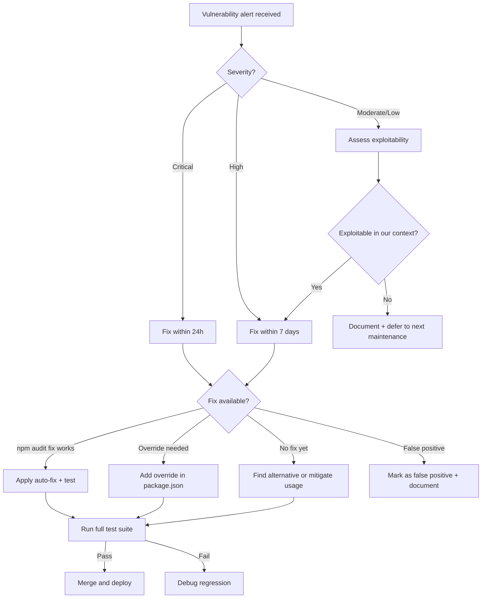

# Security Auditing for Dependencies

Comprehensive guide to dependency security: tools, workflows, CI integration, SBOM generation, and license scanning. This is the operational layer on top of the security overview in SKILL.md.

---

## Tool Landscape

### npm audit

Built into npm; checks against npm's advisory database (which sources from NVD and GitHub Security Advisories).

```bash
# Basic audit
npm audit

# JSON output (for parsing)
npm audit --json

# Only show high and critical
npm audit --audit-level=high

# Audit only production deps (skip devDependencies)
npm audit --omit=dev

# Auto-fix safe updates
npm audit fix

# Force updates even if semver-incompatible
# ⚠️ Reviews required — can change APIs
npm audit fix --force

# Audit a specific package
npm audit --json | jq '.vulnerabilities | to_entries[] | select(.value.via[].name == "lodash")'
```

**Understanding audit severity**:
- **Critical** (CVSS 9.0+): Exploitable remotely, fix immediately
- **High** (CVSS 7.0-8.9): Serious; fix within your SLA (usually &lt; 7 days)
- **Moderate** (CVSS 4.0-6.9): Contextualize; may not be exploitable in your use case
- **Low** (CVSS 0.1-3.9): Document and defer; fix in next maintenance window

### pip-audit (Python)

```bash
pip install pip-audit

# Audit current environment
pip-audit

# Audit a requirements file
pip-audit -r requirements.txt

# JSON output
pip-audit --format=json

# Fix fixable vulnerabilities
pip-audit --fix

# Skip specific advisory (with justification documented)
pip-audit --ignore-vuln GHSA-xxxx-xxxx-xxxx
```

### Snyk

Deeper than npm audit: checks transitive deps, provides fix PRs, monitors continuously.

```bash
# Install
npm install -g snyk

# Authenticate
snyk auth

# Test (shows vulnerability tree)
snyk test

# Test only production dependencies
snyk test --production

# Monitor this project (creates ongoing monitoring)
snyk monitor

# Fix vulnerabilities (creates PR)
snyk fix

# Test Docker image
snyk container test myimage:latest

# Test IaC files (Terraform, K8s YAML)
snyk iac test .

# JSON output for CI
snyk test --json | jq '.vulnerabilities[] | {id, severity, packageName, title}'
```

**Snyk CI Integration (GitHub Actions)**:
```yaml
- name: Run Snyk
  uses: snyk/actions/node@master
  env:
    SNYK_TOKEN: ${{ secrets.SNYK_TOKEN }}
  with:
    args: --severity-threshold=high --fail-on=all
```

### Socket.dev

Goes beyond CVEs to detect malicious behavior in packages before they become CVEs:

```bash
# Install
npm install -g @socketsecurity/cli

# Check a package before installing
npx socket check lodash@4.17.21

# Check entire project
npx socket check

# Real-time monitoring (CI)
npx socket ci --strict
```

**What Socket detects that npm audit misses**:
- Packages with hidden network calls
- Packages that install binaries
- Obfuscated code
- Newly published packages with suspicious patterns
- Install scripts that run shell commands
- Packages abandoned but recently transferred to new (unknown) owners
- Typosquatting variations

**Socket Scam/Attack Detection Categories**:
| Category | Description |
|----------|-------------|
| `network` | Package makes network requests |
| `shell` | Package executes shell commands |
| `filesystem` | Package accesses filesystem beyond its scope |
| `new-author` | Package recently transferred to different maintainer |
| `obfuscated-code` | Code deliberately obscured |
| `protestware` | Code with political payload |
| `typo-squatting` | Name too similar to popular package |

---

## CI Security Gate Integration

### GitHub Actions Pattern

```yaml
# .github/workflows/security.yml
name: Security Audit

on:
  push:
    branches: [main]
  pull_request:
  schedule:
    - cron: '0 8 * * 1'  # Weekly Monday morning

jobs:
  audit:
    runs-on: ubuntu-latest
    steps:
      - uses: actions/checkout@v4

      - name: Setup Node.js
        uses: actions/setup-node@v4
        with:
          node-version: '22'
          cache: 'npm'

      - name: Install dependencies
        run: npm ci

      - name: npm audit (high and above)
        run: npm audit --audit-level=high --omit=dev

      - name: Socket.dev check
        run: npx socket check --strict
        env:
          SOCKET_TOKEN: ${{ secrets.SOCKET_TOKEN }}

      - name: License check
        run: |
          npx license-checker --production \
            --onlyAllow "MIT;Apache-2.0;BSD-2-Clause;BSD-3-Clause;ISC;0BSD;Unlicense;CC0-1.0" \
            --failOn "GPL;AGPL;LGPL;CC-BY-SA"
```

### Pre-commit Hook for Local Scanning

```bash
# .git/hooks/pre-commit (or lefthook / husky)
#!/bin/sh

# Run npm audit on staged changes (only if package.json changed)
if git diff --cached --name-only | grep -q "package"; then
  echo "Running security audit..."
  npm audit --audit-level=critical
  if [ $? -ne 0 ]; then
    echo "Critical security vulnerabilities found. Fix before committing."
    exit 1
  fi
fi
```

---

## SBOM Generation

Software Bill of Materials: a machine-readable list of all components in your software. Required for some compliance frameworks (FedRAMP, SOC 2 Type II, DOD CMMC) and increasingly expected by enterprise customers.

### CycloneDX (Recommended Format)

```bash
# Node.js
npm install -g @cyclonedx/cyclonedx-npm
cyclonedx-npm --output-format json > sbom.json
cyclonedx-npm --output-format xml > sbom.xml

# Python
pip install cyclonedx-bom
cyclonedx-py environment -o sbom.json
cyclonedx-py requirements -i requirements.txt -o sbom.json

# Rust
cargo install cargo-cyclonedx
cargo cyclonedx

# Go
go install github.com/CycloneDX/cyclonedx-gomod/cmd/cyclonedx-gomod@latest
cyclonedx-gomod app -output sbom.json .

# Docker image SBOM
docker sbom myimage:latest --format cyclonedx
# or
syft myimage:latest -o cyclonedx-json=sbom.json
```

### SPDX Format

```bash
# Node.js
npx spdx-sbom-generator

# Using Syft (supports all languages + Docker)
brew install syft
syft . -o spdx-json=sbom.spdx.json
syft myimage:latest -o spdx-json=container-sbom.spdx.json
```

### SBOM in CI

```yaml
- name: Generate SBOM
  run: |
    npx @cyclonedx/cyclonedx-npm --output-format json > sbom.json

- name: Upload SBOM as artifact
  uses: actions/upload-artifact@v4
  with:
    name: sbom
    path: sbom.json
    retention-days: 90

- name: Scan SBOM for vulnerabilities
  run: |
    # Use Grype to scan the SBOM
    curl -sSfL https://raw.githubusercontent.com/anchore/grype/main/install.sh | sh -s -- -b /usr/local/bin
    grype sbom:sbom.json --fail-on high
```

---

## License Scanning

### license-checker (Node.js)

```bash
npm install -g license-checker

# List all licenses
license-checker --production

# Check against allowed list
license-checker --production --onlyAllow "MIT;Apache-2.0;BSD-2-Clause;BSD-3-Clause;ISC;0BSD"

# Fail on prohibited licenses
license-checker --production --failOn "GPL-2.0;GPL-3.0;AGPL-3.0"

# Output as CSV for compliance team
license-checker --production --csv > licenses.csv

# Output as JSON for tooling
license-checker --production --json > licenses.json

# Exclude packages (for known exceptions, document why)
license-checker --production \
  --excludePackages "exception-package@1.0.0" \
  --onlyAllow "MIT;Apache-2.0"
```

### pip-licenses (Python)

```bash
pip install pip-licenses

# Summary table
pip-licenses

# Markdown output
pip-licenses --format=markdown

# Check for prohibited licenses
pip-licenses --fail-on "GPL;AGPL"

# Full detail including project URLs
pip-licenses --with-urls --with-description

# Generate requirements file with license info
pip-licenses --format=json > licenses.json
```

### License Compatibility Reference

```
Your project type → Dependency license:

Proprietary/Commercial:
  MIT        → OK (keep attribution in NOTICE)
  Apache-2.0 → OK (keep attribution + NOTICE file)
  BSD-*      → OK (keep attribution)
  ISC        → OK
  LGPL-2.1   → OK if dynamically linked (check usage)
  LGPL-3.0   → OK if dynamically linked (check usage)
  GPL-2.0    → REJECT (copyleft spreads to your code)
  GPL-3.0    → REJECT
  AGPL-3.0   → REJECT (network use triggers copyleft)
  CC-BY-SA   → REJECT (share-alike applies)

Open Source (MIT/Apache):
  All of the above → OK (your license is permissive)
  GPL → OK (but check if you want to maintain GPL compatibility)

Open Source (GPL):
  MIT, Apache, BSD → OK (permissive absorbs into GPL)
  LGPL → OK
  GPL-2.0 → Check: must be same version or "later"
  GPL-3.0 → If your code is GPL-2.0-only, this is incompatible
  AGPL → Compatible but adds network copyleft
```

**Dual-licensed packages**: Some packages (like MySQL Connector) offer commercial licenses for proprietary use. Check the package README carefully.

---

## Dependency Confusion Attack Prevention

This is a supply chain attack where an attacker publishes a public package with the same name as your private package. The package manager uses the public version because its version number is higher.

### npm Prevention

```bash
# .npmrc — scope all internal packages to private registry
@your-org:registry=https://your-private-registry.example.com

# Authenticate
npm login --scope=@your-org --registry=https://your-private-registry.example.com

# package.json — add "publishConfig" to internal packages
{
  "name": "@your-org/internal-lib",
  "publishConfig": {
    "registry": "https://your-private-registry.example.com"
  }
}
```

### Detect Potential Confusion

```bash
# Check if your private package name is claimed on public npm
npm view @your-org/internal-package 2>&1 | grep "404"
# If you get output instead of 404, the name is already taken publicly
```

### Reserve Your Package Names

Proactively publish placeholder packages on public npm for any private package names:

```json
{
  "name": "@your-org/internal-package",
  "version": "0.0.1",
  "description": "This package is for internal use only. If you received this as a dependency, you have a misconfiguration.",
  "main": "index.js",
  "publishConfig": {
    "access": "public"
  }
}
```

---

## Vulnerability Triage Workflow

When audit reveals vulnerabilities:



### Documenting Accepted Risks

When you defer or accept a vulnerability, document it:

```json
// .nsprc or audit-exceptions.json
{
  "exceptions": [
    {
      "id": "GHSA-xxxx-xxxx-xxxx",
      "package": "some-package",
      "severity": "moderate",
      "reason": "Only used in test suite, never in production build. Dev-only dependency.",
      "expires": "2026-06-01",
      "reviewer": "your-name",
      "reviewed": "2026-03-01"
    }
  ]
}
```

This creates an audit trail and forces re-review when the exception expires.

---

## Security Monitoring Checklist

**Weekly**:
- [ ] Run `npm audit` / `pip-audit` in CI
- [ ] Check Dependabot / Renovate security PRs
- [ ] Review GitHub Security tab for new advisories

**Monthly**:
- [ ] Run Socket.dev full scan
- [ ] Regenerate SBOM and archive it
- [ ] Review license compliance report

**Quarterly**:
- [ ] Audit for unused dependencies (`npx depcheck`)
- [ ] Check packages with no recent activity (potential abandonment)
- [ ] Review and update audit exception list (expire stale entries)
- [ ] Update base Docker images to latest patch versions

**On incident**:
- [ ] Immediately: identify scope (which services, which versions)
- [ ] Within 1h: apply override or pin to safe version
- [ ] Within 24h: deploy fix to production
- [ ] Within 72h: post-mortem and process improvement
