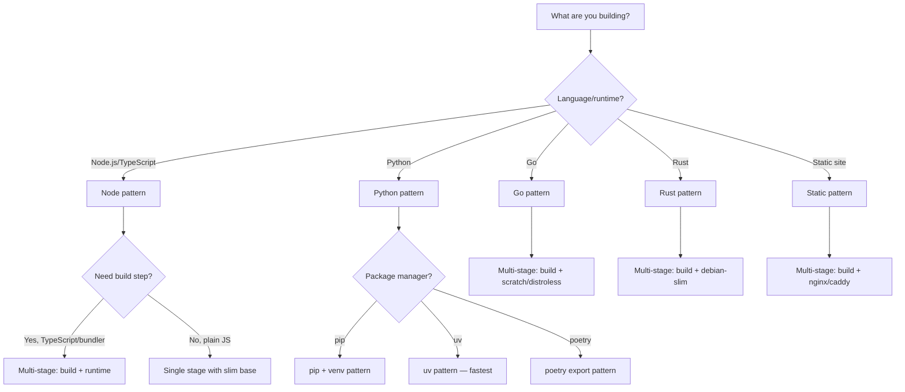
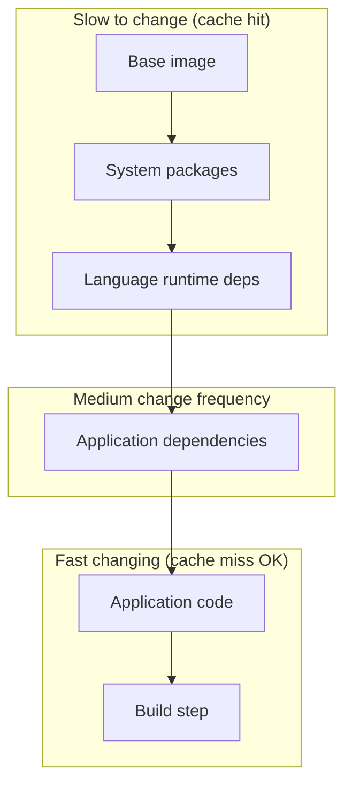

# Docker Containerization

Write production-grade Dockerfiles with multi-stage builds, security hardening, and size optimization. Covers docker-compose for local development, image layer caching, health checks, and the patterns that separate a 2GB image from a 50MB one.

## When to Use

**Use for**:
- Writing Dockerfiles from scratch or improving existing ones
- Multi-stage builds for compiled languages (Go, Rust, TypeScript)
- Docker Compose for local development environments
- Image size optimization (choosing base images, layer caching)
- Docker security scanning and hardening
- Development vs production Dockerfile patterns
- Debugging container build failures
- .dockerignore optimization

**NOT for**:
- Kubernetes deployment/orchestration (different domain)
- Cloud-specific container services (ECS, Cloud Run, App Runner)
- CI/CD pipeline configuration (use `github-actions-pipeline-builder`)
- Container networking beyond docker-compose
- Docker Swarm

---

## Dockerfile Decision Tree



---

## Production Patterns by Language

### Node.js / TypeScript (Multi-Stage)

```dockerfile
# Stage 1: Dependencies
FROM node:22-alpine AS deps
WORKDIR /app
COPY package.json package-lock.json ./
RUN npm ci --only=production

# Stage 2: Build (TypeScript/bundler)
FROM node:22-alpine AS build
WORKDIR /app
COPY package.json package-lock.json ./
RUN npm ci
COPY . .
RUN npm run build

# Stage 3: Production
FROM node:22-alpine AS production
WORKDIR /app
ENV NODE_ENV=production

# Security: non-root user
RUN addgroup -g 1001 -S nodejs && \
    adduser -S nextjs -u 1001

COPY --from=deps /app/node_modules ./node_modules
COPY --from=build /app/dist ./dist
COPY package.json ./

USER nextjs
EXPOSE 3000

HEALTHCHECK --interval=30s --timeout=3s --start-period=5s \
  CMD wget -qO- http://localhost:3000/health || exit 1

CMD ["node", "dist/index.js"]
```

### Python (uv — Fastest)

```dockerfile
FROM python:3.12-slim AS base

# Install uv
COPY --from=ghcr.io/astral-sh/uv:latest /uv /uvx /bin/

WORKDIR /app

# Install dependencies (cached layer)
COPY pyproject.toml uv.lock ./
RUN uv sync --frozen --no-dev --no-editable

# Copy application code
COPY . .

# Non-root user
RUN useradd -r -s /bin/false appuser
USER appuser

EXPOSE 8000

HEALTHCHECK --interval=30s --timeout=3s \
  CMD python -c "import urllib.request; urllib.request.urlopen('http://localhost:8000/health')"

CMD ["uv", "run", "uvicorn", "app.main:app", "--host", "0.0.0.0", "--port", "8000"]
```

### Go (Multi-Stage → Distroless)

```dockerfile
# Build stage
FROM golang:1.22-alpine AS build
WORKDIR /app
COPY go.mod go.sum ./
RUN go mod download
COPY . .
RUN CGO_ENABLED=0 GOOS=linux go build -ldflags="-s -w" -o /server ./cmd/server

# Production: distroless (no shell, no package manager, minimal attack surface)
FROM gcr.io/distroless/static-debian12
COPY --from=build /server /server
EXPOSE 8080
USER nonroot:nonroot
ENTRYPOINT ["/server"]
```

---

## Layer Caching Strategy



**Rule**: Order Dockerfile instructions from least-frequently-changed to most-frequently-changed. Each instruction creates a layer. When a layer changes, all subsequent layers are rebuilt.

### Anti-Pattern: COPY Before Dependencies

**Novice**:
```dockerfile
COPY . .                    # ← Busts cache on ANY file change
RUN npm install             # ← Reinstalls everything every build
```

**Expert**:
```dockerfile
COPY package.json package-lock.json ./  # ← Only busts on dependency changes
RUN npm ci                              # ← Cached when deps unchanged
COPY . .                                # ← Only app code changes trigger rebuild
```

**Timeline**: This has been best practice since Docker layer caching was introduced, but LLMs trained on older tutorials still generate the wrong order.

---

## Docker Compose for Development

```yaml
# docker-compose.yml
services:
  app:
    build:
      context: .
      dockerfile: Dockerfile
      target: development          # Use a dev-specific stage
    ports:
      - "${PORT:-3000}:3000"
    volumes:
      - .:/app                     # Hot reload via bind mount
      - /app/node_modules          # Anonymous volume: don't override node_modules
    environment:
      - NODE_ENV=development
      - DATABASE_URL=postgresql://postgres:postgres@db:5432/myapp
    depends_on:
      db:
        condition: service_healthy
    develop:
      watch:                       # Docker Compose Watch (2024+)
        - action: sync
          path: ./src
          target: /app/src
        - action: rebuild
          path: package.json

  db:
    image: postgres:16-alpine
    volumes:
      - pgdata:/var/lib/postgresql/data
    environment:
      POSTGRES_PASSWORD: postgres
      POSTGRES_DB: myapp
    healthcheck:
      test: ["CMD-SHELL", "pg_isready -U postgres"]
      interval: 5s
      timeout: 5s
      retries: 5
    ports:
      - "5432:5432"

  redis:
    image: redis:7-alpine
    ports:
      - "6379:6379"
    healthcheck:
      test: ["CMD", "redis-cli", "ping"]
      interval: 5s

volumes:
  pgdata:
```

### Anti-Pattern: No Health Checks

**Novice**: Relies on `depends_on` alone — but that only waits for the container to START, not for the service to be READY.
**Expert**: Always add `healthcheck` to database/cache services and use `condition: service_healthy` in `depends_on`. A Postgres container that has started but hasn't finished WAL recovery will crash your app.

---

## Image Size Optimization

| Base Image | Size | Use When |
|-----------|------|----------|
| `node:22` | ~1.1 GB | Never in production |
| `node:22-slim` | ~200 MB | Need apt packages |
| `node:22-alpine` | ~130 MB | Default choice |
| `distroless` | ~20 MB | Go/Rust compiled binaries |
| `scratch` | 0 MB | Fully static binaries |
| `chainguard/*` | ~10-30 MB | Security-hardened alternatives |

### Quick Wins

```dockerfile
# 1. Use --no-cache for apk/apt
RUN apk add --no-cache curl

# 2. Combine RUN commands to reduce layers
RUN apt-get update && \
    apt-get install -y --no-install-recommends curl && \
    rm -rf /var/lib/apt/lists/*

# 3. Use .dockerignore aggressively
# .dockerignore:
node_modules
.git
*.md
.env*
dist
coverage
.next
```

---

## Security Hardening

```dockerfile
# 1. Non-root user (MANDATORY)
RUN addgroup -g 1001 -S appgroup && \
    adduser -S appuser -u 1001 -G appgroup
USER appuser

# 2. Read-only filesystem (in compose)
# docker-compose.yml:
#   read_only: true
#   tmpfs:
#     - /tmp

# 3. No new privileges
# docker run --security-opt no-new-privileges ...

# 4. Pin image digests for reproducibility
FROM node:22-alpine@sha256:abc123...

# 5. Scan for vulnerabilities
# docker scout quickview myimage:latest
# trivy image myimage:latest
```

### Anti-Pattern: Running as Root

**Novice**: Skips the USER instruction. Everything runs as root.
**Expert**: Running as root inside a container means a container escape gives the attacker root on the host. Always create and switch to a non-root user. Only use root for package installation in build stages.
**Detection**: `docker inspect --format='{{.Config.User}}' image:tag` — if empty, it's root.

---

## Health Check Strategy by Service Type

### Principle: Liveness, Not Readiness

Docker HEALTHCHECK answers one question: "Is this process alive and minimally functional?" It does NOT answer "Are all dependencies reachable?" — that's readiness (a Kubernetes concept). Conflating them causes cascading restarts: DB goes down → every API container "fails" health check → orchestrator restarts them all → thundering herd on DB recovery.

### API Services

```dockerfile
HEALTHCHECK --interval=30s --timeout=3s --start-period=10s --retries=3 \
  CMD wget -qO- http://localhost:${PORT}/health || exit 1
```

The `/health` endpoint should:
- Return 200 if the process can serve HTTP requests
- NOT check database connectivity (that's readiness)
- NOT run expensive queries or computations
- Respond in <100ms — it runs every 30 seconds

```js
// Minimal /health endpoint
app.get('/health', (req, res) => res.status(200).json({ status: 'ok' }));
```

If you need a richer health check for monitoring dashboards (DB status, queue depth, cache hit rate), expose it on `/health/detailed` and do NOT wire it to Docker HEALTHCHECK.

Compose equivalent:
```yaml
healthcheck:
  test: ["CMD", "wget", "-qO-", "http://localhost:3000/health"]
  interval: 30s
  timeout: 3s
  start_period: 10s
  retries: 3
```

### Worker / Background Job Services

Workers don't serve HTTP. Use a heartbeat file pattern:

```dockerfile
HEALTHCHECK --interval=30s --timeout=5s --start-period=15s --retries=3 \
  CMD test $(find /tmp/worker-heartbeat -mmin -1 2>/dev/null | wc -l) -gt 0 || exit 1
```

The worker writes a timestamp file on each successful job loop iteration:
```js
// Inside your worker loop
await processJob();
fs.writeFileSync('/tmp/worker-heartbeat', Date.now().toString());
```

If the heartbeat file is older than 1 minute, the worker is stuck. Checks: process is alive, event loop is not blocked, jobs are being dequeued.

### Static File Servers (nginx, Caddy)

```dockerfile
HEALTHCHECK --interval=30s --timeout=3s --start-period=5s --retries=3 \
  CMD wget -qO- http://localhost:80/ || exit 1
```

Short start period — static servers boot fast. Just check it serves a page. No `/health` endpoint needed.

### Database Containers

Use the database's native client for health checks, not HTTP:

```yaml
# PostgreSQL
healthcheck:
  test: ["CMD-SHELL", "pg_isready -U postgres"]
  interval: 10s
  timeout: 5s
  start_period: 30s    # DBs are slow to start — generous grace period
  retries: 5

# Redis
healthcheck:
  test: ["CMD", "redis-cli", "ping"]
  interval: 10s
  timeout: 3s
  retries: 5

# MySQL
healthcheck:
  test: ["CMD", "mysqladmin", "ping", "-h", "localhost"]
  interval: 10s
  timeout: 5s
  start_period: 30s
  retries: 5
```

### Tuning Parameters

| Parameter | Guidance |
|-----------|----------|
| `interval` | 30s for apps, 10s for databases. Lower = more CPU overhead and log noise. |
| `timeout` | 3-5s. If your health check takes longer, it's too expensive. |
| `start_period` | How long until the first check. 5s for static, 10s for APIs, 30s for databases, 60s+ for JVM apps. |
| `retries` | 3 for apps, 5 for databases. Too low = restarts on transient blips. |

---

## References

- `references/multi-stage-patterns.md` — Consult for complex multi-stage builds: build caching with BuildKit, cross-compilation, monorepo Dockerfiles, Bun/Deno patterns
- `references/compose-patterns.md` — Consult for advanced docker-compose: profiles, extends, override files, networking, secrets management, GPU passthrough
