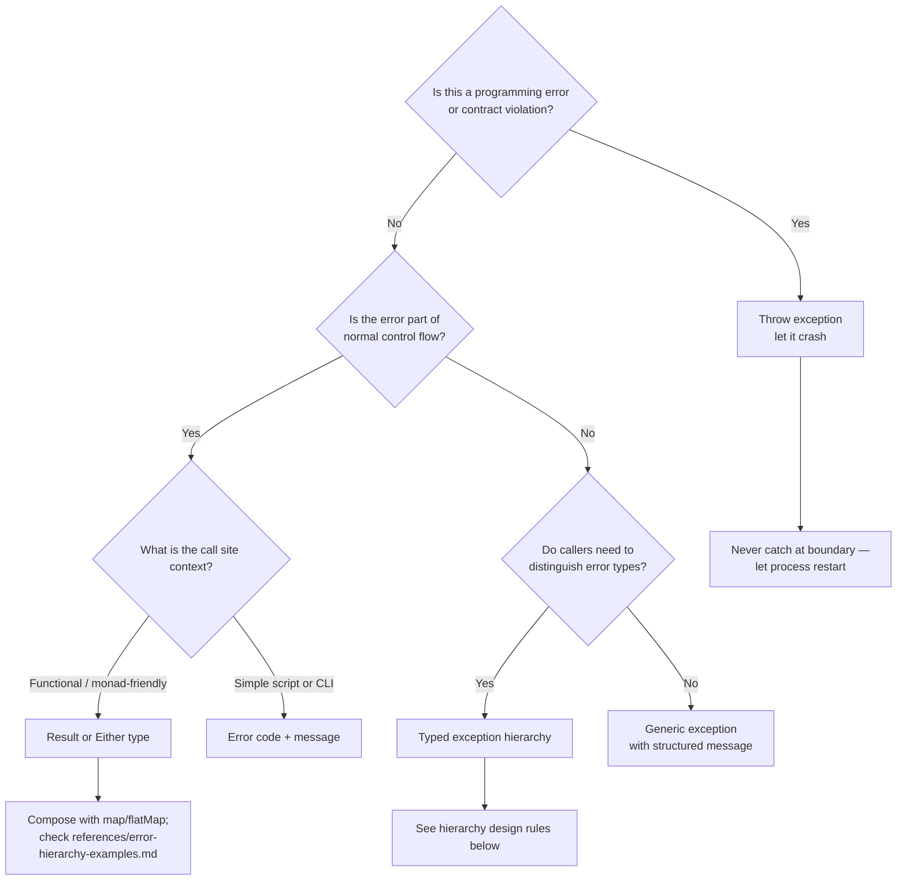
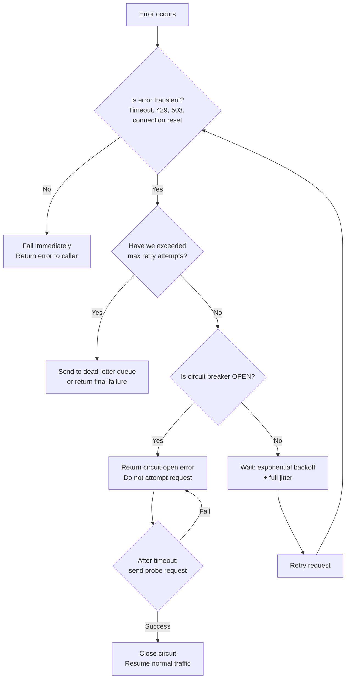

# Error Handling Patterns

Design error handling strategies that make failures explicit, recoverable, and debuggable. The central skill is matching error handling style to error semantics: not all errors are equal, and treating them equally produces systems that are equally bad at handling all of them.

## When to Use

✅ Use for:
- Choosing between exceptions, Result types, or error codes for a domain
- Designing typed error hierarchies in TypeScript or Python
- Implementing retry logic with backoff, jitter, and circuit breaking
- Building React error boundaries and graceful degradation
- Structuring error information for both users and developers
- Python exception chaining and `__cause__` / `__context__` semantics

❌ NOT for:
- Debugging a specific runtime error (use debugger or domain skill)
- Logging pipeline infrastructure (use observability skill)
- APM/monitoring configuration (use site-reliability-engineer skill)
- Writing tests for error paths (use vitest-testing-patterns skill)

---

## Core Decision: Exception vs Result Type vs Error Code



**Rules of thumb**:
- Library code: prefer Result types — never force callers to handle your exceptions
- Application code: typed exception hierarchies work well; errors are exceptional
- CLI / scripts: error codes are fine; the user is the error boundary
- Async workers: Result types or structured error objects with retry metadata

---

## Error Classification

Classify every error along two axes before deciding how to handle it:

| | **Transient** (retry may succeed) | **Permanent** (retry won't help) |
|---|---|---|
| **User-actionable** | Rate limit, quota exceeded | Invalid input, unauthorized |
| **System-actionable** | Network timeout, DB connection | Data corruption, schema mismatch |

This classification determines:
- Whether to retry (transient only)
- What to show the user (user-actionable → message; system → generic error + tracking ID)
- Whether to alert on-call (system permanent → page; transient spikes → alert)

---

## Should This Error Be Retried?



Consult `references/retry-patterns.md` for backoff formulas, jitter strategies, and circuit breaker implementation.

---

## TypeScript: Error Hierarchy Design

```typescript
// Base application error — all domain errors extend this
class AppError extends Error {
  readonly code: string;
  readonly statusCode: number;
  readonly isOperational: boolean; // false = programmer error, crash process

  constructor(message: string, code: string, statusCode: number, isOperational = true) {
    super(message);
    this.name = this.constructor.name;
    this.code = code;
    this.statusCode = statusCode;
    this.isOperational = isOperational;
    Error.captureStackTrace(this, this.constructor);
  }
}

// Domain-specific errors
class ValidationError extends AppError {
  readonly fields: Record<string, string[]>;
  constructor(fields: Record<string, string[]>) {
    super('Validation failed', 'VALIDATION_ERROR', 422);
    this.fields = fields;
  }
}

class NotFoundError extends AppError {
  constructor(resource: string, id: string) {
    super(`${resource} ${id} not found`, 'NOT_FOUND', 404);
  }
}

class RateLimitError extends AppError {
  readonly retryAfterMs: number;
  constructor(retryAfterMs: number) {
    super('Rate limit exceeded', 'RATE_LIMIT', 429);
    this.retryAfterMs = retryAfterMs;
  }
}
```

Consult `references/error-hierarchy-examples.md` for Python equivalents, Result type implementations, and full hierarchy patterns.

---

## Result Type Pattern (TypeScript)

When errors are expected outcomes of operations (parsing, API calls, DB queries), use Result instead of throw:

```typescript
type Result<T, E = AppError> =
  | { ok: true; value: T }
  | { ok: false; error: E };

// Helpers
const ok = <T>(value: T): Result<T, never> => ({ ok: true, value });
const err = <E>(error: E): Result<never, E> => ({ ok: false, error });

// Usage — caller is forced to handle both cases
async function fetchUser(id: string): Promise<Result<User, NotFoundError | NetworkError>> {
  try {
    const user = await db.users.findById(id);
    if (!user) return err(new NotFoundError('User', id));
    return ok(user);
  } catch (e) {
    return err(new NetworkError('DB unavailable', { cause: e }));
  }
}

// At call site — no silent failures
const result = await fetchUser(userId);
if (!result.ok) {
  if (result.error instanceof NotFoundError) return res.status(404).json(...);
  return res.status(500).json(...);
}
const user = result.value; // typed, safe
```

---

## React Error Boundaries

Error boundaries catch render-time exceptions. They do NOT catch async errors (fetch failures, setTimeout, event handlers).

```typescript
class RouteErrorBoundary extends React.Component<Props, State> {
  static getDerivedStateFromError(error: Error): State {
    return { hasError: true, error };
  }

  componentDidCatch(error: Error, info: React.ErrorInfo) {
    // Log to error tracking, not console.error in production
    logger.error('Render error', { error, componentStack: info.componentStack });
  }

  render() {
    if (this.state.hasError) {
      return <ErrorFallback error={this.state.error} onRetry={this.reset} />;
    }
    return this.props.children;
  }
}
```

Place boundaries at route level (one per page) and around isolated expensive subtrees (charts, rich editors). Do not wrap every component — too granular breaks the benefit.

---

## Python: Exception Chaining

Python's `raise X from Y` syntax preserves causal chains — use it always when re-raising:

```python
class AppError(Exception):
    """Base error. All domain errors subclass this."""
    def __init__(self, message: str, code: str, status: int = 500):
        super().__init__(message)
        self.code = code
        self.status = status

class DatabaseError(AppError):
    def __init__(self, operation: str, cause: Exception):
        super().__init__(f"DB error during {operation}", "DB_ERROR", 503)
        self.__cause__ = cause  # explicit chain

# In application code
try:
    result = db.execute(query)
except psycopg2.OperationalError as e:
    raise DatabaseError("user_fetch", e) from e  # preserves full traceback
```

---

## Structured Error Logging

Log errors with enough context to diagnose without reading code:

```typescript
// Good: structured, queryable, developer-oriented
logger.error('Payment processing failed', {
  error: {
    code: error.code,
    message: error.message,
    stack: error.stack,
  },
  context: {
    userId,
    orderId,
    amount,
    paymentProvider,
    attempt: retryCount,
  },
  correlation: { requestId, traceId },
});

// Then surface a sanitized message to the user
// NEVER leak error.message to users — it may contain internals
return res.status(500).json({
  error: 'Payment could not be processed. Please try again.',
  errorId: requestId, // so support can look it up
});
```

---

## Anti-Patterns

### Anti-Pattern: Pokemon Exception Handling

**Novice**: "Wrap everything in `try/catch` and log the error. At least it won't crash."

**Expert**: Catching all exceptions unconditionally ("gotta catch 'em all") hides programmer errors, masks resource leaks, and converts loud failures into silent corruption. The system appears healthy while data is being silently dropped.

```typescript
// Wrong — swallows everything including programming errors
try {
  await processOrder(order);
} catch (e) {
  console.error('something went wrong', e); // lost forever
}

// Right — catch only what you can handle, let the rest propagate
try {
  await processOrder(order);
} catch (e) {
  if (e instanceof RateLimitError) {
    await queue.requeue(order, { delay: e.retryAfterMs });
    return;
  }
  // programming errors, unexpected DB errors — let them crash
  throw e;
}
```

**Detection**: `catch (e) { }`, `catch (e) { log(e) }` with no rethrow, `except Exception as e: pass` in Python. Any catch block with no condition and no rethrow.

**Timeline**: This has always been wrong. Renewed urgency in async/await era (2017+) because swallowed promise rejections are even harder to detect than swallowed sync exceptions.

---

### Anti-Pattern: Stringly-Typed Errors

**Novice**: "I'll put the error type in the message string: `throw new Error('NOT_FOUND: User 123')`"

**Expert**: String-based error types force callers to parse strings, break under refactoring, provide no IDE support, and make exhaustive matching impossible. Callers pattern-match on strings that drift as the codebase evolves.

```typescript
// Wrong — caller must parse strings, breaks silently on rename
throw new Error(`RATE_LIMIT: retry after ${ms}ms`);
// Caller: if (error.message.startsWith('RATE_LIMIT')) { ... }

// Right — typed, refactor-safe, IDE-navigable
throw new RateLimitError(ms);
// Caller: if (error instanceof RateLimitError) { ... error.retryAfterMs ... }
```

**Python equivalent**:
```python
# Wrong
raise Exception(f"rate_limit:{retry_after}")

# Right
raise RateLimitError(retry_after_ms=retry_after)
```

**LLM mistake**: LLMs trained on StackOverflow examples frequently generate stringly-typed errors because SO answers prioritize brevity over correctness. Error codes as strings look concise in tutorials.

**Detection**: `instanceof Error` checks everywhere, string `.startsWith()` or `.includes()` in catch blocks, error codes stored in `message` field rather than a dedicated property.

---

## References

- `references/retry-patterns.md` — Consult when implementing retry logic: exponential backoff formulas, full vs equal jitter, circuit breaker state machine, dead letter queues
- `references/error-hierarchy-examples.md` — Consult for complete TypeScript and Python typed error class examples, Result monad implementations, and error boundary patterns
