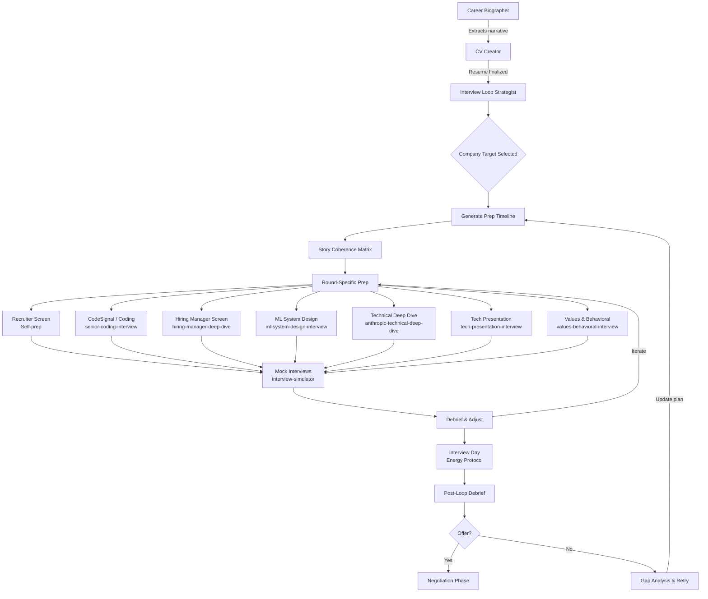
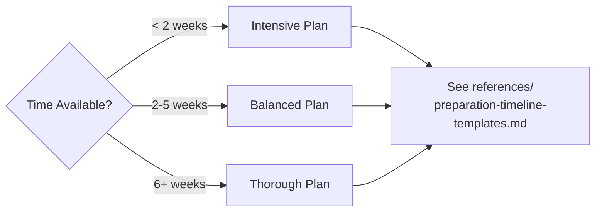

# Interview Loop Strategist

End-to-end orchestrator for senior-level AI/ML interview preparation. Coordinates timelines, story coherence across rounds, mock interview cadence, energy management, and post-interview debrief -- routing each round type to its specialist skill.

## When to Use

**Use for:**
- Building a complete interview prep plan for a specific company
- Generating 2-week, 1-month, or 2-month preparation timelines
- Ensuring story coherence -- the same project told correctly across behavioral, technical, and HM rounds
- Scheduling and tracking mock interview cadence
- Energy management strategy for all-day virtual or onsite loops
- Post-interview debrief analysis and improvement planning
- Coordinating across all 7 round-specific interview skills

**NOT for:**
- Resume or CV creation (use `cv-creator`)
- Career narrative extraction (use `career-biographer`)
- Practicing a single round type in isolation (use the round-specific skill directly)
- Salary negotiation or offer evaluation
- General career counseling

---

## Full Interview Pipeline

---

## Skill Routing Table

Each round type maps to a specialist skill. The strategist coordinates -- it does not execute round-specific practice.

| Round Type | Specialist Skill | Key Focus |
|------------|-----------------|-----------|
| Recruiter Screen | Self-prep (no skill needed) | Pitch, motivation, logistics, salary range |
| Online Assessment / Coding | `senior-coding-interview` | LC hard, system design lite, time management |
| Hiring Manager Screen | `hiring-manager-deep-dive` | Leadership, team fit, technical judgment |
| ML System Design | `ml-system-design-interview` | End-to-end ML pipelines, tradeoffs, scale |
| Technical Deep Dive | `anthropic-technical-deep-dive` | Past work forensics, technical depth, AI safety |
| Tech Presentation | `tech-presentation-interview` | 45-min talk, audience calibration, Q&A |
| Values / Behavioral | `values-behavioral-interview` | STAR stories, Anthropic values alignment |
| Mock Execution | `interview-simulator` | Realistic timed practice with scoring |

---

## Prep Timeline Selection

Choose based on time until first round:

For detailed daily schedules, consult `references/preparation-timeline-templates.md`.

---

## Story Coherence Matrix

A senior candidate has 5-8 strong projects. Each project will surface in multiple rounds but must be tailored to the audience and evaluation criteria of that round.

### How to Build the Matrix

1. **List top 5 projects** from career-biographer output (or direct input)
2. **For each project, write 3 versions:**

| Version | Round Type | Emphasis | Length |
|---------|-----------|----------|--------|
| **Technical** | ML Design, Deep Dive | Architecture decisions, tradeoffs, metrics, what you would change | 8-12 min |
| **Impact** | Behavioral, HM | Leadership, influence, collaboration, business outcome | 3-5 min (STAR) |
| **Narrative** | Presentation, Recruiter | Story arc, why it matters to the world, lessons learned | Variable |

3. **Cross-check for contradictions** -- dates, team sizes, your role, metrics must be identical across versions
4. **Map projects to Anthropic values** -- which project demonstrates which value (safety, honesty, broad benefit)?

### Example Coherence Entry

**Project: Real-Time Object Detection Pipeline (2019-2022)**

| Round | Version | Key Points |
|-------|---------|------------|
| ML Design | Technical | YOLOv5 -> custom architecture, 40ms latency constraint, edge deployment, model distillation tradeoffs |
| Deep Dive | Technical | Why ResNet backbone over EfficientNet, quantization strategy, failure mode analysis, production monitoring |
| Behavioral | Impact | Led 4-person team through 3 pivots, managed stakeholder expectations when accuracy targets slipped, mentored junior engineer who became tech lead |
| HM Screen | Impact | Drove 35% revenue increase through automation, navigated org politics to get GPU budget, built cross-functional relationships |
| Presentation | Narrative | "From research prototype to production system serving 10M requests/day -- lessons in making ML real" |

---

## Energy Management Protocol

All-day interview loops (4-6 hours) are endurance events. Cognitive fatigue causes more failures than knowledge gaps.

### Before Interview Day

- Sleep 7-8 hours for 3 consecutive nights prior (not just the night before)
- Prepare environment: quiet room, backup internet, charged devices, water, snacks
- Do NOT cram the morning of -- review only your story coherence matrix and 1-page cheat sheet
- Light exercise the morning of (walk, stretch -- not a hard workout)

### During the Loop

| Break Length | Activity | Avoid |
|-------------|----------|-------|
| 5 min | Stand, stretch, water, deep breaths | Phone, social media, reviewing notes |
| 15 min | Walk, snack (protein > sugar), bathroom | Replaying the previous round |
| 30+ min (lunch) | Eat a real meal, step outside, reset | Studying for next round |

### Cognitive Sequencing

If you can influence round order (sometimes companies ask preference):

1. **Start with your strongest round** -- builds confidence momentum
2. **Put coding early** -- requires peak cognitive freshness
3. **Behavioral/values in the middle** -- these are conversational and let you recover
4. **Presentation whenever you rehearsed it** -- muscle memory carries you
5. **Avoid technical deep dive as last round** -- fatigue makes it easy to ramble

---

## Debrief Framework

Run after every mock AND every real interview round.

### Immediate (within 30 minutes)

1. **Dump raw notes** -- what questions were asked, what you said, what you wish you said
2. **Emotional check** -- how did you feel? Confident, uncertain, surprised?
3. **Time check** -- did you run over? Under? Where did you lose time?

### Structured Analysis (within 24 hours)

| Dimension | Score (1-5) | Evidence | Action Item |
|-----------|-------------|----------|-------------|
| Technical accuracy | | | |
| Communication clarity | | | |
| Time management | | | |
| Story coherence | | | |
| Energy / confidence | | | |
| Question handling | | | |

### Pattern Detection (weekly)

- What round types consistently score lowest?
- Which stories land well? Which fall flat?
- Are you improving on last week's action items?
- Adjust prep timeline allocation based on weakness trends

For scoring rubrics per round type, consult `references/mock-interview-rubrics.md`.

---

## Anti-Patterns

### Anti-Pattern: Uniform Preparation
**Novice**: Spends equal time on every round type -- 2 hours coding, 2 hours design, 2 hours behavioral, repeat.
**Expert**: Analyzes personal weaknesses and round weighting. A candidate who aces design but freezes in coding allocates 60% of prep to coding. A candidate whose stories are inconsistent spends dedicated time on the coherence matrix.
**Detection**: Prep log shows identical hours across all categories despite known weaknesses.

### Anti-Pattern: Isolation Prep
**Novice**: Prepares each round independently. Tells a behavioral story about leading a team of 6 in one round, then says "I was the sole contributor" for the same project in a technical round.
**Expert**: Uses the story coherence matrix to thread a consistent narrative across all rounds. Reviews the matrix before every mock. Has a peer check for contradictions.
**Detection**: Same project described with conflicting details (team size, timeline, your role, metrics) across different round types.

### Anti-Pattern: Mock Avoidance
**Novice**: Reads interview guides, watches YouTube videos, reviews flashcards -- but never actually practices speaking answers aloud under time pressure.
**Expert**: Runs at minimum 2 full mock interviews per week in the final month. Records mocks. Reviews recordings. Uses `interview-simulator` for structured scoring. Treats mocks as the primary prep activity, not supplementary.
**Detection**: Zero mock session recordings in history. Unable to answer questions within time limits despite "knowing the material."

---

## Anthropic-Specific Notes

Anthropic's interview process (as of early 2026) emphasizes:

1. **AI Safety understanding** -- not just technical competence, but genuine engagement with alignment, interpretability, and responsible deployment
2. **Technical depth over breadth** -- they want to see how deep you can go on your own work, not surface-level familiarity with everything
3. **Collaborative problem-solving** -- interviews are designed to feel like working sessions, not interrogations
4. **Intellectual honesty** -- saying "I don't know" or "I was wrong about that" is valued over bluffing
5. **Mission alignment** -- why Anthropic specifically, not just "any AI company"

For detailed company-specific loop structures (Anthropic, Google DeepMind, OpenAI, Meta FAIR), consult `references/company-specific-loops.md`.

---

## Process: First Session with a Candidate

1. **Assess current state**: Which company? When is the interview? What's your background?
2. **Review upstream artifacts**: career-biographer output, cv-creator resume, any existing prep
3. **Select timeline template**: 2-week / 1-month / 2-month based on available time
4. **Build story coherence matrix**: Top 5 projects x 3 versions each
5. **Identify weakness areas**: Self-assessment + any prior interview feedback
6. **Generate personalized prep plan**: Daily schedule with skill routing
7. **Schedule first mock**: Within 48 hours of starting prep
8. **Set debrief cadence**: After every mock, weekly pattern review

---

## Reference Files

| File | Consult When |
|------|-------------|
| `references/preparation-timeline-templates.md` | Generating a daily prep schedule for 2-week, 1-month, or 2-month timeline |
| `references/mock-interview-rubrics.md` | Scoring mock interviews, self-evaluation, or identifying failure modes per round type |
| `references/company-specific-loops.md` | Tailoring prep to a specific company's interview structure (Anthropic, DeepMind, OpenAI, Meta FAIR) |
