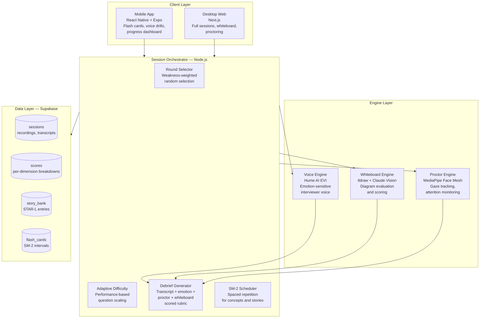
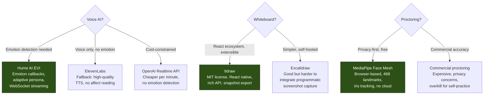
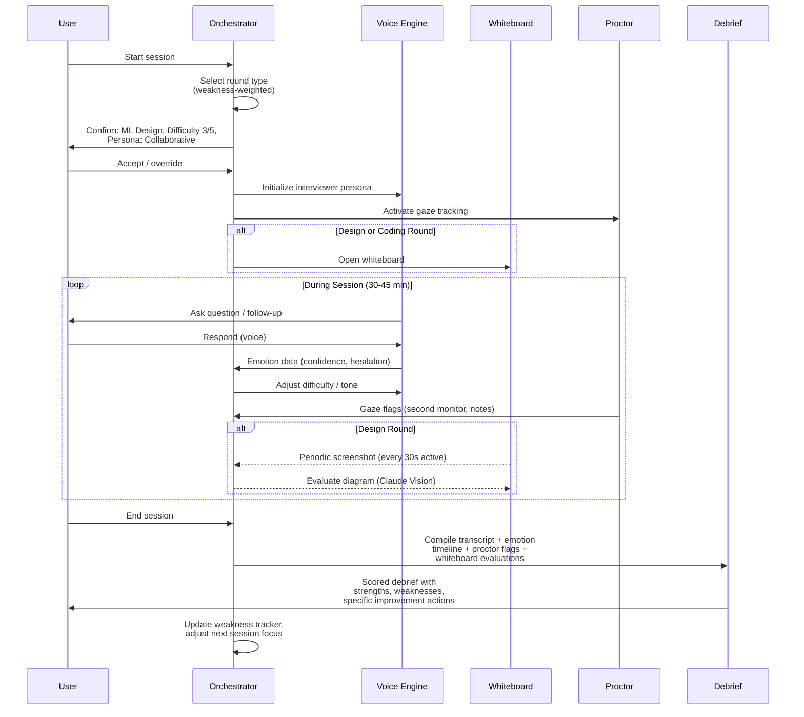

# Interview Simulator

Platform architecture and coaching system for realistic mock interview practice. This skill serves two purposes: (1) it coaches candidates on how to structure effective practice sessions, and (2) it specifies the full-stack architecture for building an automated interview simulation platform with voice AI, collaborative whiteboard, gaze-tracking proctoring, and mobile companion.

The other 7 interview skills define WHAT to practice. This skill defines HOW to practice it -- with realistic conditions, adaptive difficulty, and measurable progress.

---

## When to Use

**Use for:**
- Designing or building a mock interview simulation platform
- Configuring realistic practice sessions with voice, whiteboard, and proctoring
- Implementing adaptive difficulty that targets weaknesses automatically
- Building a scoring and debrief system that tracks progress across sessions
- Setting up spaced repetition for concept review and story rehearsal
- Establishing a daily/weekly practice protocol
- Cost analysis and optimization for practice infrastructure

**NOT for:**
- Practicing a specific round type in isolation (use the round-specific skill)
- Building a prep timeline or study plan (use `interview-loop-strategist`)
- Resume or career narrative work (use `cv-creator` or `career-biographer`)
- Salary negotiation or offer evaluation
- Conference talk preparation (different evaluation criteria)

---

## System Architecture



### Component Selection Rationale



**Why Hume over OpenAI Realtime API:** Hume's EVI provides emotion callbacks (nervousness, confidence, hesitation) that enable adaptive interviewer behavior. OpenAI's Realtime API is voice-only with no affect detection. For interview simulation, emotion awareness is the differentiator -- a real interviewer adjusts based on your emotional state.

**Why tldraw over Excalidraw:** tldraw is a React component with a rich programmatic API. You can call `editor.getSnapshot()` to capture the canvas state, export to image, and send to Claude Vision for evaluation. Excalidraw's API is more limited for programmatic interaction.

**Why MediaPipe over commercial proctoring:** This is self-practice, not exam proctoring. MediaPipe runs entirely in the browser (no cloud), processes 468 face landmarks including iris position for gaze estimation, and costs nothing. Commercial proctoring (ProctorU, ExamSoft) is designed for adversarial exam settings with privacy trade-offs that make no sense for personal practice.

---

## Session Flow



### Session Configuration Options

| Parameter | Options | Default |
|-----------|---------|---------|
| Round type | Coding, ML Design, Behavioral, Tech Presentation, HM, Technical Deep Dive | Auto (weakness-weighted) |
| Difficulty | 1 (warm-up) to 5 (adversarial) | 3 |
| Interviewer persona | Friendly, Neutral, Adversarial, Socratic | Neutral |
| Proctor strictness | Off, Training (lenient), Simulation (strict) | Training |
| Session length | 15 / 30 / 45 / 60 min | 45 min |
| Whiteboard | On / Off | Auto (on for design rounds) |
| Recording | Audio only / Audio + Video / Off | Audio only |

---

## Daily Practice Protocol

### Morning Mobile Session (10 minutes)

```
07:00  Open mobile app
07:00  3 flash cards — spaced repetition surfaces weakest concepts
       (ML concepts, system design patterns, Anthropic-specific topics)
07:05  1 behavioral story rehearsal — voice, 3 minutes max
       App plays the prompt, you respond aloud, app records duration
07:08  Quick self-check — rate confidence 1-5 on today's cards
07:10  Done — push notification schedules evening session
```

### Evening Desktop Session (30-60 minutes, 3-4x/week)

```
19:00  Open desktop app, orchestrator selects round type
19:02  Configure: confirm round, set proctor to Training mode
19:05  Session begins — voice AI drives conversation
       Whiteboard opens for design rounds
       Proctor tracks gaze, flags second monitor use
19:35  Session ends (30 min) or 19:50 (45 min)
19:35  Debrief displays: scored rubric, emotion timeline,
       proctor flags, whiteboard evaluation (if applicable)
19:45  Review debrief — spend 1/3 of practice time here
19:55  Update story bank with any new insights
20:00  Done — weakness tracker updated automatically
```

### Weekend Loop Simulation (2 hours, 1x/week)

```
10:00  Full loop: 2-3 back-to-back rounds (different types)
       5-minute breaks between rounds (no phone, no notes)
       Proctor set to Simulation (strict) mode
11:30  Energy management practice — track cognitive fatigue
11:45  Cross-round story coherence review
       Did you tell the same project consistently across rounds?
12:00  Comprehensive weekly debrief — pattern analysis across sessions
```

---

## Scoring and Progress Tracking

### Per-Session Scoring Dimensions

| Dimension | Weight | Measurement Source |
|-----------|--------|-------------------|
| Technical accuracy | 25% | Debrief AI evaluation of transcript |
| Communication clarity | 20% | Emotion data (hesitation rate, filler words) |
| Time management | 15% | Section timing vs target budget |
| Structured thinking | 15% | Whiteboard evaluation (design rounds) or verbal structure |
| Composure under pressure | 10% | Emotion timeline stability, recovery from stumbles |
| Question handling | 10% | Follow-up depth reached (levels 1-6 per values-behavioral) |
| Proctor compliance | 5% | Flag count (gaze deviations, note references) |

### Progress Visualization

Track these metrics over time on the dashboard:
- **Composite score** per session (0-100) with trend line
- **Dimension radar chart** showing strengths and weaknesses
- **Streak tracker** (consecutive days with at least one practice activity)
- **Weakness heat map** showing which round types and dimensions lag
- **Story readiness gauge** per story in bank (how many follow-up levels prepared)
- **Spaced repetition coverage** (percentage of flash cards at "mature" interval)

---

## Setup Guide

### Prerequisites

| Component | What You Need | Where to Get It |
|-----------|--------------|-----------------|
| Hume AI API key | EVI access for voice + emotion | https://hume.ai — apply for developer access |
| Anthropic API key | Claude for debrief + whiteboard eval | https://console.anthropic.com |
| Supabase project | Database + auth + storage | https://supabase.com — free tier works initially |
| Node.js 20+ | Session orchestrator runtime | https://nodejs.org |
| React Native + Expo | Mobile companion app | `npx create-expo-app` |

### First-Run Experience

```bash
# 1. Clone the simulator repo
git clone <your-simulator-repo>
cd interview-simulator

# 2. Install dependencies
npm install

# 3. Configure environment
cp .env.example .env.local
# Edit .env.local with your API keys:
#   HUME_API_KEY=...
#   HUME_SECRET_KEY=...
#   ANTHROPIC_API_KEY=...
#   NEXT_PUBLIC_SUPABASE_URL=...
#   SUPABASE_SERVICE_KEY=...

# 4. Initialize database
npx supabase db push

# 5. Run first calibration session
npm run dev
# Navigate to localhost:3000/calibrate
# 10-minute session to establish baseline scores
```

### Calibration Session

The first session is a calibration round: 10 minutes, mixed questions across all round types, no proctoring, friendly persona. This establishes baseline scores for each dimension so the adaptive difficulty has a starting point. Without calibration, the system defaults to difficulty 3 for all dimensions.

---

## Cost Analysis

| Component | Monthly Usage | Unit Cost | Monthly Total |
|-----------|--------------|-----------|---------------|
| Hume AI EVI | 20 evening sessions x 35 min + 30 morning drills x 3 min | ~$0.07/min | $60-80 |
| Claude (debrief) | 20 sessions x 1 debrief | ~$0.15/debrief | $3 |
| Claude Vision (whiteboard) | 10 design sessions x 5 evals | ~$0.03/eval | $1.50 |
| Supabase | Free tier (&lt; 500MB, &lt; 50K auth) | $0 free / $25 pro | $0-25 |
| MediaPipe | All sessions, runs locally | $0 | $0 |
| ElevenLabs (mobile fallback) | 30 morning voice drills x 3 min | ~$0.05/min | $4.50 |
| **Total** | | | **$70-115/mo** |

### Cost Optimization Strategies

1. **Session length caps**: Hard-stop at configured time to prevent runaway voice costs
2. **Whiteboard eval batching**: Evaluate every 30s during active drawing, every 2min during discussion (not continuously)
3. **Debrief caching**: If same question type + similar transcript, reuse rubric structure with specific details swapped
4. **Mobile voice**: Use ElevenLabs (cheaper) for morning drills where emotion detection is unnecessary
5. **Free tier Supabase**: Sufficient for single-user practice; upgrade only for multi-user or heavy recording storage

---

## Anti-Patterns

### Practice Without Proctoring

**Novice**: Practices with notes open on a second monitor, browser tabs with answers visible, phone in hand for quick lookups. Builds false confidence from sessions where external resources masked knowledge gaps. In the real interview, stripped of supports, performance drops 30-40%.

**Expert**: Activates proctoring from the first session, even in Training (lenient) mode. Treats every practice as an approximation of real conditions. Clears desk, closes irrelevant tabs, puts phone face-down. Uses strict Simulation mode for weekend loop simulations. Understands that the discomfort of being watched IS the training.

**Detection**: Session history shows zero proctor flags across all sessions (impossibly clean), or proctor is consistently set to "Off." Compare self-reported confidence to actual debrief scores -- large gap indicates practice conditions are too easy.

### Comfort Zone Looping

**Novice**: Manually selects the same round type repeatedly -- always behavioral (because stories are polished), always coding (because it feels productive), always the round they are already good at. Avoids design rounds because whiteboard evaluation is harsh. Avoids values rounds because deep follow-ups are uncomfortable.

**Expert**: Lets the orchestrator select rounds based on weakness analysis. Trusts the SM-2 algorithm to surface the uncomfortable topics at optimal intervals. When manually selecting, deliberately picks the lowest-scoring round type. Tracks round type distribution in the progress dashboard and rebalances if any type exceeds 40% of sessions.

**Detection**: Session history shows &gt;50% of sessions are the same round type. Weakness heat map has persistent cold spots that never improve. Flash card review skips entire categories.

### Feedback Ignored

**Novice**: Runs sessions back-to-back without reviewing debriefs. Treats mock interviews as reps to complete rather than learning opportunities. Session count is high but scores plateau. The debrief tab has a &lt;50% read rate. Improvement actions from debriefs are never attempted.

**Expert**: Spends one-third of total practice time on debrief review. After each session, reads the full scored rubric, highlights one specific improvement action, and practices that action in the next session. Reviews weekly pattern analysis to identify cross-session trends. Keeps a "lessons learned" document updated after every debrief.

**Detection**: Debrief read rate below 50% (tracked via time-on-page). Same weaknesses flagged in debriefs 3+ sessions in a row without improvement. No improvement actions logged.

---

## Integration with Round-Specific Skills

The simulator does not contain round-type content. It delegates to the 7 specialist skills for questions, rubrics, and evaluation criteria.

| Round Type | Content Skill | What Simulator Gets |
|------------|--------------|---------------------|
| Coding | `senior-coding-interview` | Problem archetypes, follow-up ladders, senior signals checklist |
| ML System Design | `ml-system-design-interview` | 7-stage framework, canonical problems, whiteboard strategy |
| Behavioral / Values | `values-behavioral-interview` | Follow-up ladder depth, STAR-L format, negative framing patterns |
| Tech Presentation | `tech-presentation-interview` | Narrative arc, depth calibration, Q&A stress test questions |
| Hiring Manager | `hiring-manager-deep-dive` | Scope-of-impact evaluation, leadership signal rubric |
| Anthropic Technical | `anthropic-technical-deep-dive` | Topic areas, opinion evaluation criteria, safety depth |
| Full Loop | `interview-loop-strategist` | Round sequencing, energy management, story coherence matrix |

---

## Reference Files

| File | Consult When |
|------|-------------|
| `references/voice-engine-setup.md` | Integrating Hume AI EVI, configuring interviewer personas, emotion-adaptive logic, WebSocket connection setup, ElevenLabs fallback |
| `references/whiteboard-engine-setup.md` | Setting up tldraw for diagram evaluation, Claude Vision scoring prompts, periodic screenshot strategy, cost per evaluation |
| `references/proctor-engine-setup.md` | MediaPipe Face Mesh setup, gaze vector calculation, suspicion thresholds, privacy configuration, flag integration with debrief |
| `references/mobile-app-architecture.md` | React Native + Expo stack, SM-2 spaced repetition implementation, push notifications, offline mode, data sync strategy |
| `references/session-orchestration.md` | Round selection algorithm, adaptive difficulty, performance tracking schema, SM-2 details, debrief generation prompts, weakness detection |
