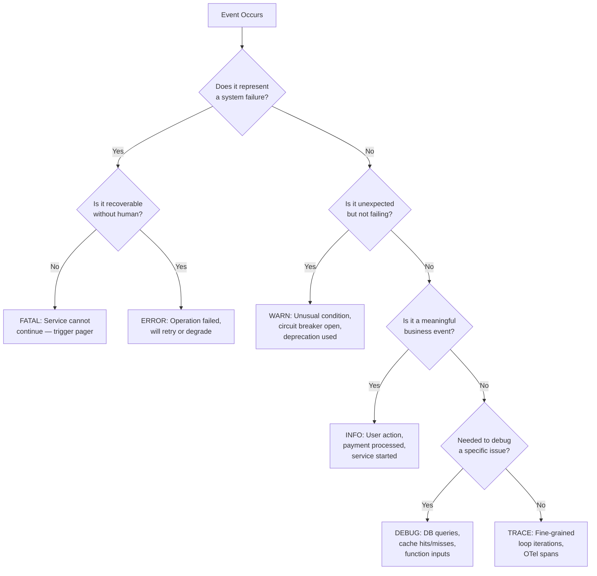
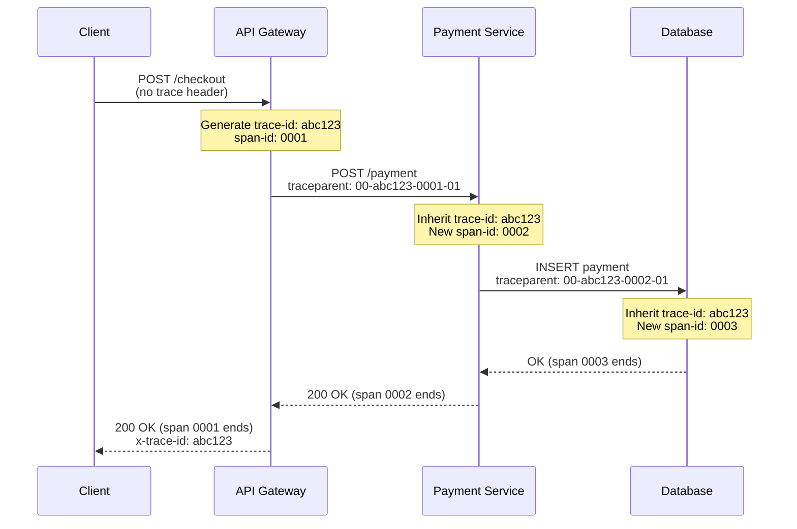

# Logging & Observability

Structured logging, distributed tracing, and metrics for production systems. Covers the full observability stack from log formatting to alert routing.

## When to Use

**Activate on:** "structured logging", "distributed tracing", "OpenTelemetry", "OTel", "correlation ID", "log levels", "Grafana dashboard", "alerting thresholds", "SLI SLO", "Prometheus metrics", "PagerDuty integration", "observability stack", "Winston setup", "Pino logger", "log aggregation", "Datadog", "Honeycomb"

**NOT for:** Performance profiling (CPU/memory flamegraphs) | Load testing | Database query optimization | Security auditing

## Decision Tree: What to Log at Each Level



**Rule of thumb**: Production runs INFO and above. DEBUG only enabled per-service via dynamic config, never always-on in prod.

## Core Patterns

### Structured Log Format (JSON)

Every log line must be parseable. String concatenation is not a log.

**Node.js with Pino:**
```typescript
import pino from 'pino';

const logger = pino({
  level: process.env.LOG_LEVEL ?? 'info',
  base: {
    service: 'payment-service',
    version: process.env.SERVICE_VERSION,
    env: process.env.NODE_ENV,
  },
  redact: {
    paths: ['req.headers.authorization', 'body.password', 'body.cardNumber', '*.ssn'],
    censor: '[REDACTED]',
  },
});

// Good: structured fields
logger.info({ orderId, userId, amountCents }, 'Payment processed');

// Bad: string interpolation
logger.info(`Payment processed for user ${userId} order ${orderId}`);
```

**Python with structlog:**
```python
import structlog

log = structlog.get_logger()

structlog.configure(
    processors=[
        structlog.contextvars.merge_contextvars,
        structlog.stdlib.add_log_level,
        structlog.stdlib.add_logger_name,
        structlog.processors.TimeStamper(fmt="iso"),
        structlog.processors.JSONRenderer(),
    ]
)

# Good: key-value pairs
log.info("payment_processed", order_id=order_id, user_id=user_id, amount_cents=amount)
```

### Correlation IDs

Every request needs a trace ID that flows through all downstream calls. This is the minimum viable distributed tracing without OTel.

```typescript
// Express middleware
import { randomUUID } from 'crypto';
import { AsyncLocalStorage } from 'async_hooks';

const requestContext = new AsyncLocalStorage<{ traceId: string; spanId: string }>();

export function correlationMiddleware(req, res, next) {
  const traceId = req.headers['x-trace-id'] ?? randomUUID();
  const spanId = randomUUID().slice(0, 8);

  requestContext.run({ traceId, spanId }, () => {
    res.setHeader('x-trace-id', traceId);
    next();
  });
}

// Logger that auto-includes context
export function getLogger(name: string) {
  return {
    info: (msg: string, fields?: object) => {
      const ctx = requestContext.getStore();
      logger.info({ ...ctx, ...fields, logger: name }, msg);
    },
    // ... error, warn, debug
  };
}
```

### OpenTelemetry Setup

See `references/opentelemetry-setup.md` for complete OTel collector config, SDK initialization per language, and span attribute conventions.

**Minimal Node.js bootstrap:**
```typescript
// Must be first import in entrypoint
import { NodeSDK } from '@opentelemetry/sdk-node';
import { OTLPTraceExporter } from '@opentelemetry/exporter-trace-otlp-http';
import { getNodeAutoInstrumentations } from '@opentelemetry/auto-instrumentations-node';

const sdk = new NodeSDK({
  serviceName: 'payment-service',
  traceExporter: new OTLPTraceExporter({
    url: process.env.OTEL_EXPORTER_OTLP_ENDPOINT,
  }),
  instrumentations: [getNodeAutoInstrumentations()],
});

sdk.start();
```

### Distributed Trace Propagation



The W3C `traceparent` header format: `00-{traceId}-{spanId}-{flags}`. Always propagate this header on every downstream HTTP call.

## Reference Files

| File | Contents |
|------|----------|
| `references/opentelemetry-setup.md` | OTel SDK init per language, collector YAML config, span attributes, context propagation |
| `references/alerting-patterns.md` | SLI/SLO definitions, alert routing, PagerDuty severity mapping, alert fatigue prevention |

## Anti-Patterns (Shibboleths)

### Anti-Pattern 1: Logging PII or Secrets in Production

**Novice thinking**: "I'll just log the full request body to debug this auth issue."

**Why wrong**: GDPR/CCPA violations carry fines up to 4% of global revenue. Secrets in logs propagate to log aggregators, S3 exports, audit trails — all places with different access controls. A single `console.log(req.body)` can expose thousands of user passwords in your Datadog dashboard.

**Detection signature**: Search your logs for `password`, `ssn`, `cardNumber`, `authorization` as field values (not keys). If any appear, you have a PII leak.

**Fix — Allowlist approach:**
```typescript
// Never log what you don't explicitly approve
const SAFE_BODY_FIELDS = ['orderId', 'productId', 'quantity', 'currency'];

logger.info({
  body: pick(req.body, SAFE_BODY_FIELDS), // only known-safe fields
  path: req.path,
  method: req.method,
}, 'Request received');
```

**Fix — Redaction in logger config:**
```typescript
// Pino's redact runs before any transport
const logger = pino({
  redact: {
    paths: [
      'req.headers.authorization',
      'req.headers.cookie',
      'body.password',
      'body.*.password',   // nested objects too
      'body.cardNumber',
      'body.ssn',
      '*.token',
      '*.secret',
    ],
    censor: '[REDACTED]',
  },
});
```

**Shibboleth**: An expert sets up redaction at logger initialization, not as a reminder comment. Redaction must be structural, not ad-hoc.

---

### Anti-Pattern 2: Unstructured String Logs Instead of Structured JSON

**Novice thinking**: `logger.info('User ' + userId + ' purchased ' + productId + ' for $' + amount)`

**Why wrong**: You cannot filter, aggregate, or alert on string-interpolated data in any log aggregator. A Grafana query for `amount > 1000` requires `amount` to be a numeric field, not embedded in a sentence. String logs are write-only — you can read them but not query them at scale.

**Impact**: Your 10 million daily log lines become unsearchable. MTTR (mean time to recovery) during incidents doubles because engineers grep through strings instead of filtering structured fields.

**Fix:**
```typescript
// Bad: string log — amount is buried in text
logger.info(`User ${userId} purchased ${productId} for $${amount}`);

// Good: structured — every field is queryable
logger.info({ userId, productId, amountDollars: amount / 100 }, 'purchase_completed');
```

**Consistent event naming**: Use `snake_case` verb-noun event names (`payment_processed`, `user_signed_up`, `order_failed`) as the message string. This creates a stable vocabulary for dashboards and alerts.

**Shibboleth**: The log message string is for humans scanning log tails. All queryable data lives in structured fields. A logger that produces `{}` as its output shape is better than one that produces readable strings.

---

### Anti-Pattern 3: Log-and-Throw (Duplicate Log Entries)

**Novice thinking**: Log the error, then re-throw so the caller also knows about it.

```typescript
// BAD: log-and-throw
async function processPayment(orderId: string) {
  try {
    return await chargeCard(orderId);
  } catch (err) {
    logger.error({ err, orderId }, 'Payment failed'); // Logged here
    throw err; // And the caller logs it again
  }
}

async function handleCheckout(req, res) {
  try {
    await processPayment(req.body.orderId);
  } catch (err) {
    logger.error({ err }, 'Checkout failed'); // Same error logged twice
    res.status(500).json({ error: 'Checkout failed' });
  }
}
```

**Why wrong**: Every error appears 2-5 times in your logs depending on call depth. Alerting on error count becomes unreliable. Incident review is confusing — engineers think there were multiple failures. Log volume costs money (Datadog charges per ingested GB).

**Fix — Log only at the boundary where you handle the error:**
```typescript
// Good: log only where you decide what to do with the error
async function processPayment(orderId: string) {
  // No try-catch: let errors propagate naturally
  return await chargeCard(orderId);
}

async function handleCheckout(req, res) {
  try {
    await processPayment(req.body.orderId);
    res.json({ success: true });
  } catch (err) {
    // One log, at the boundary where we're deciding to return 500
    logger.error({ err, orderId: req.body.orderId }, 'checkout_failed');
    res.status(500).json({ error: 'Checkout failed' });
  }
}
```

**Rule**: Log where you handle. Don't log where you propagate. The call stack in the error object already tells you where it originated.

**Shibboleth**: If you see the same `traceId` appear in more than two error log lines for a single request, you have a log-and-throw chain somewhere.

## Quality Checklist

```
[ ] All log lines are JSON (no string concatenation)
[ ] Log level strategy documented: what goes at each level
[ ] PII/secrets redacted at logger config level, not call site
[ ] Correlation IDs propagated on all outbound HTTP calls
[ ] OTel SDK initialized before any other imports
[ ] Error logs include the error object (not just message)
[ ] No log-and-throw patterns in error handling
[ ] DEBUG logs use conditional guards or sampling
[ ] SLI/SLO defined for each critical user journey
[ ] Alert routing: notify vs page threshold documented
[ ] Runbook linked from every paging alert
[ ] Log retention policy set (cost vs compliance)
```

## Output Artifacts

1. **Logger configuration** — Pino/Winston/structlog setup with redaction rules
2. **OTel bootstrap file** — SDK init with auto-instrumentation
3. **Correlation middleware** — AsyncLocalStorage request context
4. **Prometheus metrics module** — Counter/histogram/gauge definitions
5. **Grafana dashboard JSON** — Four golden signals panels
6. **Alertmanager rules YAML** — SLO-based alert definitions
