# Complete Mermaid Diagram Type Reference

Comprehensive syntax reference for all 23 Mermaid diagram types. Each section includes the declaration syntax, key features, gotchas, and a working example.

**Last updated**: 2026-03

---

## 1. Flowchart

**Declaration**: `flowchart TD` (or `TB`, `LR`, `BT`, `RL`)

Covered in detail in SKILL.md. See the Flowchart Deep Dive section.

---

## 2. Sequence Diagram

**Declaration**: `sequenceDiagram`

Covered in detail in SKILL.md. See the Sequence Diagram Essentials section.

---

## 3. Class Diagram

**Declaration**: `classDiagram`

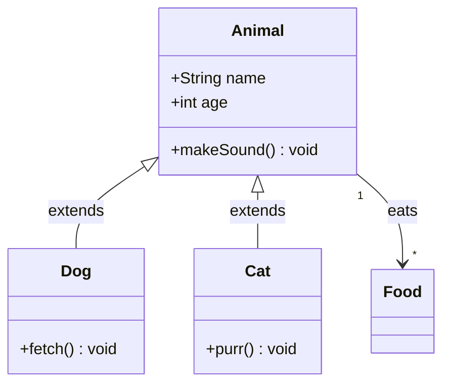

### Key Syntax

```
class ClassName {
    +publicField type       # + public
    -privateField type      # - private
    #protectedField type    # # protected
    ~packageField type      # ~ package/internal
    +methodName() returnType
    +abstractMethod()* void   # * = abstract
    +staticMethod()$ void     # $ = static
}
```

### Relationships

```
<|--    Inheritance (extends)
*--     Composition (has, owns lifecycle)
o--     Aggregation (has, separate lifecycle)
-->     Association (uses)
--      Link (bidirectional)
..>     Dependency (uses temporarily)
..|>    Realization (implements)
```

### Cardinality

```
"1" --> "*"       One to many
"1" --> "0..1"    One to zero-or-one
"*" --> "*"       Many to many
```

### Gotchas
- Generic types need HTML encoding: `List~String~` not `List<String>`
- Mermaid uses `~` for generics, not angle brackets
- Namespace support: wrap classes in `namespace MyNamespace { ... }`

---

## 4. State Diagram

**Declaration**: `stateDiagram-v2`

Covered in detail in SKILL.md. See the State Diagram Essentials section.

---

## 5. Entity Relationship Diagram

**Declaration**: `erDiagram`

Covered in detail in SKILL.md. See the ER Diagram Essentials section.

---

## 6. User Journey

**Declaration**: `journey`

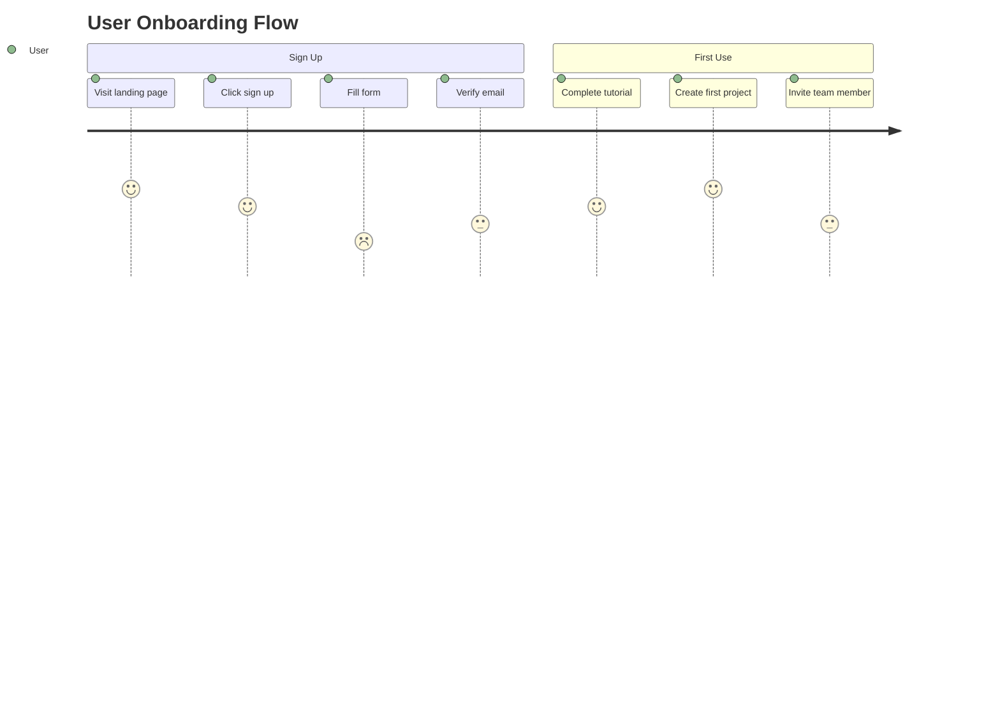

### Syntax

```
journey
    title [Title text]
    section [Section Name]
        [Task description]: [score 1-5]: [Actor1, Actor2]
```

- Score: 1 (frustrated) to 5 (delighted)
- Multiple actors: comma-separated
- Sections group related tasks visually

### Gotchas
- No colons in task descriptions (use dashes instead)
- Actors must be consistent across the diagram
- Score is required for every task

---

## 7. Gantt Chart

**Declaration**: `gantt`

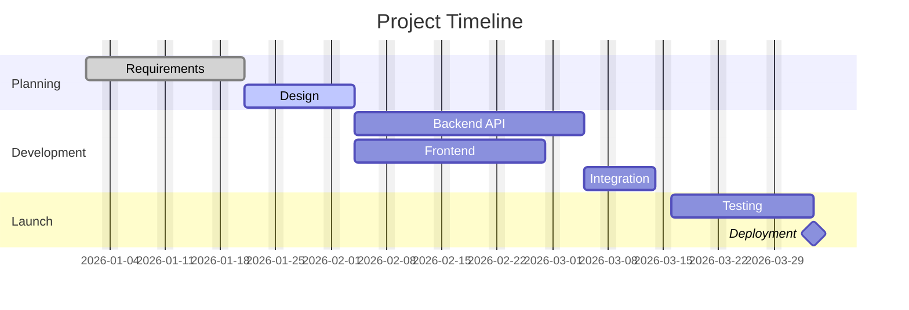

### Task Syntax

```
Task name :status, id, start, duration
```

- **Status**: `done`, `active`, `crit` (critical), or omit for default
- **Start**: `YYYY-MM-DD` or `after taskId`
- **Duration**: `Nd` (days), `Nw` (weeks), or end date
- **Milestone**: Duration of `0d`

### Date Formats

```
dateFormat YYYY-MM-DD       # Default
dateFormat DD-MM-YYYY       # European
dateFormat X                # Unix timestamp
axisFormat %b %d            # Axis display format
```

### Gotchas
- `excludes weekends` is separate from `excludes 2026-12-25`
- Task IDs are optional but needed for `after` references
- Commas in task names break parsing — avoid them

---

## 8. Pie Chart

**Declaration**: `pie`

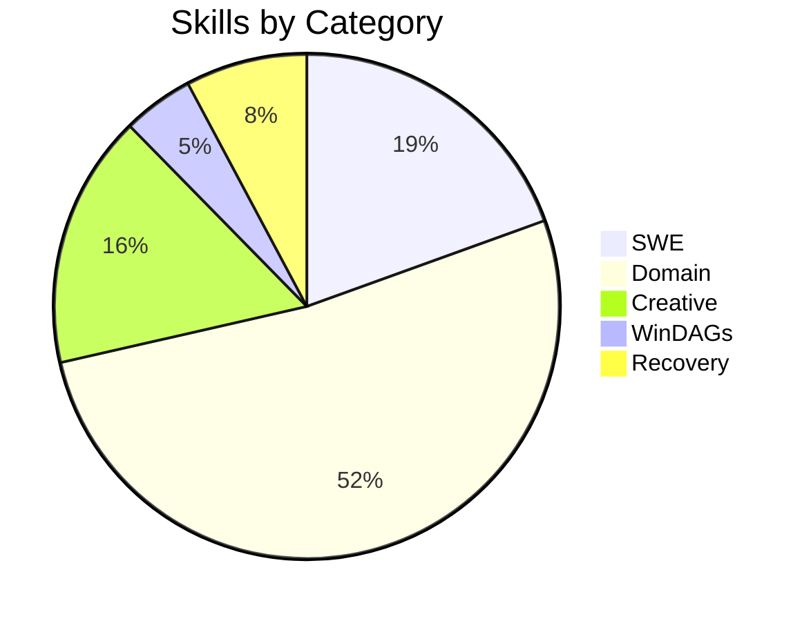

### Syntax

```
pie [showData] [title Title Text]
    "Label" : value
```

- `showData` — optional, shows percentages on slices
- Values are absolute — Mermaid calculates percentages
- Labels must be quoted

### Gotchas
- No negative values
- Labels MUST be in quotes
- `showData` keyword goes BEFORE `title`

---

## 9. Quadrant Chart

**Declaration**: `quadrantChart`

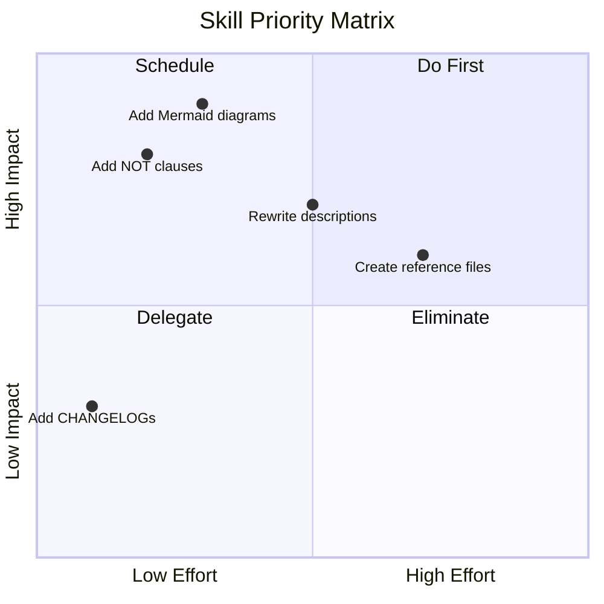

### Syntax

```
quadrantChart
    title [Title]
    x-axis [Low Label] --> [High Label]
    y-axis [Low Label] --> [High Label]
    quadrant-1 [Top-right label]
    quadrant-2 [Top-left label]
    quadrant-3 [Bottom-left label]
    quadrant-4 [Bottom-right label]
    [Point name]: [x, y]        # x and y are 0.0 to 1.0
```

### Gotchas
- Quadrant numbering: 1=top-right, 2=top-left, 3=bottom-left, 4=bottom-right (counterclockwise from top-right)
- Coordinates are 0.0 to 1.0 (normalized)
- Point names cannot contain colons

---

## 10. Requirement Diagram

**Declaration**: `requirementDiagram`

```mermaid
requirementDiagram
    requirement Auth System {
        id: REQ-001
        text: Users must authenticate before accessing protected resources
        risk: high
        verifymethod: test
    }
    requirement Token Expiry {
        id: REQ-002
        text: Auth tokens must expire within 24 hours
        risk: medium
        verifymethod: inspection
    }
    element Auth Service {
        type: microservice
    }
    Auth Service - satisfies -> Auth System
    Auth Service - satisfies -> Token Expiry
```

### Element Types

```
requirement       Standard requirement
functionalRequirement
performanceRequirement
interfaceRequirement
physicalRequirement
designConstraint
element           Implementation element
```

### Relationship Types

```
- contains ->       Parent contains child
- copies ->         Derived copy
- derives ->        Derived requirement
- satisfies ->      Element satisfies requirement
- verifies ->       Element verifies requirement
- refines ->        More specific version
- traces ->         Traceability link
```

### Verify Methods

```
verifymethod: analysis | demonstration | inspection | test
```

### Risk Levels

```
risk: low | medium | high
```

### Gotchas
- All fields (`id`, `text`, `risk`, `verifymethod`) are required
- Relationship arrows use ` - verb -> ` with spaces around the dash
- Element `type` is freeform text

---

## 11. Git Graph

**Declaration**: `gitGraph`

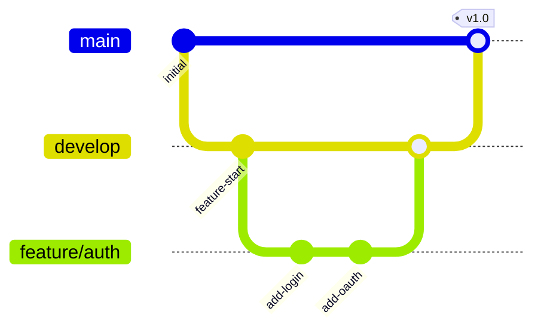

### Commands

```
commit [id: "label"] [tag: "tag"] [type: NORMAL|REVERSE|HIGHLIGHT]
branch branchName
checkout branchName
merge branchName [id: "label"] [tag: "tag"]
cherry-pick id: "commitId"
```

### Gotchas
- Branch names cannot contain spaces
- `checkout` is required before committing to a branch
- `merge` merges INTO the currently checked-out branch
- Cherry-pick requires the commit to have an explicit `id`

---

## 12. Mindmap

**Declaration**: `mindmap`

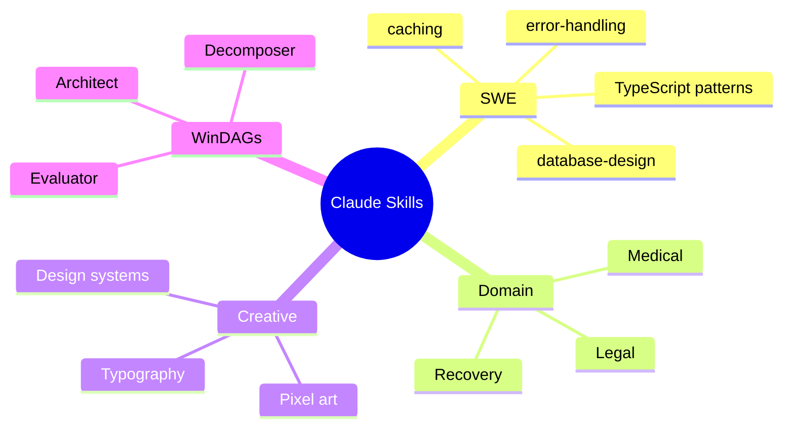

### Node Shapes

```
root((text))    Circle (root node)
text            Rectangle (default)
(text)          Rounded rectangle
[text]          Square
{{text}}        Bang/hexagon
)text(          Cloud
```

### Structure
- Indentation defines hierarchy (spaces, not tabs)
- Each deeper indent = child of the line above
- No explicit edge syntax — hierarchy IS the structure

### Gotchas
- Indentation MUST be consistent (use spaces)
- No edge labels or styling
- Cannot add links between non-parent/child nodes
- Special characters in text need escaping

---

## 13. Timeline

**Declaration**: `timeline`

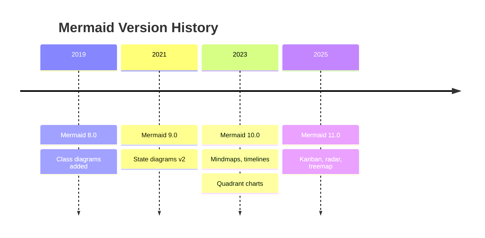

### Syntax

```
timeline
    title [Title]
    [Time Period] : [Event 1]
                  : [Event 2]
```

- Time periods are left-aligned
- Events are indented with `:` prefix
- Multiple events per time period by repeating `:` lines

### Sections

```
timeline
    section Phase 1
        2024 : Event A
    section Phase 2
        2025 : Event B
```

### Gotchas
- Time periods are strings (free text, not parsed as dates)
- No links or connections between events
- Keep events concise — long text wraps poorly

---

## 14. Sankey Diagram

**Declaration**: `sankey-beta`

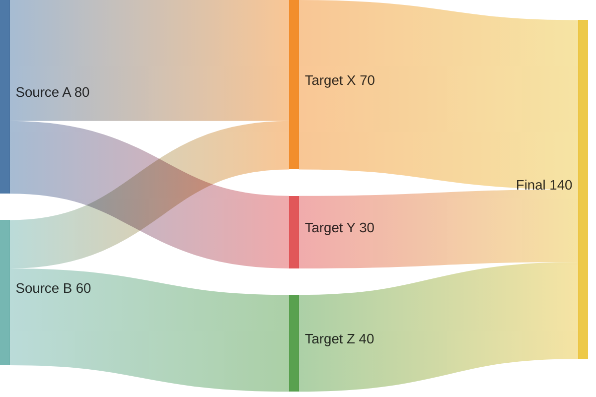

### Syntax

```
sankey-beta

Source,Target,Value
```

- CSV format: source node, target node, flow value
- Nodes are created implicitly from source/target names
- Flow width proportional to value

### Gotchas
- Header line `sankey-beta` must be followed by a blank line
- No spaces around commas in data rows
- Node names cannot contain commas
- Values must be positive numbers
- Flows go left-to-right (cannot reverse)

---

## 15. XY Chart

**Declaration**: `xychart-beta`

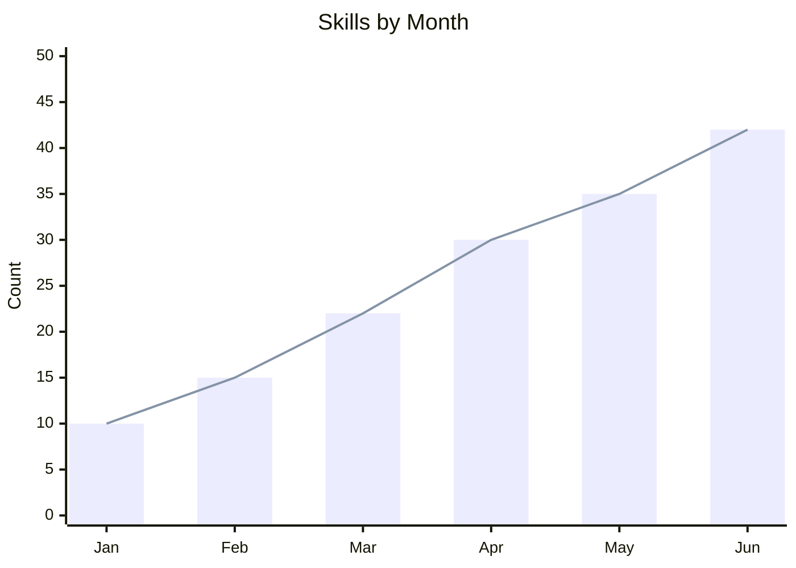

### Syntax

```
xychart-beta [horizontal]
    title "Chart Title"
    x-axis "Label" [val1, val2, ...]       # Categorical
    x-axis "Label" min --> max              # Numeric range
    y-axis "Label" min --> max
    bar [data1, data2, ...]
    line [data1, data2, ...]
```

- `horizontal` keyword rotates the chart 90 degrees
- Multiple `bar` and `line` series supported
- Data arrays must match x-axis category count

### Gotchas
- Category labels and data arrays use square brackets
- Numeric ranges use `-->` (not `..` or `-`)
- Title and axis labels should be quoted
- `horizontal` goes on the declaration line, not inside

---

## 16. Block Diagram

**Declaration**: `block-beta`

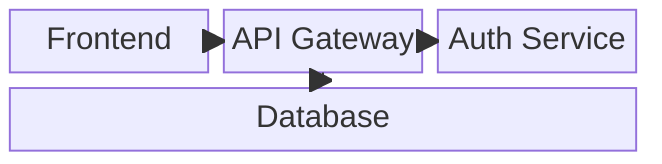

### Syntax

```
block-beta
    columns N                    # Grid columns
    A["Label"]                   # Block with label
    A["Label"]:N                 # Block spanning N columns
    space                        # Empty grid cell
    space:N                      # N empty cells

    block:groupId
        E["Child"]
    end

    A --> B                      # Connection
```

### Block Shapes

```
A["text"]       Rectangle (default)
A("text")       Rounded
A(("text"))     Circle
A{"text"}       Diamond
A{{"text"}}     Hexagon
A[/"text"/]     Parallelogram
A>"text"]       Flag
```

### Gotchas
- `columns` must be declared before any blocks
- Blocks fill left-to-right, top-to-bottom in the grid
- `:N` span syntax MUST be adjacent to the block (no space)
- Connections must reference block IDs, not labels

---

## 17. Architecture Diagram

**Declaration**: `architecture-beta`

```mermaid
architecture-beta
    group cloud(cloud)[Cloud Infrastructure]
    group api(server)[API Layer] in cloud

    service web(internet)[Web App] in cloud
    service gateway(server)[API Gateway] in api
    service auth(lock)[Auth] in api
    service db(database)[PostgreSQL] in cloud

    web:R --> L:gateway
    gateway:R --> L:auth
    gateway:B --> T:db
```

### Syntax

```
architecture-beta
    group groupId(icon)[Label]
    group groupId(icon)[Label] in parentGroup

    service serviceId(icon)[Label]
    service serviceId(icon)[Label] in groupId

    serviceA:edge --> edge:serviceB
```

### Edge Positions

```
T = Top, B = Bottom, L = Left, R = Right
```

### Icons

Built-in: `cloud`, `database`, `disk`, `internet`, `server`, `lock`

Custom icons via `iconify` (requires configuration).

### Gotchas
- Edge syntax uses `:position` on BOTH sides: `A:R --> L:B`
- Groups can nest (use `in parentGroup`)
- Only `-->` edges (no dotted, no labels)
- Icon names are from a limited built-in set

---

## 18. Kanban

**Declaration**: `kanban`

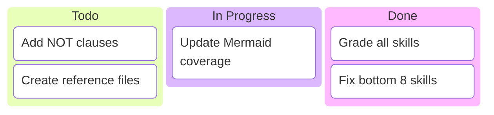

### Syntax

```
kanban
    Column Name
        taskId[Task Label]
        taskId[Task Label]@{ priority: high }
    Another Column
        taskId[Task Label]
```

### Metadata (Optional)

```
taskId[Label]@{ assignee: "name", priority: "high", ticket: "PROJ-123" }
```

### Gotchas
- Column names are unindented, tasks are indented
- Task IDs must be unique across all columns
- No connections between tasks
- Column order = display order (left to right)
- Metadata support varies by renderer

---

## 19. C4 Diagram (5 Sub-Types)

### C4 Context

**Declaration**: `C4Context`

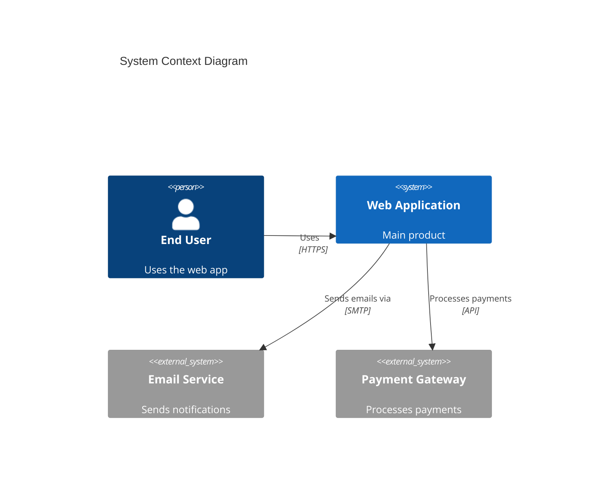

### C4 Container

**Declaration**: `C4Container`

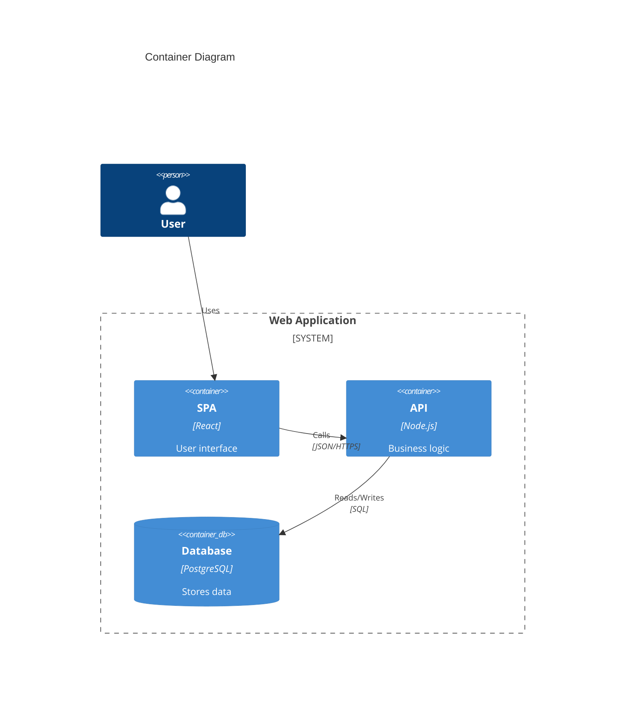

### All 5 C4 Sub-Types

| Type | Declaration | Scope |
|------|-------------|-------|
| Context | `C4Context` | System landscape — people, systems, external dependencies |
| Container | `C4Container` | Inside one system — apps, databases, APIs |
| Component | `C4Component` | Inside one container — modules, classes, services |
| Dynamic | `C4Dynamic` | Runtime interactions — numbered sequence of calls |
| Deployment | `C4Deployment` | Infrastructure — nodes, containers, deployment targets |

### Elements

```
Person(id, "Label", "Description")
Person_Ext(id, "Label", "Description")
System(id, "Label", "Description")
System_Ext(id, "Label", "Description")
System_Boundary(id, "Label") { ... }
Container(id, "Label", "Technology", "Description")
ContainerDb(id, "Label", "Technology", "Description")
ContainerQueue(id, "Label", "Technology", "Description")
Component(id, "Label", "Technology", "Description")
```

### Relationships

```
Rel(from, to, "Label")
Rel(from, to, "Label", "Technology")
Rel_D(from, to, "Label")     # Down
Rel_U(from, to, "Label")     # Up
Rel_L(from, to, "Label")     # Left
Rel_R(from, to, "Label")     # Right
```

### Gotchas
- C4 diagrams use FUNCTION CALL syntax, not Mermaid's usual `A --> B`
- `System_Boundary` uses curly braces `{ }`, not `end`
- Description and technology fields are optional but recommended
- `_Ext` suffix marks external systems/people (different styling)

---

## 20. Packet Diagram

**Declaration**: `packet-beta`

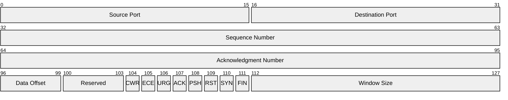

### Syntax

```
packet-beta
    start-end: "Label"
```

- Bit ranges define field positions
- Single-bit fields: `N-N: "Label"`
- Multi-bit fields: `start-end: "Label"`
- Fields render as a grid showing bit positions

### Gotchas
- Bit ranges must be non-overlapping and sequential
- Labels must be quoted
- Row width defaults to 32 bits (configurable via `bitWidth` in config)
- Primarily used for network protocol documentation

---

## 21. Radar Chart

**Declaration**: `radar`

```mermaid
radar
    title Skill Quality Assessment
    axis Description, Scope, Disclosure, Anti-Patterns, Tools, Activation, Visual, Output, Temporal, Docs
    curve skill-architect [95, 97, 90, 92, 88, 96, 93, 85, 82, 88]
    curve code-architecture [87, 90, 80, 82, 70, 85, 88, 75, 60, 72]
    curve mermaid-graph-writer [90, 92, 85, 88, 70, 90, 95, 80, 65, 78]
```

### Syntax

```
radar
    title [Title]
    axis Label1, Label2, Label3, ...
    curve SeriesName [val1, val2, val3, ...]
    curve AnotherSeries [val1, val2, val3, ...]
```

- Multiple curves overlay on the same radar
- Values should be on the same scale (e.g., 0-100)
- Axis count must match value count per curve

### Gotchas
- Axis labels are comma-separated on ONE line
- Curve values use square brackets
- Series name cannot contain spaces (use hyphens)
- Minimum 3 axes for a meaningful radar

---

## 22. Treemap

**Declaration**: `treemap`


### Syntax

```
treemap
    root[Root Label]
        child1[Child Label]
            grandchild1[Label]
        child2[Child Label]
```

- Indentation defines hierarchy (like mindmap)
- Rectangle sizes proportional to leaf count or values
- Labels use square brackets

### Gotchas
- Indentation must be consistent
- No explicit size values in basic syntax (proportional to children)
- No connections or links
- Best for showing hierarchical composition

---

## 23. ZenUML (Plugin)

**Declaration**: `zenuml`

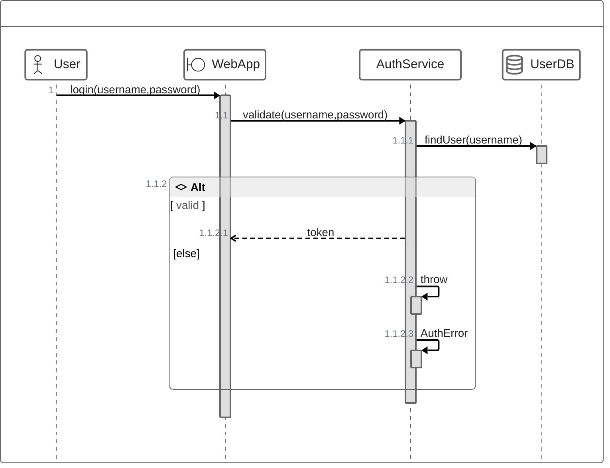

### Syntax

ZenUML uses a code-like syntax instead of Mermaid's usual DSL:

```
@Actor ParticipantName
@Boundary ParticipantName
@Service ParticipantName
@Database ParticipantName

ParticipantA->ParticipantB.methodName(args) {
    // Nested calls
    if (condition) {
        return value
    }
}
```

### Participant Stereotypes

```
@Actor       Person/user
@Boundary    System boundary (UI, API gateway)
@Control     Controller/coordinator
@Entity      Domain entity
@Service     Service component
@Database    Data store
```

### Control Flow

```
if (condition) { ... } else { ... }
while (condition) { ... }
try { ... } catch (error) { ... }
par { ... }                          # Parallel
```

### Gotchas
- **Plugin**: ZenUML is an external Mermaid plugin — not available in all renderers
- Uses curly braces `{ }` for nesting (code-like), not `activate/deactivate`
- Method call syntax: `A->B.method(args)` not `A->>B: method(args)`
- Check renderer compatibility before using

---

## Summary Table

| # | Type | Declaration | Best For |
|---|------|-------------|----------|
| 1 | Flowchart | `flowchart TD/LR` | Decision trees, processes, pipelines |
| 2 | Sequence | `sequenceDiagram` | API calls, protocols, agent communication |
| 3 | Class | `classDiagram` | OO hierarchies, interfaces, type systems |
| 4 | State | `stateDiagram-v2` | Lifecycles, status machines, FSMs |
| 5 | ER | `erDiagram` | Database schemas, data models |
| 6 | Journey | `journey` | User experience, satisfaction mapping |
| 7 | Gantt | `gantt` | Project timelines, schedules |
| 8 | Pie | `pie` | Category proportions, distributions |
| 9 | Quadrant | `quadrantChart` | Priority matrices, 2-axis comparison |
| 10 | Requirement | `requirementDiagram` | Requirements traceability |
| 11 | Git Graph | `gitGraph` | Branching strategies, release flows |
| 12 | Mindmap | `mindmap` | Taxonomies, brainstorms, concept maps |
| 13 | Timeline | `timeline` | Chronological events, version history |
| 14 | Sankey | `sankey-beta` | Flow quantities, budget allocation |
| 15 | XY Chart | `xychart-beta` | Bar/line charts, numeric data |
| 16 | Block | `block-beta` | System layouts, grid-based architectures |
| 17 | Architecture | `architecture-beta` | Cloud/infra topology, service maps |
| 18 | Kanban | `kanban` | Task boards, workflow columns |
| 19 | C4 | `C4Context` + 4 | System context, containers, components |
| 20 | Packet | `packet-beta` | Network protocols, binary layouts |
| 21 | Radar | `radar` | Multi-axis scoring, skill comparisons |
| 22 | Treemap | `treemap` | Hierarchical proportions |
| 23 | ZenUML | `zenuml` | Code-style sequence diagrams (plugin) |

---

## Stability Tiers

| Tier | Types | Notes |
|------|-------|-------|
| **Stable** | flowchart, sequenceDiagram, classDiagram, stateDiagram-v2, erDiagram, journey, gantt, pie, gitGraph, mindmap, timeline, requirementDiagram | Production-safe, syntax frozen |
| **Beta** | quadrantChart, sankey-beta, xychart-beta, block-beta, architecture-beta, packet-beta, kanban, radar, treemap | Syntax may change. The `-beta` suffix is literal. |
| **Plugin** | zenuml, C4Context/Container/Component/Dynamic/Deployment | Require external plugins or specific renderer support |
