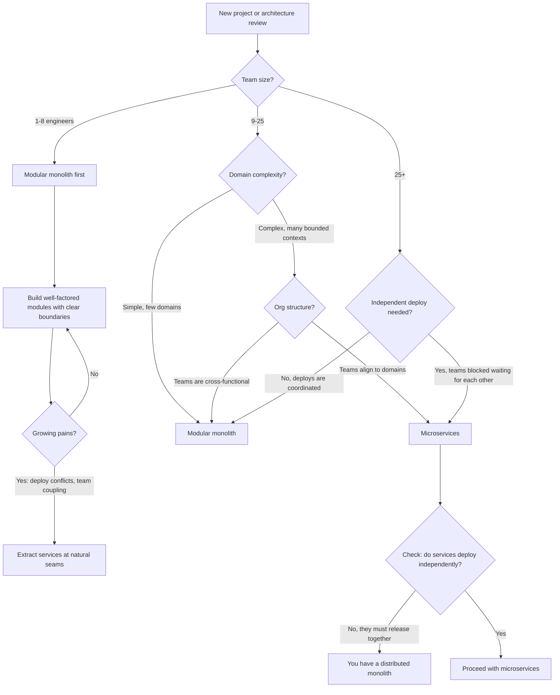
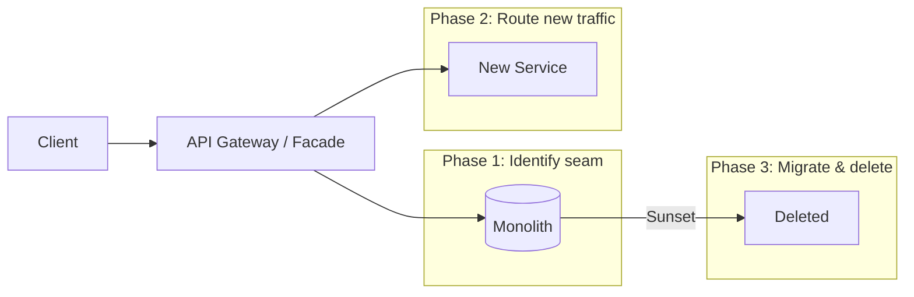
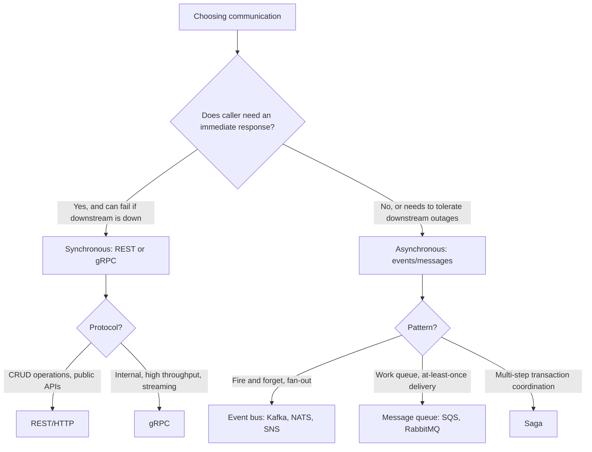
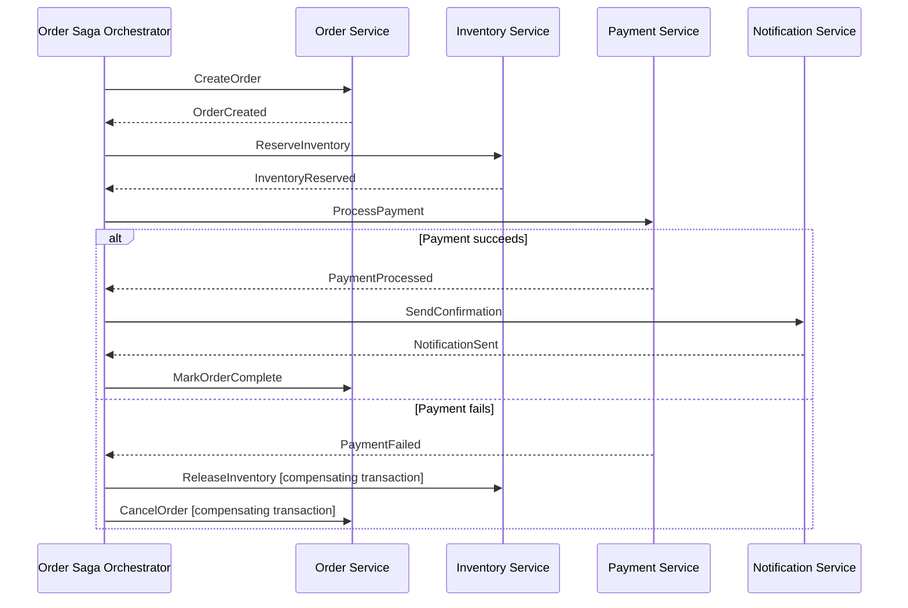
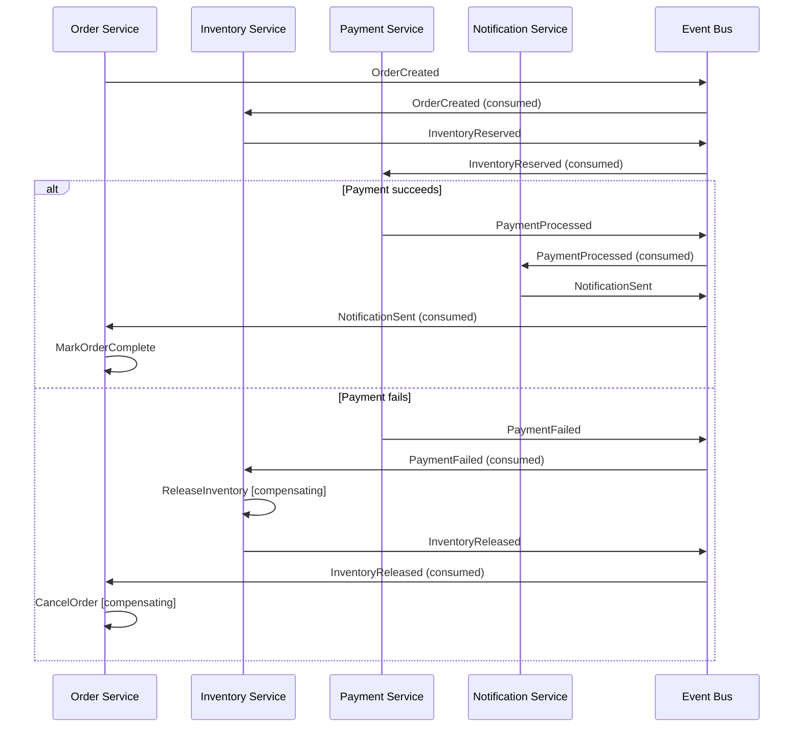

# Microservices Patterns

The craft of decomposing systems into independent services and making them work reliably together. Covers decomposition strategies, communication patterns, data ownership, and the resilience patterns that keep a distributed system from cascading into total failure.

## When to Use

**Use for**:
- Deciding whether to decompose a monolith and where to start
- Designing service boundaries using bounded contexts and domain-driven design
- Choosing between synchronous (REST/gRPC) and asynchronous (events) communication
- Implementing saga pattern for distributed transactions
- Designing API gateways and backend-for-frontend (BFF) layers
- Applying circuit breaker, bulkhead, and retry patterns
- Event sourcing and CQRS design
- Service discovery and load balancing strategies

**NOT for**:
- Monolith internal architecture (use `database-design-patterns`, `api-architect`)
- Serverless function design and deployment
- Kubernetes infrastructure and deployment configuration (use `terraform-iac-expert`)
- Service mesh configuration (Istio, Linkerd) — mention it, not the core focus
- Single-service performance optimization (use `performance-profiling`)

---

## Core Decision: Monolith vs Microservices vs Modular Monolith



### When Microservices Are Worth the Cost

The benefits of microservices: independent scaling, independent deployment, technology diversity, fault isolation. The cost: distributed systems complexity, eventual consistency, operational overhead, network latency.

Microservices make sense when:
- Different parts of the system have dramatically different scaling requirements
- Teams are large enough that a single codebase creates coordination overhead
- Domains are stable enough that service boundaries will not change constantly
- The team has the operational maturity to manage distributed systems (observability, deployment automation, on-call)

A startup with 4 engineers shipping features daily almost certainly should not be building microservices. A company with 200 engineers where the checkout team is blocked waiting for the catalog team to release — that is a microservices situation.

---

## Service Decomposition

### Bounded Context

A bounded context is the explicit boundary within which a domain model applies. Language, concepts, and rules inside the boundary are consistent. At boundaries, explicit translation happens.

```
Order Service:
  - "customer" = { id, shippingAddress, paymentMethod }
  - "product" = { id, price, quantity }

Catalog Service:
  - "product" = { id, name, description, images, attributes, category }
  - "customer" — not a concept here at all

Recommendation Service:
  - "customer" = { id, browsingHistory, purchaseHistory }
  - "product" = { id, category, tags }
```

The same word ("product") means different things in each context. This is correct — forcing a single shared model across all services creates tight coupling.

### Strangler Fig Pattern

The safe way to decompose a monolith: route traffic through a facade, extract functionality piece by piece, never do a big-bang rewrite.



Steps:
1. **Identify a seam** — a module in the monolith with clear inputs/outputs and minimal internal dependencies
2. **Stand up the new service** — implement the same functionality independently
3. **Route new traffic** to the new service; old traffic still goes to monolith
4. **Migrate old data and traffic** gradually
5. **Delete the monolith code** once confidence is high

Never try to extract the whole monolith at once. One seam at a time.

---

## Communication Patterns

### Synchronous vs Asynchronous



### Circuit Breaker

Prevents a slow/down downstream service from taking out the caller.

```
States:
  CLOSED (normal)    → requests pass through
  OPEN (tripped)     → requests fail fast without calling downstream
  HALF-OPEN (probe)  → one request allowed through to test recovery

Transitions:
  CLOSED  → OPEN:      failure threshold exceeded (e.g., 5 failures in 10 seconds)
  OPEN    → HALF-OPEN: after timeout (e.g., 30 seconds)
  HALF-OPEN → CLOSED:  probe request succeeds
  HALF-OPEN → OPEN:    probe request fails
```

```js
// Example using opossum (Node.js circuit breaker library)
const CircuitBreaker = require('opossum');

const options = {
  timeout: 3000,           // If function takes longer than 3s, trigger failure
  errorThresholdPercentage: 50,  // Open circuit when 50% of requests fail
  resetTimeout: 30000,     // Try again after 30s
};

const breaker = new CircuitBreaker(callPaymentService, options);

breaker.on('open', () => console.log('Circuit open — payment service unreachable'));
breaker.on('halfOpen', () => console.log('Testing payment service recovery'));
breaker.on('close', () => console.log('Circuit closed — payment service recovered'));

// Fallback when circuit is open
breaker.fallback(() => ({ status: 'pending', message: 'Payment queued for retry' }));
```

### Bulkhead

Isolate failures: give each downstream service its own thread pool/connection pool so one slow service cannot exhaust all resources.

```js
// Naive: single shared pool — one slow dependency starves everything
const pool = new DatabasePool({ max: 50 });

// Bulkhead: separate pools per service
const pools = {
  payments: new Pool({ max: 10 }),    // Max 10 concurrent payment calls
  catalog: new Pool({ max: 20 }),     // Catalog can use more
  notifications: new Pool({ max: 5 }), // Limit low-priority work
};
```

---

## Saga Pattern: Distributed Transactions

Sagas replace distributed ACID transactions (which require 2-phase commit and are expensive) with a sequence of local transactions, each publishing events or messages to trigger the next step. If a step fails, compensating transactions undo previous steps.

### Orchestration Saga

A central orchestrator (saga coordinator) tells each service what to do and handles failure by issuing compensating commands.



**When to use orchestration**: Complex workflows with many steps and conditional branching. The saga state and failure handling are explicit and centralized. Easier to observe (one place to look), but creates a central coordinator that knows too much.

### Choreography Saga

No central coordinator. Each service listens for events and decides what to do, then emits its own events.



**When to use choreography**: Simpler workflows with few steps. Services are more autonomous — no service knows the overall flow. Harder to observe (must trace across services), but more decoupled.

---

## Anti-Pattern: Distributed Monolith

**Novice**: Splits the application into 8 services, but every release requires deploying all 8 simultaneously because they share a database schema or make synchronous calls that break if versions mismatch.

**Expert**: Microservices that must be deployed together are not microservices — they are a distributed monolith with all the downsides of both architectures and the benefits of neither. Real microservices deploy independently, tolerate version skew through backward-compatible APIs and event schemas, and own their data exclusively. If you cannot answer "can I deploy Service A without touching Service B?" with "yes," you have not finished the decomposition.

**Detection**: Your deploy runbook says "deploy these services in this order." Your integration tests fail when services run different versions. Teams coordinate release dates across service boundaries.

---

## Anti-Pattern: Synchronous Call Chains

**Novice**: User request hits API Gateway → Order Service → calls Inventory Service → which calls Warehouse Service → which calls Shipping Service. All synchronous HTTP.

**Expert**: A chain of 4 synchronous calls multiplies latency and availability failure. If each service has 99.9% availability, a chain of 4 gives 99.6% availability — 3.5 hours of downtime per month. Latency compounds: 4 services at 50ms each = 200ms minimum, plus network overhead. Use asynchronous events for operations that do not need to block the user, and apply the circuit breaker pattern on every synchronous call. If a chain is longer than 2-3 hops, redesign the data ownership — the caller is probably missing data it should own.

**Detection**: Request waterfalls in distributed traces where service A is waiting for B, B is waiting for C. p99 latency much worse than p50 (cascading tail latency).

---

## Anti-Pattern: Shared Database

**Novice**: Microservices share a PostgreSQL database to avoid the complexity of cross-service data access.

**Expert**: A shared database is tight coupling at the storage layer. Any schema change must be coordinated across all services that touch that table. One service's slow query can lock rows that another service needs. You cannot independently scale services with different data access patterns. Each service must own its data store — schema, indexes, and all. Cross-service data access goes through the owning service's API or via events. Yes, this means you cannot do a JOIN across service boundaries. That is the constraint that forces clean data ownership.

**Detection**: Service A's tests fail because Service B modified a shared table schema. Services are using the same database connection credentials. Schema migrations require downtime for multiple services simultaneously.

---

## CQRS and Event Sourcing

### CQRS (Command Query Responsibility Segregation)

Separate the write model (commands, enforces invariants) from the read model (queries, optimized for display).

```
Write side:                          Read side:
  POST /orders → OrderService          GET /orders/{id} → OrderQueryService
  Validates business rules             Materialized view, denormalized
  Writes to order aggregate            Updated from events
  Emits OrderPlaced event              No business logic, just data
```

CQRS is valuable when read patterns are radically different from write patterns — e.g., write validates complex business rules but reads need denormalized views spanning multiple aggregates.

### Event Sourcing

Instead of storing current state, store the sequence of events that produced that state. Current state is derived by replaying events.

```js
// Traditional: store current state
await db.update('orders', { id, status: 'SHIPPED', shippedAt: new Date() });

// Event sourcing: store what happened
await eventStore.append('order-' + id, {
  type: 'OrderShipped',
  payload: { orderId: id, carrier: 'FedEx', trackingNumber: '9400...' },
  timestamp: new Date(),
  version: 4,  // optimistic concurrency control
});

// Derive current state by replaying
async function getOrderState(orderId) {
  const events = await eventStore.getEvents('order-' + orderId);
  return events.reduce(applyEvent, { status: null, items: [], history: [] });
}
```

Event sourcing provides a complete audit log, time travel (replay to any point), and the ability to derive new read models from historical events. The tradeoff: querying is harder (must use projections), and event schema evolution requires careful versioning.

---

## API Gateway and BFF

### API Gateway Responsibilities

- **Authentication/authorization**: validate JWT, check scopes before forwarding
- **Rate limiting**: per-client, per-endpoint limits
- **Request routing**: route to appropriate service based on path/header
- **Protocol translation**: external REST to internal gRPC, or vice versa
- **Response aggregation**: fan out to multiple services, merge results
- **SSL termination**: handle HTTPS externally, HTTP internally

### Backend for Frontend (BFF)

One generic API gateway becomes a problem: mobile clients need small payloads, web clients need rich data, and the gateway is making tradeoffs for everyone. BFF creates a separate gateway per client type.

```
Mobile App → BFF-Mobile → [User Service, Order Service]
                           (small payloads, battery-conscious)

Web App → BFF-Web → [User Service, Order Service, Recommendation Service]
                     (rich data, aggregated views)

Third-party API → Public API Gateway → (rate-limited, versioned, documented)
```

---

## Service Discovery

### Client-Side Discovery

Clients query a service registry (Consul, Eureka) and load balance themselves.

```js
// Client-side: ask registry, then call directly
const instances = await consul.health.service({ service: 'payment-service', passing: true });
const instance = loadBalance(instances);
const url = `http://${instance.Service.Address}:${instance.Service.Port}`;
await fetch(`${url}/api/charge`);
```

### Server-Side Discovery

Load balancer (nginx, AWS ALB, Kubernetes Service) handles discovery. Clients call the load balancer, which routes to healthy instances. This is simpler for clients — use it in Kubernetes (Kubernetes Services do this for you).

---

## Saga Orchestration: State Machine Design

### When to build your own vs use a framework

**Use Temporal.io or AWS Step Functions for production sagas.** They solve durable execution, crash recovery, and visibility for you. Building your own saga engine is justified only when: (a) you need <10ms step latency that Temporal's persistence overhead doesn't allow, or (b) your org can't adopt another infrastructure dependency.

If the user is building their own, guide them with this design:

### State Model

Every saga persists a state record after each step transition. This is the recovery mechanism — if the coordinator crashes, it reads the last persisted state and resumes.

```typescript
interface SagaState {
  sagaId: string;
  status: 'running' | 'compensating' | 'completed' | 'failed';
  currentStepIndex: number;
  completedSteps: string[];         // Step names that succeeded
  compensatedSteps: string[];       // Step names that were compensated
  context: Record<string, unknown>; // Accumulates results from each step
  startedAt: string;                // ISO timestamp
  updatedAt: string;
  failureReason?: string;
}
```

Persist this to a database (Postgres JSONB column is fine) — not Redis, not in-memory. If the coordinator crashes, the state must survive.

### Execution Rules

1. **Forward execution**: Run steps in order. After each step succeeds, persist state with `currentStepIndex++` and the step's result merged into `context`. The persist-then-advance ordering matters — if the process crashes between step execution and persist, the step re-runs on recovery. Steps MUST be idempotent.

2. **Failure triggers compensation**: When a step fails, set `status: 'compensating'` and run compensations in **reverse order** starting from the last completed step. Only compensate steps that are in `completedSteps` and not already in `compensatedSteps`.

3. **Compensation is also persisted**: After each compensation succeeds, add the step name to `compensatedSteps` and persist. If the coordinator crashes during compensation, it resumes compensating from where it left off — never double-compensating a step.

4. **Per-step timeouts**: Each step declares its own timeout. A payment capture might need 30s; an email notification needs 5s. Wrap step execution in `Promise.race([step.command(context), timeout(step.timeoutMs)])`. On timeout, treat as failure and begin compensation.

5. **Resume logic**: On coordinator startup, query for sagas with `status: 'running'` or `status: 'compensating'`. For `running`, re-execute the step at `currentStepIndex` (idempotent, so safe). For `compensating`, continue compensating from the first un-compensated step (reverse order).

### Example: Order Saga

```
Steps (forward):
  1. reserveInventory  → compensate: releaseInventory
  2. chargePayment     → compensate: refundPayment
  3. shipOrder         → compensate: cancelShipment
  4. sendConfirmation  → compensate: sendCancellationEmail

If chargePayment fails:
  → compensate releaseInventory (only step 1 completed)
  → set status: 'failed', record failureReason

If shipOrder fails:
  → compensate refundPayment (step 2)
  → compensate releaseInventory (step 1)
  → reverse order matters: refund before releasing inventory
```

### What NOT to do

- **Don't use an in-memory state machine** — it dies with the process and your saga is stuck half-executed with no way to recover.
- **Don't compensate in forward order** — if you refund after releasing inventory, another customer may have claimed that inventory. Reverse order preserves logical consistency.
- **Don't retry indefinitely** — compensations can also fail. After 3 compensation retries, raise an alert for human intervention. A saga stuck in `compensating` for hours is worse than one that fails loudly.
- **Don't skip idempotency** — the entire crash-recovery mechanism depends on it. `reserveInventory` called twice with the same saga ID must produce the same result, not double-reserve.

---

## References

- `references/communication-patterns.md` — Consult for: REST vs gRPC decision matrix, async messaging brokers (Kafka vs RabbitMQ vs SQS), idempotency patterns, saga choreography vs orchestration tradeoffs, CQRS read model patterns
- `references/decomposition-strategies.md` — Consult for: bounded context identification, strangler fig implementation steps, domain-driven decomposition techniques, team topology alignment, database decomposition patterns, data migration strategies
