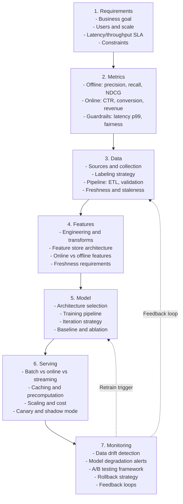

# ML System Design Interview

End-to-end ML pipeline design coaching for staff+ engineers. Covers the full arc from problem definition through production monitoring -- the scope expected at L6+ interviews at top-tier ML organizations.

This skill assumes 15+ years of ML/CV/AI/NLP experience. It does not teach fundamentals. It structures the knowledge you already have into the format interviewers reward.

---

## When to Use

**Use for**:
- Practicing 45-minute ML system design rounds
- Structuring whiteboard presentations for recommendation, ranking, RAG, fraud, perception systems
- Analyzing serving architecture tradeoffs (batch vs online vs streaming)
- Identifying L6+ differentiation signals (problem ownership, org constraints, data flywheels)
- Reviewing and critiquing ML system design answers

**NOT for**:
- Coding interviews (use `senior-coding-interview`)
- Behavioral / leadership questions (use `interview-loop-strategist`)
- ML theory or math derivations
- Implementing models or writing training code
- Paper reading or research review

---

## The 7-Stage Design Framework

Every ML system design answer follows this arc. The stages are sequential but you will loop back as constraints emerge. The Mermaid diagram below is your whiteboard skeleton.

### Stage Details

**Stage 1 -- Requirements (5 minutes)**
Ask clarifying questions before designing anything. Establish: Who is the user? What is the business metric? What is the latency SLA? What scale (QPS, data volume)? What are hard constraints (cost, privacy, regulation)? An L6+ candidate owns the problem definition -- do not wait for the interviewer to hand you requirements.

**Stage 2 -- Metrics (3 minutes)**
Define offline metrics that you can measure before deployment AND online metrics that matter to the business. Explain the gap: "NDCG improvement offline does not always translate to CTR lift online because of position bias and novelty effects." Define guardrail metrics: latency p99, fairness across user segments, cost per prediction.

**Stage 3 -- Data (7 minutes)**
Where does training data come from? How is it labeled (human, weak supervision, implicit signals)? What is the class balance? How fresh does data need to be? What is the data pipeline (batch ETL vs streaming)? What data quality checks exist? This stage separates L6+ candidates from L5 -- junior candidates assume clean labeled data.

**Stage 4 -- Features (5 minutes)**
What features does the model need? Which are precomputed (offline) vs computed at request time (online)? Feature store architecture: online store (low-latency lookups) vs offline store (batch training). Feature freshness: user features update daily, item features update hourly, contextual features are real-time.

**Stage 5 -- Model (8 minutes)**
Start with a simple baseline (logistic regression, XGBoost) and explain why. Then propose the production architecture (two-tower, transformer, etc.) and justify the upgrade. Discuss training pipeline: how often, how much data, how to handle distribution shift. Iteration strategy: what experiments to run first.

**Stage 6 -- Serving (8 minutes)**
This is where system design and ML intersect. Discuss: inference latency requirements, batch precomputation vs online inference, GPU/CPU tradeoffs, model serving framework, caching strategy, cost optimization (quantization, distillation, spot instances). Draw the serving architecture.

**Stage 7 -- Monitoring (5 minutes)**
What happens after deployment? Data drift detection (PSI, KL divergence). Model degradation alerts (metric decay over time). A/B testing framework (sample size, duration, novelty effects). Rollback strategy (shadow mode, canary percentage). Feedback loops that improve the model over time.

---

## 45-Minute Time Budget

| Phase | Minutes | What to Cover |
|-------|---------|---------------|
| Requirements + Clarification | 5 | Business goal, users, scale, SLA, constraints |
| Metrics | 3 | Offline, online, guardrails, metric alignment |
| Data | 7 | Sources, labeling, pipeline, quality, freshness |
| Features | 5 | Engineering, store architecture, online/offline split |
| Model | 8 | Baseline, production arch, training, iteration |
| Serving | 8 | Latency, architecture, cost, deployment strategy |
| Monitoring | 5 | Drift, alerts, A/B testing, rollback, feedback |
| Q&A Buffer | 4 | Interviewer deep-dives, defend tradeoffs |

If the interviewer cuts in with questions, adapt -- but cover all 7 stages even briefly. Skipping monitoring is the most common L5 mistake.

---

## Canonical Problem Set

| Problem | Key Challenges | Must-Discuss |
|---------|---------------|--------------|
| Recommendation System | Cold start, position bias, multi-objective optimization | Two-tower retrieval + reranking, exploration-exploitation |
| Search Ranking | Query intent classification, relevance vs engagement, latency at scale | Inverted index + embedding retrieval, L1/L2 ranking cascade |
| Content Moderation | Multi-modal (text+image+video), adversarial evasion, precision-recall tradeoff | Human-in-the-loop, escalation tiers, appeal workflow |
| RAG Pipeline | Retrieval quality, chunk strategy, hallucination detection, evaluation | Embedding model selection, hybrid search, reranking, citation |
| Fraud Detection | Extreme class imbalance, adversarial adaptation, real-time requirement | Feature velocity, graph features, ensemble + rules, feedback delay |
| Autonomous Driving Perception | Sensor fusion, safety-critical latency, long-tail distribution | Multi-task architecture, simulation, OTA updates, regulatory |

---

## Serving Architecture Comparison

| Pattern | Latency | Freshness | Cost | Best For |
|---------|---------|-----------|------|----------|
| Batch prediction | N/A (precomputed) | Hours-stale | Low compute, high storage | Email recommendations, daily reports |
| Online inference | 10-500ms | Real-time | High compute (GPU) | Search ranking, fraud detection |
| Near-real-time | 1-60s | Minutes-fresh | Medium | Feed ranking, content moderation |
| Streaming | Sub-second | Continuous | High (always-on) | Fraud, anomaly detection, bidding |

Detailed serving tradeoffs, framework comparisons, and cost optimization strategies are in `references/serving-tradeoffs.md`.

---

## L6+ Differentiation Signals

What separates a staff+ answer from a senior answer:

**1. Own the Problem Definition**
Do not accept the problem as stated. Ask: "What business metric are we optimizing? Is this a revenue problem or an engagement problem? What is the current solution and why is it insufficient?" L5 candidates accept "build a recommendation system." L6+ candidates ask "what are we recommending, to whom, and what does success look like?"

**2. Discuss Organizational Constraints**
Real systems live inside organizations. Address: team size (can we maintain a custom model or should we use a managed service?), on-call burden, cross-team data dependencies, compliance requirements, migration path from legacy system.

**3. Data Flywheel Strategy**
Show that you think about the virtuous cycle: better model -> more engagement -> more data -> better model. Discuss how to accelerate it: active learning, implicit feedback loops, exploration strategies, cold-start bootstrapping.

**4. Build vs Buy Decisions**
Not everything should be custom. Argue for managed services where appropriate (embedding APIs, feature stores, serving platforms) and custom solutions where competitive advantage demands it. Show you understand the total cost of ownership.

**5. Multi-Objective Thinking**
Real systems optimize multiple objectives simultaneously: relevance AND diversity, accuracy AND fairness, quality AND latency. Discuss how to handle conflicts: Pareto optimization, constrained optimization, multi-task learning, business-rule post-processing.

---

## Whiteboard Strategy

**What to draw and when:**

| Time | Draw This | Purpose |
|------|-----------|---------|
| 0-5 min | Requirements box with bullet points | Anchor the discussion, show structured thinking |
| 5-8 min | Metric table (offline vs online) | Demonstrate you think beyond model accuracy |
| 8-15 min | Data pipeline diagram (sources -> ETL -> store) | Show you understand data engineering |
| 15-20 min | Feature architecture (offline store + online store) | Demonstrate feature store knowledge |
| 20-28 min | Model architecture + serving diagram | The core system design artifact |
| 28-36 min | Full system diagram with latency annotations | Connect everything, show you can ship |
| 36-41 min | Monitoring dashboard sketch + feedback arrows | Close the loop, show production thinking |

Use boxes for components, arrows for data flow, and annotate with latency/throughput numbers. The diagram should be readable by someone who walks in at minute 30.

---

## Anti-Patterns

### Model-First Thinking

**Novice**: Jumps to "I would use a transformer" or "Let me describe the attention mechanism" in the first 2 minutes, before understanding the problem, defining metrics, or discussing data. Spends 70% of time on model architecture and 0% on serving.

**Expert**: Spends the first 10 minutes on requirements, metrics, and data before mentioning any model. Names a simple baseline first (logistic regression on handcrafted features), then argues for complexity only when the baseline's limitations are clear. Allocates equal time to serving and monitoring.

**Detection**: Architecture diagram has a detailed model box but no data pipeline, no feature store, no serving layer, and no monitoring component. Mentions model architecture in the first sentence.

### Ignoring the Data

**Novice**: Assumes clean, labeled data exists at scale. Says "we would train on millions of labeled examples" without discussing where labels come from, how much they cost, what the class distribution looks like, or how stale the data gets.

**Expert**: Asks about data sources, labeling strategy (human vs weak supervision vs implicit signals), class imbalance handling, data freshness SLA, and data quality monitoring. Discusses the cost of labeling and proposes strategies to reduce it (active learning, semi-supervised methods, synthetic data).

**Detection**: No discussion of data collection, labeling costs, class imbalance, data quality checks, or data freshness anywhere in the answer. The word "label" does not appear.

### No Monitoring Story

**Novice**: Design ends at the serving layer. No mention of what happens after the model is deployed. Does not discuss how to detect degradation, how to roll back, or how to improve the model over time.

**Expert**: Discusses data drift detection (population stability index, feature distribution monitoring), model performance decay alerts, A/B testing framework with proper statistical rigor, canary deployment strategy, shadow mode for safe rollouts, and explicit feedback loops that flow data back into retraining.

**Detection**: Architecture diagram has no monitoring component. No feedback arrows from production back to training. No mention of A/B testing, canary deployment, or rollback.

---

## Reference Files

Consult these for deep dives -- they are NOT loaded by default:

| File | Consult When |
|------|-------------|
| `references/ml-design-templates.md` | Working through a specific problem (recommendation, search, RAG, fraud, content mod, perception). Contains 6 fully worked designs with Mermaid diagrams. |
| `references/serving-tradeoffs.md` | Deep-diving on serving architecture, framework selection, caching, cost optimization, deployment strategies. Contains framework comparisons and latency targets by use case. |
| `references/evaluation-metrics-guide.md` | Choosing metrics, understanding metric alignment, designing A/B tests, evaluating generative AI. Contains metric decision trees and formulas. |
