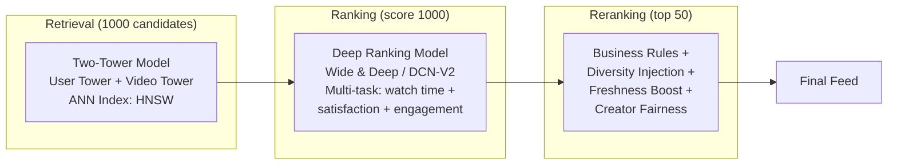
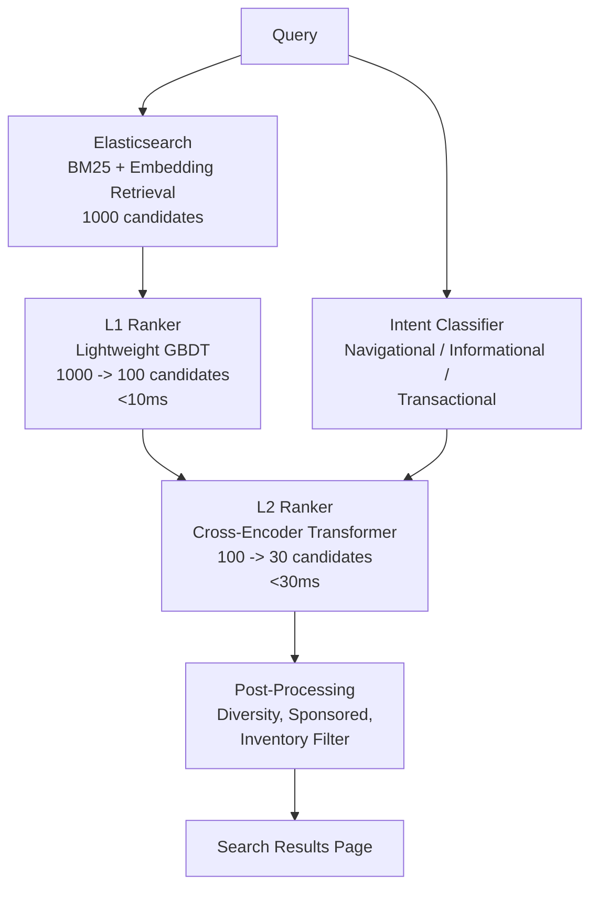
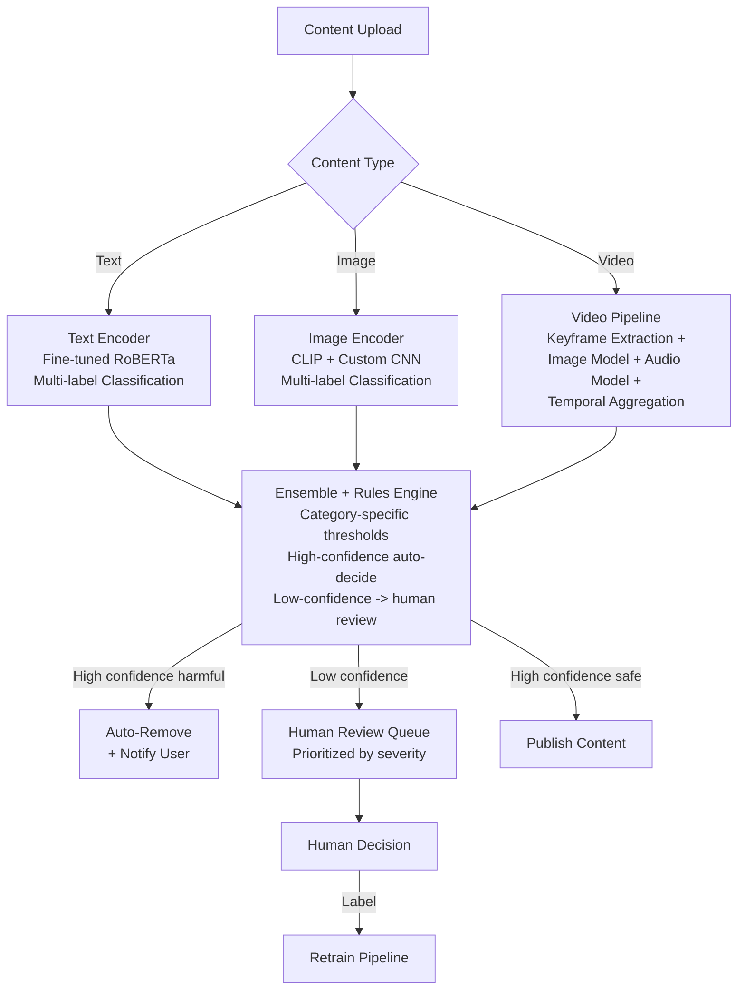
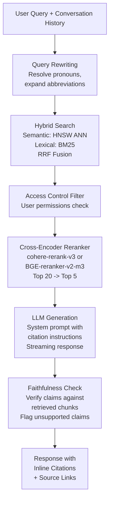
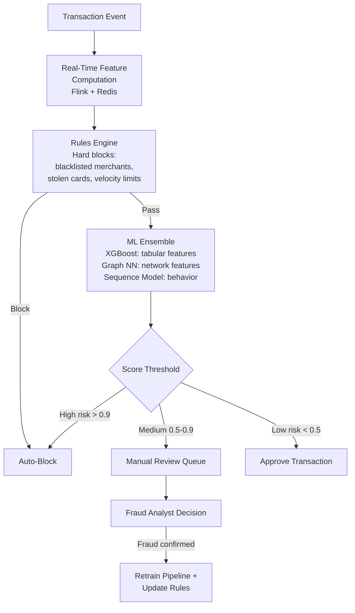
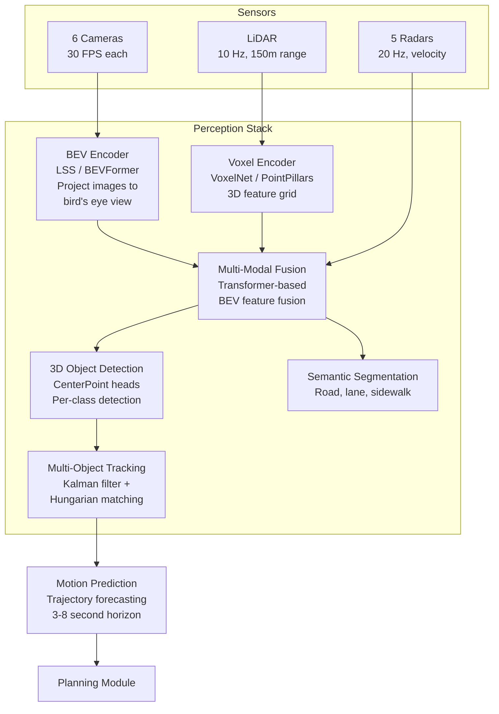

# ML System Design Templates

Six fully worked ML system designs. Each follows the 7-stage framework from SKILL.md. Use these as skeletons for practice -- adapt, do not memorize.

---

## 1. YouTube-Scale Video Recommendation System

### Requirements
- Recommend videos to 2B+ monthly active users
- Homepage feed, "Up Next" sidebar, notifications
- Optimize for watch time (primary), satisfaction (guardrail via surveys), diversity (guardrail)
- Latency: &lt;200ms for homepage, &lt;100ms for "Up Next"
- Must handle cold-start for new users and new videos

### Metrics

| Type | Metric | Target |
|------|--------|--------|
| Offline | Recall@K (retrieval) | &gt;0.30 at K=500 |
| Offline | NDCG (ranking) | &gt;0.45 |
| Online | Watch time per session | +2% vs control |
| Online | Daily active users | No regression |
| Guardrail | Survey satisfaction | No regression |
| Guardrail | Content diversity (entropy) | &gt;0.7 |

### Data Pipeline
- Implicit signals: watch time, completion rate, likes, shares, skips, scroll-past
- Explicit signals: thumbs up/down, "not interested", survey responses
- Video features: title embeddings, visual embeddings (from frames), audio features, metadata (category, creator, duration, upload date)
- User features: watch history, search history, demographics, device, time-of-day
- Pipeline: Kafka streaming for real-time events -> Spark for batch aggregation -> Feature store (online: Redis, offline: Hive)

### Feature Engineering
- User embedding: learned from interaction history (updated daily)
- Video embedding: multi-modal (text + visual + audio, updated on upload)
- Cross features: user-category affinity, time-of-day preference, device-format preference
- Real-time features: session watch history, current time, user location
- Feature freshness: user features daily, video features on upload, context features real-time

### Model Architecture

- **Retrieval**: Two-tower with approximate nearest neighbor (HNSW via FAISS). User tower encodes user features + recent history. Video tower encodes video features. Inner product scoring. Retrain daily.
- **Ranking**: Deep cross network (DCN-V2) with multi-task heads for watch time prediction, satisfaction prediction, and engagement prediction. Combines with Wide component for memorization. Retrain every 6 hours on streaming data.
- **Reranking**: Post-processing layer for diversity (MMR), freshness boost, creator fairness constraints, and business rules (e.g., promote Shorts, suppress near-duplicates).

### Serving Architecture
- Retrieval: precomputed user/video embeddings, ANN index updated hourly, served via custom C++ service
- Ranking: online inference on GPU cluster (TensorRT), batched requests, &lt;50ms p99
- Feature serving: Redis cluster for online features (&lt;5ms), Hive for offline training features
- Caching: prediction cache for returning users (invalidate on new watch event), embedding cache (TTL 1 hour)
- Scale: ~500K QPS peak, sharded by user ID hash

### Monitoring
- Data drift: monitor feature distributions daily (PSI threshold 0.1)
- Model metrics: track NDCG on holdout set hourly, watch time per session in real-time
- A/B testing: 1% canary -> 5% ramp -> 50/50 split, minimum 7-day test, account for novelty effect
- Rollback: shadow mode for new models, instant rollback via feature flag, 5-minute detection latency
- Feedback loop: user interactions feed back into training data within 24 hours

---

## 2. Real-Time Search Ranking (E-Commerce)

### Requirements
- Rank product search results for 100M+ daily queries
- Optimize for conversion rate (primary) and revenue per search (secondary)
- Latency: &lt;50ms total (retrieval + ranking)
- Handle query intent: navigational, informational, transactional
- Support personalization, seasonal trends, real-time inventory

### Metrics

| Type | Metric | Target |
|------|--------|--------|
| Offline | NDCG@10 | &gt;0.50 |
| Offline | MRR | &gt;0.40 |
| Online | Conversion rate | +1.5% vs control |
| Online | Revenue per search | +2% vs control |
| Guardrail | Search latency p99 | &lt;50ms |
| Guardrail | Click-through rate on page 1 | No regression |

### Data Pipeline
- Query logs: query text, clicked products, purchased products, dwell time, add-to-cart events
- Product catalog: title, description, images, price, category, brand, stock level, seller rating
- User signals: purchase history, browsing history, wishlist, location, device
- Real-time: inventory levels, price changes, flash sales, trending queries
- Pipeline: Kafka for click streams -> Flink for real-time aggregation -> Elasticsearch for retrieval -> Feature store for ML features

### Feature Engineering
- Query features: query embedding (BERT-based), query intent classifier, query frequency, seasonal signal
- Product features: product embedding, price percentile in category, review score, conversion rate, return rate, stock level
- Query-product features: BM25 score, semantic similarity, historical CTR for query-product pair
- User features: category affinity, price sensitivity, brand preference, purchase recency
- Real-time: session clicks, cart contents, time since last purchase

### Model Architecture

- **Retrieval**: Elasticsearch with BM25 + dense embedding retrieval (hybrid). 1000 candidates in &lt;10ms.
- **L1 Ranker**: LightGBM on precomputed features. Scores 1000 candidates in &lt;10ms. Features: BM25 score, semantic similarity, product popularity, price, reviews.
- **L2 Ranker**: Cross-encoder (DistilBERT fine-tuned) for query-product relevance. Scores 100 candidates with full attention. Multi-task: relevance + purchase probability.
- **Post-processing**: Diversity injection (no more than 3 results from same brand), sponsored placement, out-of-stock demotion.

### Serving Architecture
- Retrieval: Elasticsearch cluster with custom plugin for hybrid search
- L1: CPU inference, model cached in memory, feature lookup from Redis
- L2: GPU inference (Triton), batched across concurrent queries, quantized INT8
- Feature store: Redis for real-time features, DynamoDB for user features
- Caching: query-level cache for popular queries (LRU, 15-min TTL), embedding cache for products
- Scale: 3K QPS average, 15K QPS peak (flash sales)

### Monitoring
- Relevance: daily NDCG on human-judged query sets (100 queries, 3 judges per query)
- Business: conversion rate by query intent, revenue per search, zero-result rate
- Latency: p50/p95/p99 per ranking stage, alert on p99 &gt;50ms
- A/B testing: interleaving for ranking comparison, minimum 3-day test
- Feedback loop: click-through and purchase data feed L1/L2 retraining weekly

---

## 3. Content Moderation Pipeline (Text + Image + Video)

### Requirements
- Moderate user-generated content across text, images, and video
- Categories: hate speech, violence, nudity, spam, misinformation, self-harm
- Precision &gt;95% for auto-removal (minimize false positives), recall &gt;90% for review queue
- Latency: text &lt;100ms, image &lt;500ms, video &lt;5s (for first-frame check, async for full)
- Handle adversarial evasion (Unicode tricks, steganography, text-in-image)
- Support appeals workflow with human review

### Metrics

| Type | Metric | Target |
|------|--------|--------|
| Offline | Precision (auto-remove) | &gt;0.95 |
| Offline | Recall (review queue) | &gt;0.90 |
| Online | False positive rate (user appeals upheld) | &lt;2% |
| Online | Time to action (from upload to decision) | &lt;10s (text), &lt;60s (image) |
| Guardrail | Human review load | &lt;5% of total content |
| Guardrail | Evasion detection rate | &gt;80% on adversarial test set |

### Data Pipeline
- Training data: human-labeled content (internal + vendor), synthetic adversarial examples, public datasets (HatEval, MMHS150K)
- Labeling: 3-annotator consensus, specialist reviewers for edge cases, regular calibration sessions
- Data challenges: label subjectivity (cultural context), class imbalance (harmful content is &lt;1%), evolving policy
- Pipeline: content upload -> feature extraction -> model inference -> decision -> (optional) human review -> label back to training

### Model Architecture

- **Text**: Fine-tuned RoBERTa for multi-label classification. Handles: hate speech, threats, spam, self-harm. Adversarial robustness via character-level augmentation and homoglyph normalization.
- **Image**: CLIP embeddings + custom CNN head for NSFW/violence/hate-symbol detection. Perceptual hashing for known-bad content matching.
- **Video**: Keyframe extraction (1 FPS + scene change detection), per-frame image model, audio transcription + text model, temporal aggregation for context.
- **Rules engine**: Policy-specific thresholds per category, auto-escalation for high-severity (CSAM, terrorism), geographic policy variations.

### Serving Architecture
- Text: CPU inference, batched, &lt;100ms p99
- Image: GPU inference (TorchServe), precomputed hash lookup for known-bad content (&lt;10ms), model inference for unknown content (&lt;500ms)
- Video: async pipeline, first-frame check synchronous (&lt;5s), full video analysis async (&lt;5min)
- Scaling: auto-scale GPU pods on queue depth, priority queue for reported content
- Caching: perceptual hash database (billions of entries), embedding similarity cache for near-duplicates

### Monitoring
- Precision tracking: sample 1% of auto-removed content for human review weekly
- Recall tracking: monitor appeal rate and appeal success rate
- Adversarial testing: red team generates evasion attempts monthly, measure detection rate
- Policy drift: new policy additions trigger retraining within 48 hours
- Regional monitoring: per-region precision/recall because policies vary

---

## 4. Enterprise RAG System (with Evaluation)

### Requirements
- Answer questions over enterprise knowledge base (100K+ documents, 10M+ chunks)
- Sources: Confluence, Google Docs, Slack, Jira, code repositories, PDFs
- Accuracy: cited answers with verifiable sources, hallucination rate &lt;5%
- Latency: &lt;3s for answer generation (streaming first token &lt;500ms)
- Support multi-turn conversation with context carryover
- Handle access control (user can only see documents they have permission for)

### Metrics

| Type | Metric | Target |
|------|--------|--------|
| Offline | Retrieval recall@10 | &gt;0.85 |
| Offline | Answer faithfulness (LLM-as-judge) | &gt;0.90 |
| Offline | Citation precision | &gt;0.85 |
| Online | User satisfaction (thumbs up/down) | &gt;75% positive |
| Online | Answer latency (first token) | &lt;500ms |
| Guardrail | Hallucination rate | &lt;5% |
| Guardrail | Access control violation | 0% |

### Data Pipeline
- Ingestion: connectors for Confluence, Google Workspace, Slack, Jira, GitHub, S3 (PDFs)
- Chunking strategy: semantic chunking (respect section boundaries) + sliding window overlap, chunk size 512-1024 tokens
- Embedding: text-embedding-3-large (OpenAI) or E5-large-v2 (self-hosted), re-embed on document update
- Index: vector database (Pinecone/Weaviate/Qdrant) + BM25 index (Elasticsearch) for hybrid search
- Access control: document-level ACL stored alongside vectors, filtered at query time
- Refresh: webhook-triggered re-indexing on document update, full re-index weekly

### Feature Engineering
- Query features: query embedding, query type classifier (factual, procedural, comparative), entity extraction
- Document features: document embedding, recency score, authority score (based on author/source), access frequency
- Retrieval features: BM25 score, semantic similarity, document recency, source diversity
- Conversation features: conversation history embedding, topic continuity score

### Model Architecture

- **Query rewriting**: LLM rewrites multi-turn queries into standalone queries. Resolves "it", "that", abbreviations.
- **Hybrid search**: Reciprocal Rank Fusion of semantic (embedding similarity) and lexical (BM25) retrieval. 50-100 candidates.
- **Reranking**: Cross-encoder model scores query-document pairs with full attention. Top 20 -> top 5. Critical for precision.
- **Generation**: GPT-4o / Claude with system prompt enforcing citation format. Streaming for responsiveness.
- **Faithfulness check**: Post-generation verification that each claim is supported by a retrieved chunk. Flag or remove unsupported claims.

### Serving Architecture
- Embedding service: batch embedding for ingestion, online embedding for queries (&lt;100ms)
- Vector DB: managed service (Pinecone/Weaviate), ~50ms for ANN search
- Reranker: GPU inference, batched, &lt;200ms for 20 candidates
- LLM: API call with streaming, first token &lt;500ms
- Caching: query embedding cache, popular query answer cache (TTL 1 hour, invalidate on source doc update)
- Total latency budget: query rewrite (100ms) + search (100ms) + rerank (200ms) + generation (streaming from 500ms)

### Monitoring
- Retrieval quality: weekly human evaluation of retrieval relevance on 50 query sample
- Answer quality: LLM-as-judge for faithfulness (automated daily), human evaluation weekly
- Hallucination monitoring: automated claim extraction + verification pipeline, alert on &gt;5% hallucination rate
- User feedback: thumbs up/down per answer, track satisfaction trend
- Index freshness: monitor document staleness, alert on stale sources cited
- A/B testing: test retrieval strategies, reranker models, generation prompts independently

---

## 5. Real-Time Fraud Detection

### Requirements
- Detect fraudulent transactions in real-time for a payment platform
- Transaction volume: 10K TPS peak, 3K TPS average
- Latency: &lt;100ms per transaction (decision before authorization)
- Precision &gt;99% for auto-block (minimize false positives on legitimate transactions)
- Recall &gt;85% for fraud (catch most fraud, accept some false negatives for review)
- Handle adversarial adaptation (fraudsters change tactics)

### Metrics

| Type | Metric | Target |
|------|--------|--------|
| Offline | AUC-ROC | &gt;0.98 |
| Offline | Precision at 85% recall | &gt;0.50 |
| Online | False positive rate (legitimate blocked) | &lt;0.1% |
| Online | Fraud loss rate ($ fraud / $ total) | &lt;0.05% |
| Guardrail | Decision latency p99 | &lt;100ms |
| Guardrail | Model freshness | Retrained within 24h of new fraud pattern |

### Data Pipeline
- Transaction data: amount, merchant, category, location, timestamp, device, IP, card info
- User history: transaction history, account age, velocity patterns, historical fraud flags
- External data: IP geolocation, device fingerprint, merchant risk scores, consortium data
- Labels: confirmed fraud (chargebacks, investigations), confirmed legitimate (no dispute after 60 days)
- Label delay: fraud labels arrive 30-90 days after transaction (chargeback cycle)
- Pipeline: Kafka streaming -> Flink for real-time feature computation -> model serving -> decision engine

### Feature Engineering
- Transaction features: amount, merchant category, time of day, day of week, is_international
- Velocity features (real-time): transactions in last 1h/24h/7d, unique merchants in 24h, amount in 24h
- Behavioral features: deviation from user's typical amount, new merchant flag, new device flag, new location flag
- Graph features: merchant risk score (fraud rate), device cluster score, IP reputation
- Derived: amount / average_amount ratio, time_since_last_transaction, geographic_velocity (distance/time)

### Model Architecture

- **Rules engine**: Deterministic checks first (blacklists, velocity limits, amount limits). Fast and interpretable. Catches ~30% of fraud.
- **XGBoost**: Primary model on tabular features. Fast inference (&lt;5ms). Handles feature interactions well.
- **Graph neural network**: Captures device/IP/merchant network patterns. Batch-computed graph features updated hourly, fed into XGBoost.
- **Sequence model**: LSTM on user's transaction history for behavioral anomaly detection. Precomputed user state updated per transaction.
- **Ensemble**: Weighted average with XGBoost dominant. Three threshold tiers: auto-block, review, approve.

### Serving Architecture
- Feature store: Redis for real-time features (velocity, running averages), updated per transaction
- Rules engine: in-memory, &lt;2ms latency
- ML model: CPU inference (XGBoost), batched, &lt;10ms
- Total budget: feature lookup (10ms) + rules (2ms) + ML inference (10ms) + decision logic (5ms) = ~27ms p50
- Scaling: stateless model servers, auto-scale on TPS, geographically distributed
- Fallback: if model service is down, rules-only mode (higher false positive rate, acceptable for availability)

### Monitoring
- Real-time dashboards: fraud rate, false positive rate, decision distribution, latency
- Model drift: daily comparison of feature distributions between training and production
- Adversarial detection: cluster analysis of blocked transactions, alert on new attack patterns
- Feedback loop: chargeback data feeds retraining within 24 hours (challenge: 30-90 day label delay, use early fraud indicators)
- A/B testing: careful -- cannot A/B test by approving known fraud. Use shadow scoring and historical replay.

---

## 6. Autonomous Vehicle Perception Stack

### Requirements
- Real-time 3D object detection and tracking for autonomous vehicles
- Sensors: 6 cameras (360-degree), 1 LiDAR, 5 radars, IMU, GPS
- Object classes: vehicles, pedestrians, cyclists, traffic signs, lane markings, road edges
- Latency: &lt;100ms end-to-end (sensor input to 3D bounding boxes)
- Safety: miss rate &lt;0.01% for pedestrians within 50m (safety-critical)
- Handle: rain, snow, night, glare, construction zones, emergency vehicles

### Metrics

| Type | Metric | Target |
|------|--------|--------|
| Offline | mAP@0.5 IoU (3D) | &gt;0.80 |
| Offline | Pedestrian recall @50m | &gt;99.99% |
| Offline | False positive rate | &lt;1 per 10km driven |
| Online | Disengagement rate | &lt;1 per 1000 miles |
| Guardrail | End-to-end latency | &lt;100ms |
| Guardrail | Functional safety (ASIL-D) | 0 critical failures |

### Data Pipeline
- Collection: fleet of test vehicles with calibrated sensor suites, data recorded at 10Hz
- Labeling: 3D bounding box annotation (LiDAR point cloud + camera images), lane marking annotation
- Scale: petabytes of raw sensor data, millions of labeled frames
- Long-tail: active learning to find rare scenarios (emergency vehicles, construction, animals)
- Simulation: synthetic data generation (CARLA, internal simulator) for corner cases
- Pipeline: raw data -> calibration + synchronization -> labeling -> quality review -> training dataset

### Model Architecture

- **Camera backbone**: BEVFormer or LSS (Lift-Splat-Shoot) to project 2D images into bird's-eye-view features. Run on GPU.
- **LiDAR backbone**: PointPillars or VoxelNet for 3D voxel encoding. Efficient point cloud processing.
- **Fusion**: Transformer-based attention over BEV features from camera + LiDAR + radar. Learns to weight modalities by scenario (camera better for signs, LiDAR better for geometry, radar better for velocity).
- **Detection**: CenterPoint heads for 3D bounding box prediction. Per-class heads for different object types.
- **Tracking**: Extended Kalman filter for state estimation, Hungarian algorithm for association, handle occlusion and reappearance.

### Serving Architecture
- Hardware: NVIDIA Orin / Thor SoC, dedicated inference accelerator
- Model optimization: TensorRT, INT8 quantization, pruning (must maintain safety metrics)
- Latency budget: camera processing (20ms) + LiDAR processing (15ms) + fusion (10ms) + detection (15ms) + tracking (5ms) + prediction (15ms) = ~80ms
- Redundancy: dual compute units, fallback to radar-only mode if camera/LiDAR fails
- OTA updates: model updates deployed via over-the-air, staged rollout (1% fleet -> 10% -> 100%)

### Monitoring
- Per-vehicle telemetry: inference latency, detection confidence distributions, sensor health
- Fleet-wide analytics: disengagement analysis (what caused human takeover), near-miss detection
- Shadow mode: new model runs in parallel, predictions compared but not acted upon
- Simulation regression: every model update tested against 10K+ scenarios in simulation before deployment
- Safety: formal verification for safety-critical paths, redundant perception for ASIL-D compliance
- Feedback loop: disengagement events trigger automatic data collection and prioritized labeling
