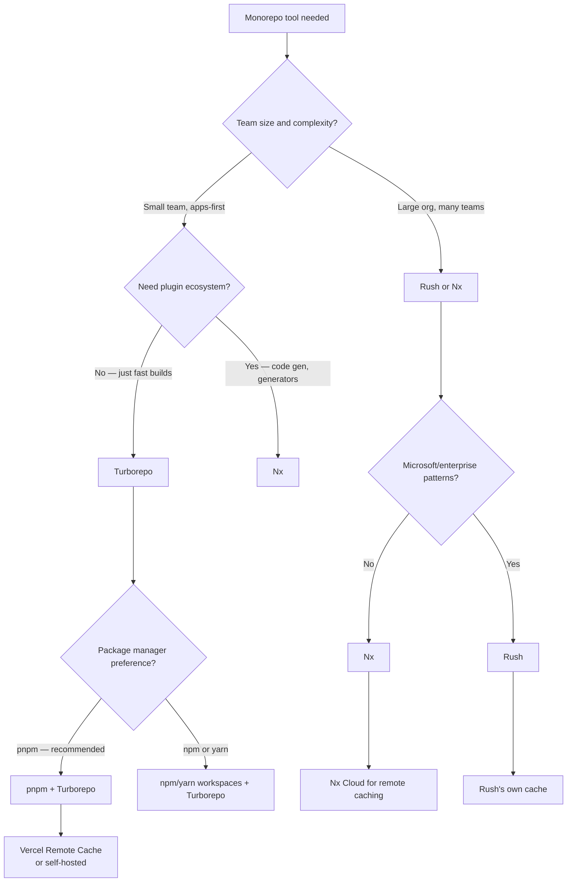
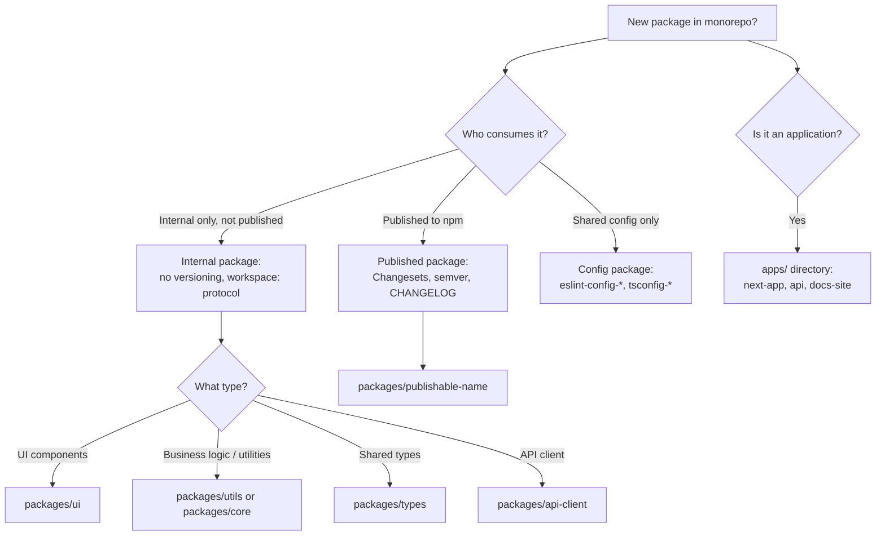
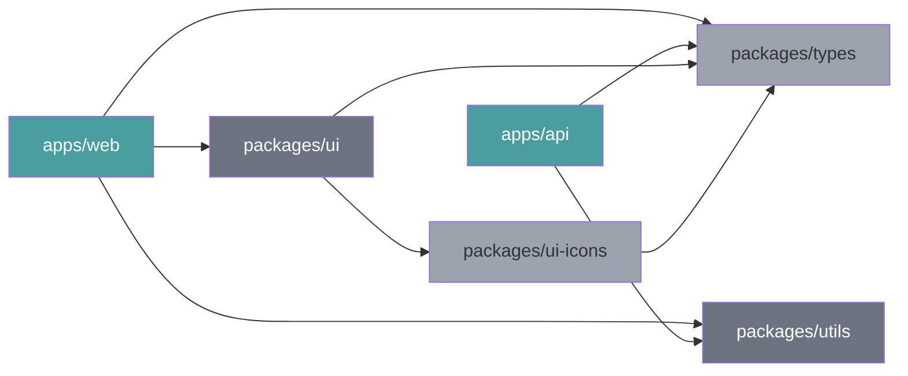

# Monorepo Management

Monorepo tooling and workspace architecture expert for JavaScript and TypeScript projects. Covers tool selection, task pipeline configuration, dependency graph management, CI optimization, and versioning strategy.

## When to Use

Use for:
- Choosing between Turborepo, Nx, Lerna, and Rush for a new or migrating repository
- Configuring `turbo.json` task pipelines, remote caching, and Docker pruning
- Structuring workspace packages: apps, packages, shared configs, internal libraries
- Setting up pnpm or npm workspaces with correct hoisting rules
- Eliminating circular dependencies between workspace packages
- Configuring path-based CI with affected package detection
- Managing package versioning and changelogs with Changesets

NOT for:
- Git submodules or polyrepo coordination → discuss trade-offs separately
- Bazel, Pants, or Buck for non-JavaScript monorepos
- Single-package repository setup → use project-level tooling skills
- Container orchestration of services within the monorepo → use docker-containerization

---

## Tool Selection Decision Tree



### Tool Comparison Summary

| Tool | Best For | Remote Cache | Learning Curve |
|------|----------|-------------|----------------|
| **Turborepo** | Apps-first, fast builds, simple config | Vercel / self-hosted | Low |
| **Nx** | Library-heavy, code generation, plugin ecosystem | Nx Cloud / self-hosted | Medium |
| **Rush** | Enterprise, Microsoft stack, strict isolation | Custom | High |
| **Lerna** | Legacy — migrating from | None (use with Turborepo) | Low |

**Recommendation for new projects**: Start with pnpm workspaces + Turborepo. Migrate to Nx if you need advanced code generation or project graph visualization.

---

## Workspace Architecture Decision Tree



---

## Dependency Graph and Build Pipeline



**Reading the graph**: Build order flows from dependencies to dependents. `packages/types` (no deps) builds first. `packages/ui` builds after `types`. `apps/web` builds last. Turborepo and Nx compute this graph automatically — you define task dependencies, they order execution.

---

## Turborepo Configuration

### turbo.json — Task Pipeline

```json
{
  "$schema": "https://turbo.build/schema.json",
  "tasks": {
    "build": {
      "dependsOn": ["^build"],
      "inputs": ["src/**/*.tsx", "src/**/*.ts", "package.json", "tsconfig.json"],
      "outputs": [".next/**", "!.next/cache/**", "dist/**"]
    },
    "test": {
      "dependsOn": ["^build"],
      "inputs": ["src/**/*.ts", "src/**/*.tsx", "**/*.test.ts", "**/*.test.tsx"],
      "outputs": ["coverage/**"]
    },
    "lint": {
      "inputs": ["src/**/*.ts", "src/**/*.tsx", ".eslintrc*"]
    },
    "typecheck": {
      "dependsOn": ["^build"]
    },
    "dev": {
      "cache": false,
      "persistent": true
    }
  }
}
```

**Key concepts**:
- `^build` means "build all dependencies first before building this package"
- `inputs` determines cache keys — changes outside inputs don't invalidate the cache
- `outputs` are stored in cache and restored on cache hit
- `cache: false` for long-running tasks (dev servers, watchers)
- `persistent: true` for tasks that don't exit

### Running Tasks

```bash
# Run build for all packages
turbo build

# Run only for packages affected by changes since main branch
turbo build --filter=...[origin/main]

# Run for a specific app and its dependencies
turbo build --filter=web...

# Run in parallel across packages
turbo lint typecheck --parallel

# Dry run to see what would execute
turbo build --dry-run
```

### Remote Caching

```bash
# Login to Vercel remote cache (free for open source)
npx turbo login

# Link to team/project
npx turbo link

# CI: pass token via environment
TURBO_TOKEN=$TURBO_TOKEN turbo build
```

Self-hosted alternative: `turbo-remote-cache` package or Turborepo's built-in HTTP cache server in Turborepo 2.x.

**Consult** `references/turborepo-patterns.md` for Docker pruning for deployment, scoped filtering, and advanced pipeline patterns.

---

## pnpm Workspaces

### pnpm-workspace.yaml

```yaml
packages:
  - 'apps/*'
  - 'packages/*'
  - 'tools/*'
```

### package.json workspace dependencies

```json
{
  "dependencies": {
    "@myorg/ui": "workspace:*",
    "@myorg/utils": "workspace:^1.0.0"
  }
}
```

Use `workspace:*` for internal packages that should always match the local version. Use `workspace:^` only for internal packages that are also published and where you want semver range resolution.

### Hoisting Control

```
# .npmrc — control hoisting behavior
hoist=true
public-hoist-pattern[]=*eslint*
public-hoist-pattern[]=*prettier*
shamefully-hoist=false  # never — breaks encapsulation
```

`shamefully-hoist=true` is a trap: it makes all packages available everywhere but breaks encapsulation. If your tools require it, fix the tool dependency instead.

---

## Changesets for Versioning

```bash
# Initialize in your monorepo
npx changeset init

# Create a changeset when making a change
npx changeset
# Prompts: which packages changed, major/minor/patch, description

# Preview what versions will be bumped
npx changeset status

# Bump versions and update changelogs (CI or release branch)
npx changeset version

# Publish to npm
npx changeset publish
```

### .changeset/config.json

```json
{
  "$schema": "https://unpkg.com/@changesets/config@3.0.0/schema.json",
  "changelog": "@changesets/cli/changelog",
  "commit": false,
  "fixed": [],
  "linked": [],
  "access": "restricted",
  "baseBranch": "main",
  "updateInternalDependencies": "patch",
  "ignore": ["@myorg/app-web", "@myorg/app-api"]
}
```

Set `access: "public"` for open-source packages. `ignore` lists apps that should not be published to npm.

**Consult** `references/workspace-architecture.md` for full CODEOWNERS setup, ESLint config sharing, and shared tsconfig patterns.

---

## Path-Based CI (Only Test What Changed)

```yaml
# .github/workflows/ci.yml
name: CI

on:
  push:
    branches: [main]
  pull_request:

jobs:
  build:
    runs-on: ubuntu-latest
    steps:
      - uses: actions/checkout@v4
        with:
          fetch-depth: 0  # required for turbo --filter to work correctly

      - uses: pnpm/action-setup@v4
        with:
          version: 9

      - uses: actions/setup-node@v4
        with:
          node-version: 20
          cache: 'pnpm'

      - run: pnpm install --frozen-lockfile

      - name: Build affected packages
        run: pnpm turbo build --filter=...[origin/main]
        env:
          TURBO_TOKEN: ${{ secrets.TURBO_TOKEN }}
          TURBO_TEAM: ${{ vars.TURBO_TEAM }}

      - name: Test affected packages
        run: pnpm turbo test --filter=...[origin/main]
```

`--filter=...[origin/main]` means "run for packages whose files changed compared to `main`, plus all packages that depend on them (upstream consumers)."

---

## Anti-Patterns

### Anti-Pattern: No Task Caching (Rebuilding Everything)

**Novice**: "We run `turbo build` and it always rebuilds all 40 packages, even when only one changed."

**Expert**: Turborepo caches by computing a hash of inputs (source files + env + turbo config). If inputs haven't changed, the output is restored from cache in milliseconds. The most common cause of cache misses is missing `inputs` declarations — Turborepo falls back to hashing the entire package directory, including files like `.DS_Store`, `node_modules`, and IDE configs that change constantly.

**Detection**: Run `turbo build --verbosity=2` and look for "MISS" next to packages. Check whether `.turbo` cache entries exist and if the hash matches between runs.

**Fix**: Explicitly declare `inputs` in `turbo.json` to include only files that affect build output. Explicitly declare `outputs` so the cache knows what to store. Add non-source files to `.gitignore` and `.turboignore`.

**LLM mistake**: Tutorials often omit `inputs` and `outputs` because a working demo doesn't need them. Production repos require explicit declarations or cache hit rates stay near 0%.

---

### Anti-Pattern: Circular Dependencies Between Workspace Packages

**Novice**: "`packages/auth` imports from `packages/api-client` and `packages/api-client` imports from `packages/auth` — is that a problem?"

**Expert**: Yes. Circular dependencies make build order impossible to determine. Turborepo will error on cycles. More importantly, circular deps indicate a design flaw: two packages whose concerns are entangled. The fix is to extract the shared types or utilities to a third package that both can import without creating a cycle.

**Detection**:
```bash
# Turborepo detects cycles and refuses to run
turbo build  # "Error: Package graph cycle detected"

# Manual detection with madge
npx madge --circular --extensions ts packages/
```

**Fix**:
```
Before:
  packages/auth → packages/api-client → packages/auth (cycle!)

After:
  packages/types (new: shared auth types, no dependencies)
  packages/api-client → packages/types
  packages/auth → packages/types
  packages/auth → packages/api-client (one-way, no cycle)
```

**Timeline**: This is not a new problem — circular deps have been a JavaScript packaging issue since npm v1 (2010). The reason it appears in monorepos specifically is that workspace packages make it easy to import across package boundaries without thinking about dependency direction.

---

### Anti-Pattern: Using `shamefully-hoist=true` in pnpm

**Novice**: "My CLI tool can't find its peer dependency. I'll add `shamefully-hoist=true` to `.npmrc` to fix it."

**Expert**: `shamefully-hoist` makes pnpm behave like npm/yarn classic, putting all packages in a flat `node_modules`. This "fixes" the immediate issue but breaks pnpm's strict isolation, which is the entire reason to use pnpm. The right fix is to add the missing peer dependency to the package that needs it, or use `public-hoist-pattern` to hoist only the specific package that requires it.

**Detection**: Any `.npmrc` with `shamefully-hoist=true` in a pnpm workspace.

---

## References

- `references/turborepo-patterns.md` — Consult when configuring turbo.json, setting up remote caching, using Docker pruning for deployment, or debugging cache misses.
- `references/workspace-architecture.md` — Consult when designing package boundaries, sharing ESLint/TypeScript configs, setting up CODEOWNERS, or planning a migration from single-repo to monorepo.
