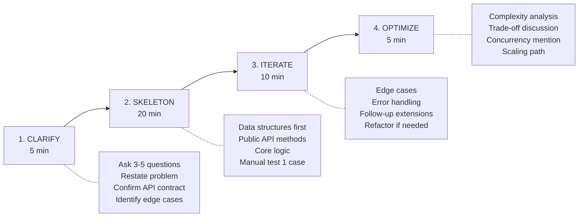
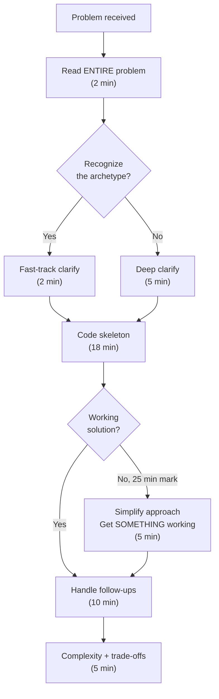

# Senior Coding Interview

Execute L6+ real-world coding interviews where the problem is building a small system, not solving an algorithm puzzle. The core differentiator at Staff+ level is not whether you can solve it, but how you solve it: clean abstractions, narrated reasoning, graceful iteration, and production sensibility.

## When to Use

- Practicing real-world coding problems (in-memory stores, rate limiters, task schedulers)
- Reviewing interview code for senior-level signals
- Preparing communication strategy for live coding sessions
- Working through CodeSignal incremental-style problems
- Mock interview practice with follow-up extensions

**NOT for:**
- LeetCode/competitive programming (segment trees, suffix arrays, contest optimization)
- Behavioral interviews (use interview-loop-strategist)
- System design whiteboard with no code (use ml-system-design-interview)
- Resume or career strategy

---

## The 4-Stage Approach

### Stage 1: Clarify (5 minutes)

**Goal**: Demonstrate you think before coding. Ask questions that reveal ambiguity the interviewer planted intentionally.

Mandatory questions for every problem:
1. **Scale**: "How many items/requests are we expecting?" (determines data structure choice)
2. **API surface**: "Should this be a class with methods, or standalone functions?"
3. **Constraints**: "Are keys always strings? Can values be None/null?"
4. **Concurrency**: "Single-threaded for now, or should I consider thread safety?"
5. **Error handling**: "Should invalid input raise exceptions or return error values?"

Restate the problem in your own words before writing any code. This catches misunderstandings early and signals comprehension.

### Stage 2: Skeleton (20 minutes)

**Goal**: Get a working solution for the core case. Not perfect, not optimized -- working.

Order of implementation:
1. Define the data model (dataclass or NamedTuple for structured data)
2. Write the class/function signatures with type hints
3. Implement the happy path
4. Manually trace through one example out loud

**Senior signal**: Start with the public API, not the internal helpers. Show top-down thinking.

### Stage 3: Iterate (10 minutes)

**Goal**: Handle follow-ups. This is where Staff+ candidates differentiate -- each extension should feel like a natural evolution, not a rewrite.

The follow-up ladder (interviewers typically go 2-3 levels deep):
1. **Working** -- Base problem solved
2. **Edge Cases** -- Empty inputs, duplicates, overflow, None values
3. **Concurrent** -- Thread safety, locks, atomic operations
4. **Distributed** -- Multiple nodes, consistency, partitioning
5. **Fault-tolerant** -- Crash recovery, persistence, graceful degradation

**Senior signal**: When asked "how would you make this distributed?", discuss the trade-offs before changing code. Name specific patterns (consistent hashing, write-ahead logs). You don't need to implement distributed systems in 40 minutes -- you need to show you know the path.

### Stage 4: Optimize & Discuss (5 minutes)

**Goal**: Show you understand what you built and where it breaks.

Cover:
- Time and space complexity for each operation
- What would break at 10x scale
- What you would change given more time
- Testing strategy (what tests would you write first?)

---

## Problem Archetypes

| Archetype | Core Data Structure | Key Follow-ups | Reference |
|-----------|-------------------|----------------|-----------|
| In-Memory Key-Value Store | `dict` + metadata | TTL, transactions, snapshots | `references/problem-archetypes.md` |
| File System Abstraction | Trie or nested dict | Glob patterns, watchers, permissions | `references/problem-archetypes.md` |
| Rate Limiter | `deque` or sorted list | Sliding window, distributed, token bucket | `references/problem-archetypes.md` |
| LRU Cache | `OrderedDict` or dict+DLL | Generics, TTL, size-based eviction | `references/problem-archetypes.md` |
| Task Scheduler | Heap + dict | Priorities, dependencies, cancellation | `references/problem-archetypes.md` |
| Event/Pub-Sub System | `defaultdict(list)` | Typed events, wildcards, async delivery | `references/problem-archetypes.md` |
| Log Parser/Analyzer | Generators + Counter | Streaming, time windows, aggregation | `references/problem-archetypes.md` |
| API Client with Retry | State machine | Backoff, circuit breaker, idempotency | `references/problem-archetypes.md` |

---

## Communication Protocol

Senior interviews are 50% code and 50% communication. The interviewer is evaluating whether they want to work with you, not just whether you can solve the problem.

### What to Narrate

- **Before writing**: "I'm going to use a dict with timestamps as values because we need O(1) lookup and the TTL check can be lazy."
- **At decision points**: "I could use a heap here for O(log n) insert, but since we're told the number of items is small, a sorted list with bisect is simpler and good enough."
- **When stuck**: "I'm not sure about the best way to handle concurrent access here. Let me get the single-threaded version working first, then we can discuss locks."
- **After completing**: "The core operations are O(1) for get/set. The cleanup sweep is O(n) but only runs periodically."

### What NOT to Do

- Don't narrate syntax: "Now I'm writing a for loop..." -- the interviewer can see that.
- Don't go silent for more than 60 seconds. If you're thinking, say so.
- Don't ask "Is this right?" -- instead say "Let me trace through an example to verify."

---

## Senior Signals Checklist

These are the things that make an interviewer write "strong hire" for L6+:

| Signal | How to Demonstrate |
|--------|-------------------|
| Clean abstractions | Separate concerns: data model, business logic, I/O |
| Production sensibility | Error handling, input validation, logging mentions |
| Testing awareness | "I'd test the TTL edge case where expiry happens during a get" |
| Extensibility | Design classes that can be extended without rewriting |
| Trade-off fluency | Name multiple approaches, choose one, explain why |
| Complexity awareness | State big-O for each operation without being asked |
| Concurrency knowledge | Mention thread safety even if not implementing it |
| Stdlib mastery | Use `dataclasses`, `defaultdict`, `deque`, generators naturally |

---

## Python Patterns for Senior Interviews

Senior candidates use Python idioms that signal deep experience. See `references/python-patterns-senior.md` for the complete catalog with examples.

Key patterns to internalize:
- `@dataclass` for any structured data (not raw dicts)
- Context managers for resource cleanup
- Generators for streaming/lazy evaluation
- `collections.defaultdict`, `Counter`, `deque` -- know the stdlib
- Type hints on public methods (skip on internal helpers in time-pressured interviews)
- Exception hierarchies for domain errors

---

## Anti-Patterns

### Anti-Pattern: LeetCode Brain

**Novice**: Reaches for algorithmically elegant solutions (segment trees, suffix arrays, Fenwick trees) when a hash map or sorted list suffices. Spends 15 minutes on optimal time complexity for a problem where n &lt; 1000.

**Expert**: Chooses the simplest correct solution first. Uses built-in data structures (`dict`, `list`, `deque`, `heapq`) unless the problem explicitly demands otherwise. Discusses when algorithmic sophistication matters only if asked about scale. The goal is working, readable, maintainable code -- not a competitive programming submission.

**Detection**: Solution is asymptotically optimal but unmaintainable. Candidate cannot explain trade-offs between their approach and a simpler one. No working solution exists at the 25-minute mark because they're still optimizing.

### Anti-Pattern: Silent Coder

**Novice**: Writes code for 15+ minutes without speaking. Treats the interview like a solo coding session. When they do speak, they narrate syntax ("Now I'm writing a for loop") rather than intent.

**Expert**: Narrates intent before writing code ("I'm going to use a dict here because we need O(1) lookup by key"). Asks clarifying questions when ambiguity appears. Signals uncertainty honestly ("I'm not sure if Python's `heapq` supports decrease-key -- let me use a different approach that I'm confident in"). Treats the interviewer as a collaborator, not an examiner.

**Detection**: Interviewer has to prompt "what are you thinking?" more than twice. Long silences followed by large code blocks. No questions asked during the clarify phase.

### Anti-Pattern: Premature Optimization

**Novice**: Starts with the distributed/concurrent/fault-tolerant version before solving the single-machine case. Adds caching, sharding, or thread pools before there's a working solution to optimize. Designs for 10 million users when the problem says "a few thousand."

**Expert**: Gets a working solution first, then optimizes when asked. Separates "what I'd do in production" from "what I'm implementing in this 40-minute interview." When the interviewer asks about scale, discusses the optimization path verbally: "I'd add a write-ahead log for durability, then shard by key hash for horizontal scaling."

**Detection**: No working solution at the 25-minute mark. Code has `Lock`, `ThreadPoolExecutor`, or `asyncio` imports but no passing test case. Architecture diagram exists but core logic doesn't.

---

## CodeSignal Incremental Format

CodeSignal's pre-recorded incremental format (used by Anthropic and others) differs from live interviews. See `references/codesignal-incremental.md` for detailed strategy.

Key differences:
- No interviewer to ask questions -- you must self-clarify from the problem statement
- Incremental stages build on your previous code -- design for extension from the start
- Time pressure is real but self-managed -- no one tells you to move on
- You can re-read the problem statement -- do it before each stage

---

## Time Budget Decision Tree

---

## References

- `references/problem-archetypes.md` -- Consult for worked examples of 8 problem archetypes with skeletons, clarifying questions, and follow-up extensions
- `references/python-patterns-senior.md` -- Consult for senior Python idioms that signal experience: dataclasses, context managers, generators, stdlib mastery, testing hooks
- `references/codesignal-incremental.md` -- Consult when preparing for CodeSignal's pre-recorded incremental format: time management, extension strategies, self-testing without an interviewer
