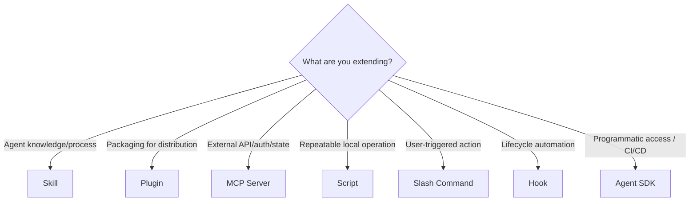

# Claude Extension Taxonomy: Skills, Plugins, MCPs, Hooks, Agent SDK

The Claude ecosystem has seven extension types. Each serves a different purpose. Choosing the wrong one is a common mistake. This reference defines each type and when to use it.

**Last updated**: March 2026

---

## The Full Taxonomy



---

## Skills (SKILL.md in `.claude/skills/`)

**What they are**: Markdown documents that encode domain expertise, decision trees, anti-patterns, and process instructions. Loaded into the agent's context as standard operating procedures.

**How they work**: The runtime scans `name` + `description` at startup. When a skill matches a query, its full SKILL.md is loaded into context. Reference files are loaded on demand.

**When to use**:
- Encoding domain expertise (shibboleths, anti-patterns, temporal knowledge)
- Providing decision trees and process workflows
- Defining output contracts for downstream consumers
- Teaching the agent HOW to think about a domain

**When NOT to use**:
- Calling external APIs (use MCP)
- Running code (use scripts)
- Providing a user-triggered action (use slash command)

**Key property**: Skills are **passive knowledge** — they shape the agent's reasoning but don't execute code. They're the cheapest, most portable extension type.

**Frontmatter fields** (as of March 2026):

| Field | Required | Purpose |
|-------|----------|---------|
| `name` | No (defaults to dir name) | Display name |
| `description` | Recommended | Activation trigger + keywords |
| `allowed-tools` | No | Tool whitelist (least privilege) |
| `argument-hint` | No | Autocomplete hint |
| `disable-model-invocation` | No | `true` = user-only via `/` |
| `user-invocable` | No | `false` = hidden from `/` menu |
| `context` | No | `fork` = run in isolated subagent |
| `agent` | No | Which subagent type when `context: fork` |
| `model` | No | Override model when skill is active |
| `hooks` | No | Hooks scoped to skill lifecycle |
| `license` | No | License identifier |
| `metadata` | No | Arbitrary key-value map |

---

## Plugins (`.claude-plugin/plugin.json`)

**What they are**: Self-contained directories that bundle skills, agents, hooks, MCP servers, and slash commands into a distributable package. Plugins are the **packaging and distribution** mechanism for Claude Code extensions.

**How they work**: Plugins live in a directory with `.claude-plugin/plugin.json` manifest. Components are auto-discovered in standard locations (`skills/`, `agents/`, `commands/`, `hooks/`). When installed, plugin components get namespaced: `plugin-name:skill-name`.

**When to use**:
- Sharing skills with teammates or the community
- Bundling related skills + hooks + MCP servers together
- Distributing via marketplaces (git repos with `marketplace.json`)
- Versioning and publishing extension sets

**When NOT to use**:
- Personal-only skills (just use `.claude/skills/` directly)
- Single scripts that don't need packaging
- One-off customizations

**The colon syntax**: `/plugin-name:skill-name` is **namespacing**, preventing collisions when multiple plugins define components with the same name.

**Plugin directory structure**:
```
my-plugin/
├── .claude-plugin/
│   └── plugin.json          # Manifest (only this goes in .claude-plugin/)
├── skills/                  # Skill directories (SKILL.md in each)
├── agents/                  # Agent definitions (markdown)
├── commands/                # Slash commands (markdown)
├── hooks/
│   └── hooks.json           # Hook configuration
├── .mcp.json                # MCP server configs
├── settings.json            # Default settings
└── README.md
```

**Distribution methods**:
- Local: `claude --plugin-dir ./my-plugin`
- Marketplace: `claude plugin install name@marketplace`
- Official directory: `github.com/anthropics/claude-plugins-official`

**Key property**: Plugins are for **distribution**, not for new functionality. All plugin components (skills, hooks, MCP servers, agents) work identically whether standalone or inside a plugin.

**Full guide**: See `references/plugin-architecture.md`

---

## MCP Servers (Model Context Protocol)

**What they are**: Standalone servers that expose tools, resources, and prompts to Claude via a standardized JSON-RPC 2.0 protocol. They run as separate processes.

**How they work**: Claude discovers available tools from the MCP server at startup. When the agent decides to use a tool, it sends a JSON-RPC request to the server, which executes the operation and returns results.

**Three transport types**:

| Transport | Use Case | Command |
|-----------|----------|---------|
| **HTTP** (recommended) | Remote cloud services | `claude mcp add --transport http name url` |
| **SSE** (deprecated) | Server-Sent Events | `claude mcp add --transport sse name url` |
| **stdio** | Local processes | `claude mcp add --transport stdio name -- cmd args` |

**Configuration scopes**:
- **Local** (default): `~/.claude.json` under project path
- **Project**: `.mcp.json` at project root (committed to VCS)
- **User**: `~/.claude.json` globally
- **Plugin**: `.mcp.json` at plugin root (bundled)

**When to use**:
- External API access requiring authentication (OAuth, API keys)
- Stateful connections (WebSockets, database connections, sessions)
- Operations needing security boundaries (credentials shouldn't be in prompts)
- Real-time data streams or event subscriptions
- Rate-limited services that need connection pooling

**When NOT to use**:
- Simple local file operations (just use scripts or built-in tools)
- Stateless computations (scripts are lighter weight)
- One-off operations that don't need auth or state
- Encoding domain knowledge (use skills)

**Tool Search**: When many MCP servers are configured and tool descriptions exceed 10% of context window, Claude Code automatically enables Tool Search — deferring MCP tool loading until needed.

**Skills + MCP**: Skills can reference MCP tools in `allowed-tools` using `mcp__<server>__<tool>` naming. Skills cannot formally declare MCP dependencies in frontmatter, but can document requirements.

**Key property**: MCPs are for **operations that need auth, state, or security boundaries**. Not a general abstraction layer. If you don't need those things, a script is simpler.

**Status (March 2026)**: MCP is the universal tool integration standard. Spec at `modelcontextprotocol.io/specification/2025-11-25`. Donated to Linux Foundation's AAIF in Dec 2025.

---

## Scripts (`scripts/` in skill folders)

**What they are**: Working code files (Python, Bash, Node.js) bundled with skills that perform repeatable operations.

**How they work**: The agent runs them via Bash tool calls. They take CLI arguments, do their work, and return results via stdout.

**When to use**:
- Repeatable local operations (validation, analysis, transformation)
- Domain-specific algorithms that must be implemented correctly
- Pre-flight checks that prevent common errors
- Batch processing of local files
- Any stateless computation

**When NOT to use**:
- Operations requiring auth or API keys (use MCP)
- Stateful operations across multiple calls (use MCP)
- Long-running background processes (use MCP or Temporal)

**Requirements**: Must actually work (not templates), minimal dependencies (prefer stdlib), clear CLI interface, graceful error handling, installation docs.

**Key property**: Scripts are **the workhorse of self-contained skills**. They make skills immediately useful without any infrastructure setup.

---

## Slash Commands (`/command-name`)

**What they are**: User-triggered actions invoked by typing `/` in the Claude Code interface.

**How they work**: When a user types `/skill-name`, Claude loads that skill's SKILL.md and executes it. In plugins, the format is `/plugin-name:command-name`.

**Relation to skills**: A slash command IS a skill. `user-invocable: true` makes it appear in the `/` menu. `disable-model-invocation: true` makes it ONLY available via `/`.

**Plugin commands**: Plugins can also define commands in a `commands/` directory as standalone markdown files (separate from skills in `skills/`).

---

## Hooks (Claude Code Lifecycle Events)

**What they are**: Deterministic scripts, HTTP calls, or LLM checks that execute at specific lifecycle points in Claude Code. Much more powerful than git hooks alone.

**How they work**: Configured in `settings.json` (user, project, or plugin scope). When the specified event fires, the hook runs. Hooks can block, modify, or provide context for agent actions.

**17+ Event Types** (as of March 2026):

| Event | When | Can Block? |
|-------|------|-----------|
| `SessionStart` | Session begins/resumes | No |
| `UserPromptSubmit` | User submits prompt | No |
| `PreToolUse` | Before tool execution | Yes (allow/deny/ask) |
| `PermissionRequest` | Permission dialog appears | Yes |
| `PostToolUse` | After tool succeeds | No (provides context) |
| `PostToolUseFailure` | After tool fails | No |
| `Notification` | Claude sends notification | No |
| `SubagentStart` | Subagent spawned | No |
| `SubagentStop` | Subagent finishes | No |
| `Stop` | Claude finishes responding | Yes (can continue) |
| `TeammateIdle` | Agent team member going idle | No |
| `TaskCompleted` | Task marked complete | No |
| `ConfigChange` | Configuration file changes | Yes |
| `WorktreeCreate` | Worktree being created | Replaces default |
| `WorktreeRemove` | Worktree being removed | No |
| `PreCompact` | Before context compaction | No |
| `SessionEnd` | Session terminates | No |

**Four Hook Types**:

| Type | What It Does |
|------|-------------|
| `command` | Runs shell command. stdin=JSON event, stdout=response, stderr=feedback |
| `http` | POSTs event data to HTTP endpoint |
| `prompt` | Single-turn LLM check (Haiku by default). Returns `{ok, reason}` |
| `agent` | Multi-turn verification with tool access. Same response format |

**PreToolUse Input Modification** (v2.0.10+): PreToolUse hooks can modify tool inputs before execution via `updatedToolInput` in JSON output.

**When to use**:
- Blocking dangerous operations (PreToolUse: deny `rm -rf`, force push)
- Auto-formatting after file writes (PostToolUse)
- Security monitoring (PreToolUse: check for credential leaks)
- Quality gates (Stop: verify tests pass before finishing)
- Session initialization (SessionStart: inject context)

**NOT just git hooks**: The old taxonomy was wrong. Claude Code hooks are a rich lifecycle system, not limited to git events. Git hooks (`.git/hooks/`) are a separate system that still works for git-specific automation.

---

## Agent SDK (Programmatic Claude Code Access)

**What it is**: npm/pip packages that provide the same tools, agent loop, and context management that power Claude Code, accessible programmatically.

**Packages**:
- TypeScript: `@anthropic-ai/claude-agent-sdk`
- Python: `claude-agent-sdk`

**How it works**: Import the SDK, call `query()` with a prompt and options, receive a stream of messages. The agent runs with the same capabilities as Claude Code (Read, Write, Edit, Bash, Glob, Grep, WebSearch, etc.).

**When to use**:
- CI/CD pipelines (automated code review, test generation)
- Custom applications built on Claude Code's runtime
- Batch processing (analyze many files programmatically)
- Building agents that leverage Claude Code's tool ecosystem
- Production automation workflows

**When NOT to use**:
- Interactive development (use CLI)
- Simple one-off tasks (use CLI)
- Tasks that don't need code execution tools (use Messages API directly)

**Skills + Agent SDK**: The SDK loads filesystem-based configuration including skills when `setting_sources=["project"]` is set. This means SDK-powered agents can use your skill library.

```python
# Python example
from claude_agent_sdk import query, ClaudeAgentOptions

async for message in query(
    prompt="Find and fix the bug in auth.py",
    options=ClaudeAgentOptions(
        allowed_tools=["Read", "Edit", "Bash"],
        setting_sources=["project"],  # Load skills, CLAUDE.md, etc.
    ),
):
    print(message)
```

**Relation to MCPs**: The Agent SDK can connect to MCP servers programmatically, giving SDK-powered agents access to the same external tools as interactive Claude Code.

**Relation to SDK Tools (Messages API)**: The Agent SDK wraps the Messages API's `tool_use` capability but adds the full Claude Code runtime (filesystem access, shell execution, context management). SDK tools via the Messages API are the lower-level primitive; the Agent SDK is the high-level abstraction.

---

## Decision Matrix

| Need | Extension Type | Why |
|------|---------------|-----|
| Encode domain expertise | **Skill** | Passive knowledge, cheapest, most portable |
| Package for sharing | **Plugin** | Bundles skills + hooks + MCP + agents |
| External API + auth | **MCP Server** | Manages auth, state, security boundaries |
| Local repeatable operation | **Script** | Works immediately, no infra needed |
| User-triggered explicit action | **Slash Command** (skill) | Discoverable in UI, invoked with `/` |
| Lifecycle automation | **Hook** | 17+ events: PreToolUse, Stop, SessionStart, etc. |
| CI/CD / programmatic access | **Agent SDK** | npm/pip, same tools as CLI |
| Custom app integration | **SDK Tool** (Messages API) | Lower-level tool_use for your codebase |

### The Graduation Path

```
Domain knowledge → Skill (SKILL.md)
                     ↓ needs code?
                   Script (scripts/)
                     ↓ needs auth/state?
                   MCP Server (mcp-server/)
                     ↓ needs orchestration?
                   Subagent (agents/)
                     ↓ needs distribution?
                   Plugin (plugin.json)
                     ↓ needs CI/CD automation?
                   Agent SDK
```

Each level adds infrastructure. Only promote when the simpler level genuinely can't do the job.

---

## Common Mistakes

### MCP for Everything
**Wrong**: Building an MCP server for local JSON parsing.
**Right**: Write a 10-line Python script. MCPs are for auth/state boundaries.

### Skills Without Scripts
**Wrong**: A skill that describes a validation process but doesn't include a validation script.
**Right**: Include `scripts/validate.py` that actually runs. Skills + scripts = immediately productive.

### Slash Command for Auto-Trigger Skills
**Wrong**: Making every skill a slash command.
**Right**: Most skills should auto-trigger on matching queries. Only make it a slash command if the user needs to invoke it explicitly.

### Script That Should Be an MCP
**Wrong**: A script that stores API keys in environment variables and makes authenticated API calls.
**Right**: Package it as an MCP server with proper credential management.

### Plugin for Personal Use
**Wrong**: Creating a full plugin for skills only you use.
**Right**: Keep personal skills in `.claude/skills/`. Plugins are for distribution.

### Confusing Hooks with Git Hooks
**Wrong**: Thinking Claude Code hooks are just `.git/hooks/` wrappers.
**Right**: Claude Code hooks fire at 17+ lifecycle events (PreToolUse, PostToolUse, Stop, etc.) with 4 execution types (command, http, prompt, agent). Git hooks are a separate system.

### Agent SDK for Simple Tasks
**Wrong**: Using the Agent SDK to run a one-off fix.
**Right**: Use the CLI interactively. The SDK is for automation and programmatic access.
