# Visual Artifacts in Skills: Mermaid Diagrams & Code

Skills that include Mermaid diagrams serve two audiences simultaneously:

- **For humans reading docs**: Diagrams render as visual flowcharts, state machines, ER models, timelines. Structure is parsed at a glance.
- **For agents executing tasks**: Mermaid is a text-based graph DSL. `A -->|Yes| B` is an explicit, unambiguous directed edge. The agent reads the raw text and reasons over the graph structure directly — it never "sees" the rendered picture.

This dual utility is what makes Mermaid ideal for skills. Prose like "if the skill exists, audit it; otherwise create it" requires the agent to parse natural language for branching logic. The Mermaid equivalent — `A{Exists?} -->|Yes| B[Audit]` / `A -->|No| C[Create]` — encodes the same branching as an explicit graph the agent can traverse.

**Rule of thumb**: If a skill describes a process, decision tree, architecture, state machine, timeline, or data relationship, it should include a Mermaid diagram. The agent benefits from the formal structure; the human benefits from the visual rendering.

---

## Can Agents Actually Interpret Mermaid?

Yes. Mermaid is just text — a concise DSL for describing graphs, sequences, and relationships. When a skill contains:

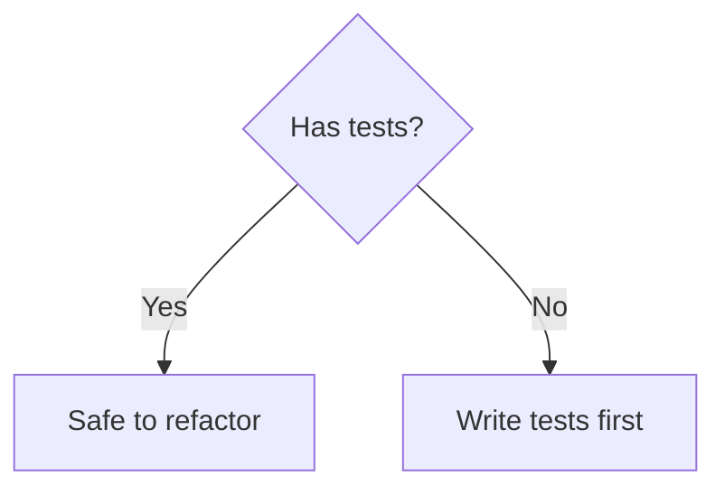

The agent reads: node A is a decision ("Has tests?"), with a "Yes" edge to node B ("Safe to refactor") and a "No" edge to node C ("Write tests first"). This is actually **more precise** than equivalent prose, because:

1. **Edges are explicit** — prose can be ambiguous about which condition leads where
2. **Node types encode meaning** — `{diamond}` = decision, `[rectangle]` = action, `([stadium])` = start/end
3. **Structure is formal** — the graph topology is machine-readable
4. **Token cost is low** — the Mermaid above is ~30 tokens; prose equivalent is ~40 tokens

The tradeoff: Mermaid is slightly less natural to *write* than prose. But it's more precise to *consume*, for both agents and humans.

**When prose is better**: Explanatory context, rationale, nuance, caveats. "Use X because Y" is better as a sentence. "If X then A, if Y then B" is better as a flowchart.

---

## Why Mermaid Over Other Formats

| Medium | Tokens | Agent-parseable | Human-readable | Version-controllable |
|--------|--------|-----------------|----------------|---------------------|
| Prose paragraph | ~200 | Ambiguous branching | Familiar but slow | Yes but hard to diff |
| Markdown table | ~80 | Good for comparisons | Fast scan | Yes |
| Mermaid diagram | ~60 | Explicit graph structure | Instant visual | Yes, text-based |
| ASCII art | ~150 | Fragile, misaligned | Breaks on re-flow | Painful to maintain |

**Prefer Mermaid over ASCII art.** Mermaid is semantic (explicit nodes and edges); ASCII art is visual layout that breaks on re-flow and is harder for agents to parse reliably.

---

## Raw Mermaid vs. Quoted Mermaid

**In SKILL.md (skill's own content)**: Use raw ` ```mermaid ` blocks. These are the skill's actual diagrams — the agent reads them directly, and humans see rendered versions.

**In reference docs (showing how to write Mermaid)**: Use ` ````markdown ` outer fences to wrap ` ```mermaid ` examples. This is meta-documentation — examples of what to write, not diagrams to interpret.

**Never**: Wrap a skill's own decision tree in a `````markdown` fence. That turns it from "follow this logic" into "here's an example of a diagram" — the agent treats quoted content as illustrative, not operative.

---

## Mermaid YAML Frontmatter Configuration (Optional)

Mermaid diagrams can optionally include a YAML frontmatter block (delimited by `---`) before the diagram definition. **This is purely for rendering customization** — themes, colors, spacing. Agents ignore it. Renderers apply sensible defaults without it.

**When to use frontmatter**: Published documentation where visual consistency matters.
**When to skip it**: Skills, reference files, agent-consumed content. Plain Mermaid is cleaner and lower-token.

### Basic Structure

````markdown
```mermaid
---
title: My Diagram Title
config:
  theme: default
  themeVariables:
    primaryColor: "#4a86c8"
---
flowchart LR
  A[Start] --&gt; B[End]
```
````

### Theme Options

| Theme | Use When |
|-------|----------|
| `default` | General purpose, clean look |
| `dark` | Dark-mode environments |
| `forest` | Green-toned, organic feel |
| `neutral` | Minimal, grayscale |
| `base` | Starting point for full customization via `themeVariables` |

### Common `themeVariables`

```yaml
config:
  themeVariables:
    primaryColor: "#4a86c8"        # Main node fill
    primaryTextColor: "#fff"       # Text on primary nodes
    primaryBorderColor: "#3a76b8"  # Border of primary nodes
    secondaryColor: "#f4f4f4"      # Secondary node fill
    tertiaryColor: "#e8e8e8"       # Tertiary node fill
    lineColor: "#333"              # Edge/arrow color
    fontSize: "16px"               # Base font size
    fontFamily: "monospace"        # Font family
    background: "#ffffff"          # Diagram background
    nodeBorder: "#333"             # Default node border
    noteTextColor: "#333"          # Note text color
    noteBkgColor: "#fff5ad"        # Note background
    edgeLabelBackground: "#fff"    # Edge label background
```

### Per-Diagram Configuration

The `config` block can include diagram-specific keys:

```yaml
---
config:
  flowchart:
    htmlLabels: true
    curve: basis           # basis, linear, stepBefore, stepAfter
    padding: 15
    nodeSpacing: 50
    rankSpacing: 50
    defaultRenderer: dagre  # dagre or elk
  sequence:
    mirrorActors: false
    bottomMarginAdj: 1
    actorFontSize: 14
    noteFontSize: 12
    messageFontSize: 14
    diagramMarginX: 50
    diagramMarginY: 10
    useMaxWidth: true
  gantt:
    titleTopMargin: 25
    barHeight: 20
    barGap: 4
    topPadding: 50
    sectionFontSize: 16
  er:
    layoutDirection: TB    # TB or LR
    minEntityWidth: 100
    minEntityHeight: 75
    entityPadding: 15
    fontSize: 12
  mindmap:
    padding: 10
    maxNodeWidth: 200
  timeline:
    padding: 50
    useMaxWidth: true
---
```

Full configuration reference: https://mermaid.ai/open-source/config/configuration.html

---

## Diagram Type Catalog

Mermaid supports a rich taxonomy of diagram types. Choose based on what you're modeling.

### Flowchart / Graph — Decision Trees & Processes

**Use when**: A skill encodes a decision tree, troubleshooting flowchart, or branching process.

**This is the most common diagram type for skills** — most skills have some "If X then A, if Y then B" logic that belongs in a flowchart.

````markdown
```mermaid
flowchart TD
  A[User asks to create skill] --&gt; B{Existing skill?}
  B --&gt;|Yes| C[Audit & Improve]
  B --&gt;|No| D[Gather 3-5 examples]
  D --&gt; E[Plan reusable contents]
  E --&gt; F[Initialize skill folder]
  F --&gt; G[Write scripts → refs → SKILL.md]
  G --&gt; H[Validate]
  H --&gt; I{Errors?}
  I --&gt;|Yes| G
  I --&gt;|No| J[Ship it]
```
````

**Direction options**: `TD` (top-down), `LR` (left-right), `BT` (bottom-top), `RL` (right-left)

**Node shapes**:
- `[text]` — rectangle
- `(text)` — rounded rectangle
- `{text}` — diamond (decision)
- `([text])` — stadium/pill
- `[[text]]` — subroutine
- `[(text)]` — cylinder (database)
- `((text))` — circle
- `>text]` — flag/asymmetric
- `[/text/]` — parallelogram
- `[\text\]` — reverse parallelogram
- `[/text\]` — trapezoid
- `[\text/]` — reverse trapezoid
- `{{text}}` — hexagon

**Edge styles**:
- `-->` solid arrow
- `---` solid line
- `-.->` dotted arrow
- `==>` thick arrow
- `--text-->` labeled edge
- `~~~` invisible link (for layout control)

---

### Sequence Diagram — Interactions & Protocols

**Use when**: A skill describes communication between agents, APIs, services, or any request/response protocol.

````markdown
```mermaid
sequenceDiagram
  participant O as Orchestrator
  participant S as Subagent
  participant SK as Skill

  O->>S: Assign task + context
  S->>SK: Load skill, check applicability
  SK--&gt;>S: "When to use" matches ✓
  S->>S: Follow skill steps 1-5
  S->>SK: Run QA checklist
  SK--&gt;>S: Validation passed ✓
  S->>O: Return artifacts + skills used + risks
```
````

**Features**:
- `->` solid line, `->>` solid arrow, `-->` dotted line, `-->>` dotted arrow
- `activate` / `deactivate` for lifeline boxes
- `Note right of X: text` for annotations
- `alt` / `else` / `end` for conditional blocks
- `loop` / `end` for repetition
- `par` / `and` / `end` for parallel execution
- `critical` / `option` / `end` for critical sections
- `break` / `end` for break-out flows
- `rect rgb(...)` / `end` for colored background regions
- `autonumber` for automatic message numbering

---

### State Diagram — Lifecycle & Status Machines

**Use when**: A skill manages something with distinct states and transitions (build pipelines, document lifecycle, feature flags, deployment stages).

````markdown
```mermaid
stateDiagram-v2
  [*] --&gt; Draft
  Draft --&gt; InReview: Submit for review
  InReview --&gt; Approved: Pass validation
  InReview --&gt; Draft: Revisions needed
  Approved --&gt; Published: Deploy
  Published --&gt; Deprecated: Sunset
  Deprecated --&gt; [*]

  state InReview {
    [*] --&gt; StructureCheck
    StructureCheck --&gt; ContentCheck
    ContentCheck --&gt; ActivationTest
    ActivationTest --&gt; [*]
  }
```
````

**Features**:
- `[*]` for start/end states
- Nested states with `state Name { ... }`
- `<<choice>>` for conditional branching
- `<<fork>>` / `<<join>>` for parallel states
- Notes with `note right of StateName`

---

### Entity-Relationship Diagram — Data Models

**Use when**: A skill works with structured data, database schemas, API shapes, or any domain where entities have relationships.

````markdown
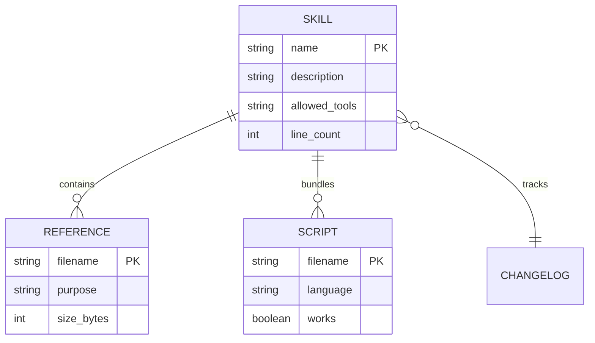
````

**Relationship cardinality**:
- `||--||` exactly one to exactly one
- `||--o{` one to zero-or-many
- `}o--o{` zero-or-many to zero-or-many
- `||--|{` one to one-or-many

---

### Gantt Chart — Timelines & Project Plans

**Use when**: A skill involves phased rollouts, migration plans, sprint planning, or any time-sequenced work.

````markdown
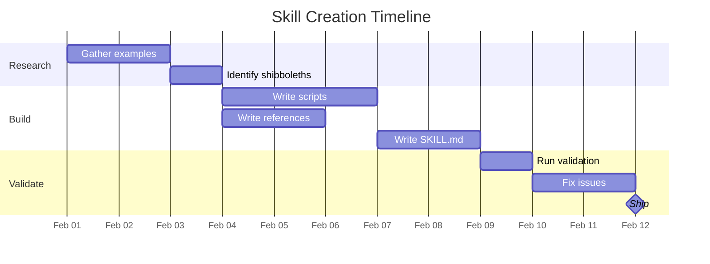
````

**Features**:
- `done`, `active`, `crit` tags for status/priority
- `milestone` for zero-duration markers
- Dependencies with `after taskId`
- Sections for logical grouping

---

### Mindmap — Concept Hierarchies

**Use when**: A skill covers a domain taxonomy, feature map, brainstorm output, or any hierarchical concept space.

````markdown
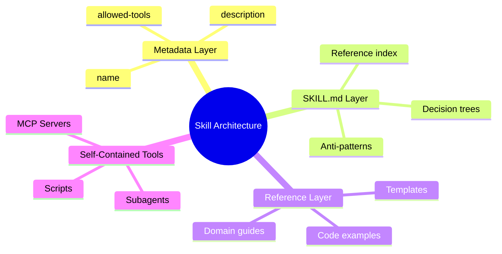
````

**Features**:
- Root node shapes: `((circle))`, `(rounded)`, `[square]`, `{{hexagon}}`
- Automatic layout based on indentation
- Icon support with `::icon(fa fa-book)`

---

### Timeline — Historical / Temporal Knowledge

**Use when**: A skill encodes temporal knowledge (framework evolution, API deprecations, "what changed when").

````markdown
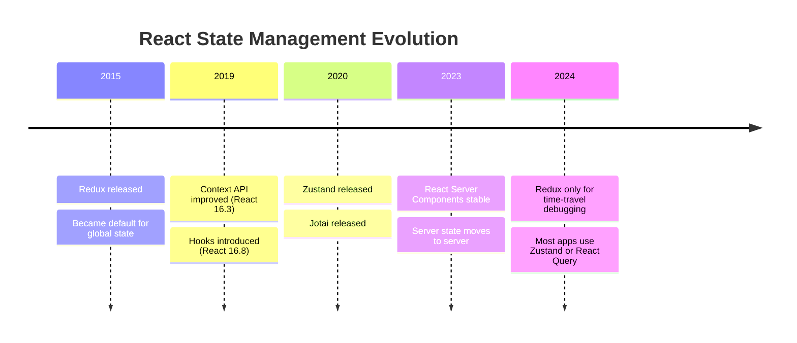
````

This is particularly valuable for **shibboleth encoding** — the temporal evolution that LLMs get wrong.

---

### Pie Chart — Proportions & Distributions

**Use when**: Showing relative sizes, coverage breakdowns, or category distributions.

````markdown
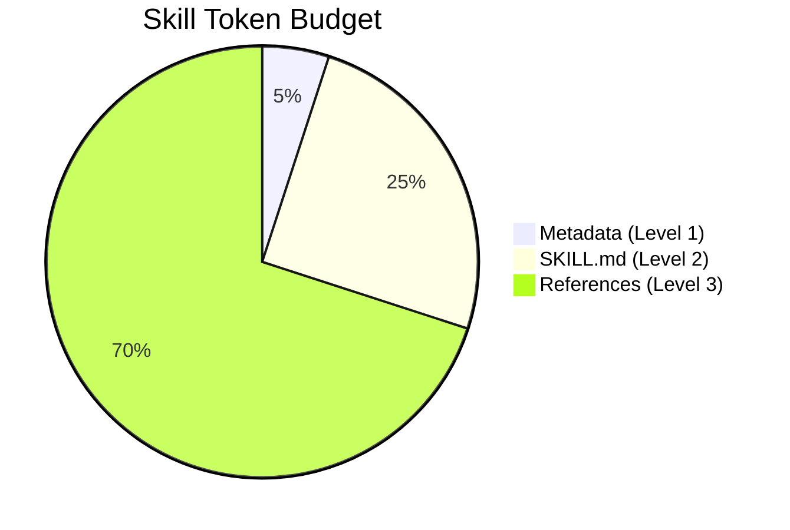
````

---

### Quadrant Chart — 2x2 Decision Matrices

**Use when**: A skill needs to position options along two axes (effort vs. impact, risk vs. reward, urgency vs. importance).

````markdown
```mermaid
quadrantChart
  title Skill Improvement Priority
  x-axis Low Effort --&gt; High Effort
  y-axis Low Impact --&gt; High Impact
  quadrant-1 Do First
  quadrant-2 Plan Carefully
  quadrant-3 Delegate or Skip
  quadrant-4 Quick Wins
  Add NOT clause: [0.2, 0.8]
  Tighten description: [0.3, 0.9]
  Add Mermaid diagrams: [0.4, 0.6]
  Build MCP server: [0.9, 0.7]
  Rewrite from scratch: [0.8, 0.5]
```
````

---

### Git Graph — Branching & Merge Strategies

**Use when**: A skill involves version control workflows, release strategies, or branch management.

````markdown
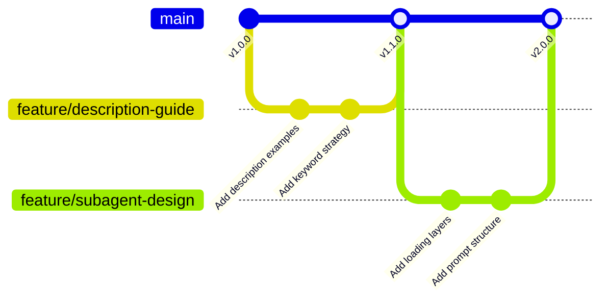
````

---

### Class Diagram — Object Models & Type Hierarchies

**Use when**: A skill involves type systems, class hierarchies, interfaces, or any OO/structural modeling.

````markdown
```mermaid
classDiagram
  class Skill {
    +String name
    +String description
    +String[] allowedTools
    +validate() bool
    +activate(query) Response
  }
  class Reference {
    +String filename
    +String purpose
    +load() Content
  }
  class Script {
    +String filename
    +String language
    +run(args) Result
  }
  Skill "1" --&gt; "*" Reference : contains
  Skill "1" --&gt; "*" Script : bundles
  Skill <|-- MetaSkill : extends
```
````

---

### User Journey — Experience Mapping

**Use when**: A skill models a user flow, onboarding experience, or multi-step interaction.

````markdown
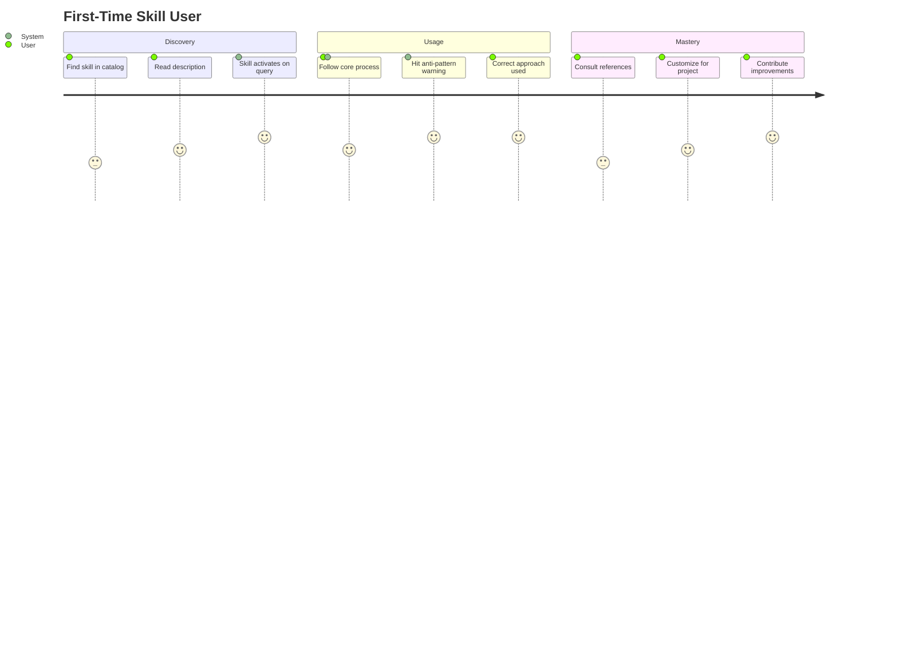
````

Scores are satisfaction ratings (1-5). Actors are labeled after the colon.

---

### Sankey Diagram — Flow Quantities

**Use when**: Showing how quantities flow between categories (token budgets, request routing, resource allocation).

````markdown
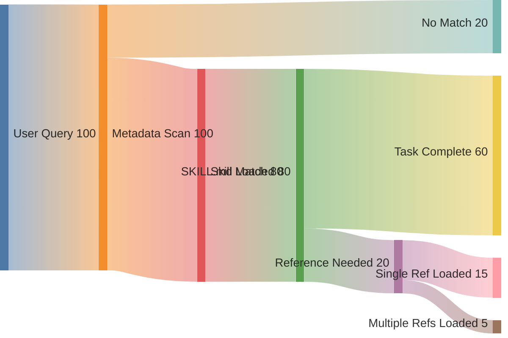
````

---

### XY Chart — Data Visualization

**Use when**: Plotting metrics, benchmarks, performance data, or any numeric comparison.

````markdown
```mermaid
xychart-beta
  title "Activation Rate by Description Quality"
  x-axis ["Vague", "Keywords Only", "Keywords+NOT", "Full Formula"]
  y-axis "Activation %" 0 --&gt; 100
  bar [12, 45, 78, 94]
  line [12, 45, 78, 94]
```
````

---

### Block Diagram — System Architecture

**Use when**: Modeling system components, infrastructure layouts, or architectural blocks.

````markdown
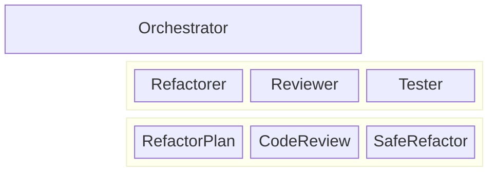
````

---

### Architecture Diagram — Infrastructure & Deployment

**Use when**: Modeling cloud architecture, service topology, or deployment infrastructure.

````markdown

````

---

### Kanban — Task/Status Boards

**Use when**: Modeling workflow stages, task statuses, or any column-based status tracking.

````markdown
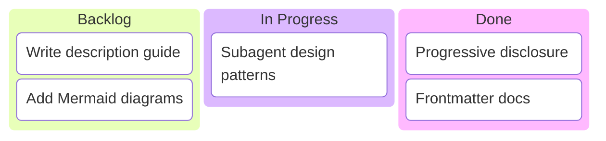
````

---

### Requirement Diagram — Traceability & Compliance

**Use when**: A skill deals with requirements management, compliance verification, regulatory traceability, or any formal "shall" requirements with verify/satisfy/trace relationships.

````markdown
```mermaid
requirementDiagram
  requirement auth_req {
    id: REQ-001
    text: The system shall authenticate users via OAuth 2.0
    risk: high
    verifymethod: test
  }

  requirement mfa_req {
    id: REQ-002
    text: The system shall support MFA for admin accounts
    risk: medium
    verifymethod: inspection
  }

  element auth_module {
    type: module
    docref: src/auth/oauth.ts
  }

  element mfa_module {
    type: module
    docref: src/auth/mfa.ts
  }

  auth_module - satisfies -> auth_req
  mfa_module - satisfies -> mfa_req
  mfa_req - derives -> auth_req
```
````

**Relationship types**: `contains`, `copies`, `derives`, `satisfies`, `verifies`, `refines`, `traces`

**Verify methods**: `analysis`, `demonstration`, `inspection`, `test`

**Risk levels**: `low`, `medium`, `high`

---

### C4 Diagram — Multi-Level Architecture Views

**Use when**: A skill models system architecture at different zoom levels (context, container, component, deployment). Simon Brown's C4 model is the standard for communicating software architecture to different audiences.

````markdown
```mermaid
C4Context
  title System Context Diagram — Skill Platform

  Person(user, "Skill Author", "Creates and maintains skills")
  Person(agent, "Claude Agent", "Executes skills at runtime")

  System(platform, "Skill Platform", "Hosts, validates, and serves skills")
  System_Ext(github, "GitHub", "Version control and distribution")
  System_Ext(registry, "Plugin Registry", "Community skill marketplace")

  Rel(user, platform, "Publishes skills to")
  Rel(agent, platform, "Loads skills from")
  Rel(platform, github, "Syncs with")
  Rel(platform, registry, "Distributes to")
```
````

**C4 sub-types** (each zooms in one level):
- `C4Context` — highest level: systems and people
- `C4Container` — zoom into one system: apps, databases, services
- `C4Component` — zoom into one container: modules, classes
- `C4Dynamic` — runtime interactions between containers/components
- `C4Deployment` — physical/cloud infrastructure mapping

````markdown
```mermaid
C4Container
  title Container Diagram — Skill Platform

  Person(author, "Skill Author")

  System_Boundary(platform, "Skill Platform") {
    Container(api, "API Server", "Node.js", "Handles skill CRUD and validation")
    ContainerDb(db, "Skill Store", "SQLite", "Stores skill metadata and content")
    Container(validator, "Validator", "Python", "Runs frontmatter and content checks")
  }

  Rel(author, api, "Publishes via", "HTTPS")
  Rel(api, db, "Reads/writes")
  Rel(api, validator, "Validates with")
```
````

---

### Packet Diagram — Network Protocol Structures

**Use when**: A skill deals with network protocols, binary formats, data serialization, or packet-level communication structures.

````markdown
```mermaid
packet-beta
  0-15: "Source Port"
  16-31: "Destination Port"
  32-63: "Sequence Number"
  64-95: "Acknowledgement Number"
  96-99: "Data Offset"
  100-105: "Reserved"
  106: "URG"
  107: "ACK"
  108: "PSH"
  109: "RST"
  110: "SYN"
  111: "FIN"
  112-127: "Window Size"
  128-143: "Checksum"
  144-159: "Urgent Pointer"
```
````

Fields are specified as bit ranges. Each line defines a field with `start-end: "Label"`.

---

### Radar Chart — Multi-Dimensional Comparisons

**Use when**: A skill compares options across multiple dimensions (skill grading axes, framework comparisons, capability assessments, team skill matrices).

````markdown
```mermaid
radar
  title Skill Quality Assessment
  axis Description, Scope, Disclosure, Anti-Patterns, Tools, Activation, Visuals, Output, Temporal, Docs
  curve a["code-architecture"] { 90, 92, 85, 88, 80, 90, 95, 82, 70, 75 }
  curve b["caching-strategies"] { 88, 90, 83, 85, 78, 88, 90, 80, 72, 73 }
```
````

Each `curve` is a data series plotted against the shared axes. Values scale to fit the chart.

---

### Treemap — Hierarchical Size Comparisons

**Use when**: Showing relative sizes within a hierarchy (codebase size by module, token budgets, skill library composition, disk usage).

````markdown
```mermaid
treemap
  title Skill Library by Category
  SWE Skills
    code-architecture: 434
    microservices-patterns: 434
    typescript-advanced-patterns: 401
    monorepo-management: 369
    performance-profiling: 362
  Recovery Skills
    sobriety-tools-guardian: 380
    recovery-app-onboarding: 350
    recovery-coach-patterns: 320
  Design Skills
    windows-3-1-web-designer: 310
    neobrutalist-web-designer: 290
```
````

Numbers represent relative size. The treemap fills space proportionally.

---

### ZenUML — Alternative Sequence Syntax

**Use when**: You prefer a code-like syntax for sequence diagrams. ZenUML is available as a Mermaid plugin and uses a more programming-style notation.

````markdown
```mermaid
zenuml
  @Orchestrator as O
  @Subagent as S
  @Skill as SK

  O->S.assignTask(context) {
    S->SK.loadSkill() {
      return applicability
    }
    S->S.executeSteps()
    return artifacts
  }
```
````

**Note**: ZenUML requires the ZenUML plugin. It may not render in all Mermaid environments. Prefer `sequenceDiagram` for maximum compatibility.

---

## Which Diagram Type for Which Skill Content?

| Skill Content | Best Diagram Type | Why |
|---------------|-------------------|-----|
| Decision trees / troubleshooting | **Flowchart** | Branching logic is what flowcharts do |
| Agent/API communication | **Sequence** | Shows request/response over time |
| Lifecycle / status transitions | **State** | Explicitly models valid transitions |
| Data models / schemas | **ER Diagram** | Purpose-built for entities + relationships |
| Framework evolution / temporal knowledge | **Timeline** | Chronological shibboleth encoding |
| Domain taxonomy / concept maps | **Mindmap** | Hierarchical at a glance |
| Priority / effort-vs-impact | **Quadrant** | 2x2 matrix is instantly parseable |
| Project phases / rollout plans | **Gantt** | Time-sequenced dependencies |
| Branching strategies | **Git Graph** | Models branch/merge visually |
| Type hierarchies / interfaces | **Class Diagram** | OO structural relationships |
| User experience flows | **User Journey** | Maps satisfaction across steps |
| Quantity flows / budgets | **Sankey** | Shows proportional flow between categories |
| Metrics / benchmarks | **XY Chart** | Numeric data visualization |
| System architecture (component layout) | **Block** | Spatial block arrangement |
| Infrastructure / cloud topology | **Architecture** | Service-to-service with icons |
| Task status tracking | **Kanban** | Column-based workflow visualization |
| Proportional breakdowns | **Pie** | Simple category proportions |
| Requirements traceability / compliance | **Requirement** | Formal verify/satisfy/trace relationships |
| Multi-level system views (C4 model) | **C4** | Context → Container → Component → Deploy |
| Network protocols / binary formats | **Packet** | Bit-level field layout |
| Multi-axis capability comparison | **Radar** | Spider chart across N dimensions |
| Hierarchical size comparison | **Treemap** | Area-proportional nesting |
| Sequence diagrams (code-style syntax) | **ZenUML** | Programming-like notation (plugin) |

---

## Best Practices for Mermaid in Skills

### 1. Put Diagrams in the Right Layer

- **SKILL.md**: Include 1-3 key diagrams (decision trees, core workflow). These are loaded on activation and should be high-value, low-token.
- **References**: Include detailed diagrams (full ER models, comprehensive state machines, architecture layouts). These are loaded on demand.
- **Never**: Overload SKILL.md with 10 diagrams. That defeats progressive disclosure.

### 2. Use Mermaid for Decision Trees Instead of Prose

**Bad (prose)**:
> "First check if the skill exists. If it does, audit it. If not, gather examples, then plan contents, then initialize, then write, then validate."

**Good (flowchart)**:
```mermaid
flowchart TD
  A{Skill exists?} -->|Yes| B[Audit & Improve]
  A -->|No| C[Gather examples]
  C --> D[Plan contents]
  D --> E[Initialize]
  E --> F[Write]
  F --> G[Validate]
```

The flowchart is ~40 tokens. The prose is ~35 tokens. For a human, the flowchart is instantly parseable. For an agent, the flowchart encodes explicit branching structure (`-->|Yes|`, `-->|No|`) that prose leaves ambiguous. Both audiences benefit; neither is disadvantaged.

### 3. Prefer Specific Diagram Types Over Generic Flowcharts

A sequence diagram for protocol interactions is more informative than a flowchart of the same protocol. A state diagram for lifecycle management is clearer than a flowchart with "go back to step 2" arrows. Choose the diagram type that matches the underlying structure.

### 4. Skip YAML Frontmatter Unless Publishing

YAML frontmatter in Mermaid is for rendering customization only — themes, colors, spacing. **Agents don't use it. Renderers apply defaults without it.** Only add frontmatter when you're publishing polished documentation and need visual consistency across multiple diagrams.

For skills and references, plain Mermaid is cleaner and costs fewer tokens:

```mermaid
flowchart LR
  A --> B
```

If you do need it (e.g., for a published site), the syntax is a `---` block before the diagram type. See the Configuration section above for all options.

### 5. Use Raw Mermaid, Not Quoted Mermaid

In SKILL.md and references, use raw ` ```mermaid ` blocks — these are content the agent should interpret and act on. Only use outer ` ````markdown ` fences in documentation *about* Mermaid (like this file), where the example is illustrative, not operative.

### 6. Keep Diagrams Self-Contained

Each diagram should be understandable without reading the surrounding prose. Use descriptive node labels, not cryptic abbreviations:

- ✅ `A[Check description has NOT clause]`
- ❌ `A[Step 2.3]`

### 7. Code Blocks Are Visual Artifacts Too

Don't neglect inline code examples as visual artifacts. A 5-line code snippet is worth 50 words of description:

```yaml
# Good: concrete, copy-pasteable
description: CLIP semantic search for image-text matching.
  NOT for counting, spatial reasoning, or generation.
```

> Bad: "Write a description that mentions what the skill does, when it should be used, and includes a NOT clause with things it should not be used for."

---

## Encouraging Visual Artifacts in Skills You Create

When creating or auditing a skill, ask these questions. If the answer is "yes" and the skill only uses prose, **that's an improvement opportunity**.

| Question | Diagram |
|----------|---------|
| Does it have a decision tree or branching process? | Flowchart |
| Does it describe a multi-step protocol or API interaction? | Sequence or ZenUML |
| Does it manage states or lifecycle transitions? | State diagram |
| Does it encode temporal knowledge (framework evolution, deprecations)? | Timeline |
| Does it model data relationships or schemas? | ER diagram |
| Does it prioritize options on two axes? | Quadrant chart |
| Does it describe system architecture? | Block, Architecture, or C4 |
| Does it compare options across multiple dimensions? | Radar chart |
| Does it have phased rollouts or migration plans? | Gantt chart |
| Does it involve branching strategies or release workflows? | Git graph |
| Does it show quantity flows between categories? | Sankey diagram |
| Does it need to show proportional breakdowns? | Pie or Treemap |
| Does it plot metrics or benchmarks? | XY chart |
| Does it have requirements with traceability? | Requirement diagram |
| Does it model user experience across steps? | User journey |
| Does it track task/work status? | Kanban |
| Does it involve type hierarchies or interfaces? | Class diagram |
| Does it deal with network protocols or binary formats? | Packet diagram |

Mermaid supports **23 diagram types** — there is almost always a better option than prose for structured content.
