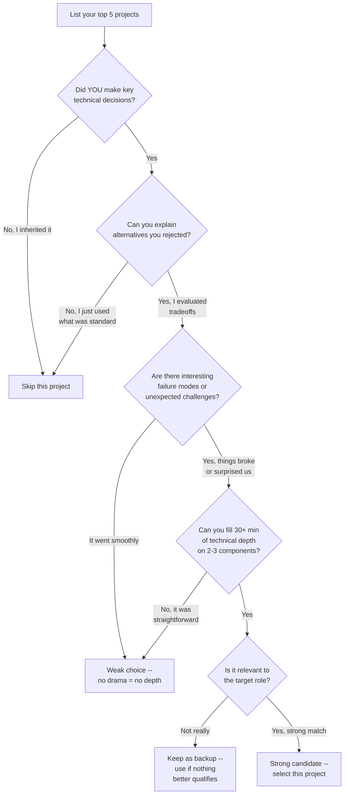
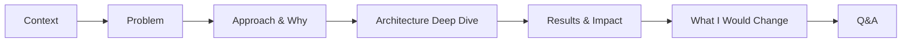

# Tech Presentation Interview

The tech presentation round is a **reverse system design**: instead of designing a hypothetical system on a whiteboard, you present a real system YOU built. This tests three things no other round can: genuine depth of understanding, ability to communicate complex ideas under pressure, and authentic ownership versus inherited knowledge.

## When to Use

**Use for:**
- Selecting which project to present from your career
- Structuring a 25-45 minute technical presentation with narrative arc
- Calibrating depth -- which components to go deep on, which to skim
- Preparing whiteboard/virtual-board diagrams with progressive disclosure
- Rehearsing answers to hostile follow-up questions
- Adapting presentation to different audience compositions (researchers, engineers, managers)

**NOT for:**
- Designing a system you haven't built (use `ml-system-design-interview`)
- Writing your resume or extracting career stories (use `cv-creator` or `career-biographer`)
- Coordinating across multiple interview rounds (use `interview-loop-strategist`)
- Practicing coding problems or behavioral STAR stories
- Conference talk preparation (different format, different evaluation criteria)

---

## Project Selection

The most common failure mode is choosing the wrong project. Use this decision tree:

### Selection Criteria Scorecard

Rate each candidate project 1-5:

| Criterion | Weight | What to evaluate |
|-----------|--------|------------------|
| Personal ownership | 5x | YOUR decisions, not team consensus or inherited architecture |
| Technical complexity | 4x | Non-obvious tradeoffs, scale challenges, algorithmic depth |
| Interesting failures | 4x | Things that broke, surprises, pivots, lessons learned |
| Relevance to role | 3x | Overlaps with what the target team builds |
| Quantified impact | 2x | Metrics you can cite (latency, throughput, revenue, accuracy) |
| Recency | 1x | More recent is better, but a great 5-year-old project beats a boring recent one |

**Threshold**: Total score > 60 = strong choice. 40-60 = acceptable if nothing better. &lt; 40 = find another project.

---

## Narrative Arc Framework

Every great presentation follows this structure. Deviations lose the audience.

### Phase Details

**1. Context (2 min)** -- Set the stage. Who was the user? What was the business? Why did this matter?
- One sentence on the company/team
- One sentence on the user problem
- One sentence on the scale (requests/sec, data volume, user count)
- Do NOT start with "I built a service that..." -- start with the PROBLEM

**2. Problem (3 min)** -- What made this HARD? Not what you built, but why it was non-trivial.
- Constraints that created tension (latency vs accuracy, cost vs reliability)
- Why existing solutions didn't work
- What would happen if you got it wrong (consequences = stakes)

**3. Approach & Why (5 min)** -- Decision-making process, not just the decision.
- 2-3 alternatives you considered and WHY you rejected each
- The key insight or constraint that drove your choice
- What you were optimizing for (and what you knowingly sacrificed)

**4. Architecture Deep Dive (10 min)** -- Go deep on 2-3 components. NOT a tour of every box.
- Start with 3-box overview on whiteboard (see `references/whiteboard-diagrams.md`)
- Pick 2-3 technically interesting components to zoom into
- For each deep component: what it does, why it's designed that way, what breaks if you change it
- Progressive disclosure: add detail only when relevant or asked

**5. Results & Impact (3 min)** -- Quantified outcomes.
- Before/after metrics (latency, throughput, accuracy, cost, developer hours)
- Business impact (revenue, users, customer satisfaction)
- Team impact (adoption, developer experience, operational burden)

**6. What I Would Change (2 min)** -- The most important 2 minutes.
- 1-2 specific technical decisions you'd reverse with hindsight
- Why you made the original decision (it was rational at the time)
- What you learned that changed your thinking
- This section builds more credibility than all your wins combined

**7. Q&A (15+ min)** -- Where the real evaluation happens.
- See "Handling Deep Follow-Ups" section below

---

## Depth Calibration

The cardinal sin is covering everything at surface level. Pick 2-3 layers to go DEEP.

| Component Type | Skim (1-2 sentences) | Medium (2-3 min) | Deep (5+ min) |
|---------------|---------------------|-------------------|---------------|
| Standard infra (load balancer, CDN) | Almost always skim | Only if custom config | Never unless this IS the project |
| Data storage layer | If standard SQL/NoSQL | If sharding, replication, or hybrid | If you designed the storage engine |
| ML model architecture | If off-the-shelf | If fine-tuned or modified | If custom architecture or novel approach |
| Data pipeline | If standard ETL | If real-time or complex transforms | If you solved a hard data quality problem |
| API/interface design | If REST/GraphQL standard | If complex versioning or contracts | If protocol design was the core challenge |
| Monitoring/observability | Usually skim | If anomaly detection is core | If this IS the system |

**Rule of thumb**: Go deep on the parts where YOU made a non-obvious decision. Skim the parts where you used an industry-standard tool in the standard way.

---

## Handling Deep Follow-Ups

The Q&A is where interviewers separate builders from bystanders. Prepare for these patterns:

### "Tell me more about X"
- This is an invitation, not a trap. Go one level deeper on implementation.
- Structure: "The key challenge with X was [constraint]. We solved it by [approach] because [reason]. The tricky part was [non-obvious detail]."
- If you genuinely don't remember a detail: "I'd need to check the specifics, but the design principle was [principle] and the implementation followed [pattern]."

### "Why didn't you use [alternative]?"
- Never dismiss the alternative. Acknowledge its strengths first.
- Structure: "We considered [alternative]. It's strong for [use case]. We chose [our approach] because in our context, [specific constraint] made [alternative] less suitable. Specifically, [concrete reason with numbers if possible]."
- If you hadn't considered it: "That's a good option I hadn't evaluated at the time. Based on what I know now, the key tradeoff would be [tradeoff]. I think for our constraints, [assessment]."

### "That seems over-engineered"
- Don't get defensive. Restate the constraint that justified the complexity.
- Structure: "I understand that reaction. The complexity was driven by [specific requirement]. Without [the complex part], we would have hit [concrete failure mode]. That said, if [requirement] changes, I'd simplify by [specific simplification]."

### "What would you do differently?"
- NEVER say "nothing." This is the most important question.
- Prepare 2-3 specific technical changes with reasoning.
- Structure: "Knowing what I know now, I'd change [specific decision]. At the time, [why it was rational]. Since then, [what changed -- new tooling, learned lesson, scale changed]. The new approach would be [specific alternative]."

### "What's the failure mode?"
- Describe actual failures that happened, not hypotheticals.
- Structure: "The primary failure mode is [X]. We hit it [frequency]. When it happens, [impact]. Our mitigation is [approach]. The residual risk is [what's still unprotected]."

---

## Audience Calibration

Adjust depth based on who's in the room:

| Audience | Emphasize | De-emphasize |
|----------|-----------|-------------|
| Researchers / scientists | Novel approaches, evaluation methodology, ablation studies | Infra details, deployment ops |
| Backend / systems engineers | Scale, reliability, performance tradeoffs, failure handling | ML model internals, business context |
| ML engineers | Model architecture, training pipeline, data challenges, serving infra | Business impact, team dynamics |
| Engineering managers | Decision-making process, team coordination, technical risk management | Low-level implementation details |
| Mixed panel | Start broad, let Q&A reveal where each panelist wants depth | Don't pre-optimize for one audience |

---

## Anti-Patterns

### Demo Reel
**Novice**: Presents all wins, no failures or trade-offs. Every decision was optimal. The system performed beautifully from day one. Metrics only go up and to the right.
**Expert**: Proactively discusses what didn't work, what surprised them, and what they'd change. Treats failures as evidence of genuine engagement, not embarrassment. Shares specific metrics for both successes AND shortcomings.
**Detection**: When asked "what would you do differently?" the answer is vague ("maybe better testing") or unconvincing ("honestly, I'm pretty happy with how it turned out"). No failure stories surface organically during the presentation.

### Team Credit Confusion
**Novice**: Uses "we" for everything. "We designed the architecture." "We chose Kafka." "We solved the latency problem." Unclear what THEY specifically did versus what the team did collectively versus what a teammate owned entirely.
**Expert**: Clear ownership markers throughout: "I led the design of the serving layer, collaborated with our data team on the pipeline, and my teammate Sarah owned the model training infrastructure. Let me focus on the serving layer since that was my primary contribution." Uses "I" for decisions they drove, "we" for genuine collaboration, and names teammates for their contributions.
**Detection**: Under follow-up questioning, cannot explain specific technical decisions in detail. When asked "why Kafka over RabbitMQ?", answers with "that was the team's decision" or gives a generic textbook comparison rather than the specific evaluation they ran.

### Architectural Tourism
**Novice**: Covers every component at surface level. "And then we had a cache, and a queue, and a database, and a load balancer, and a model server, and a feature store..." Each component gets 1-2 sentences. Runs out of time before reaching anything interesting. The whiteboard looks like a busy subway map.
**Expert**: Draws the 3-box overview, explicitly says "I'm going to focus on two components where the interesting engineering happened," and goes DEEP. Spends 5 minutes on one component explaining the tradeoffs, alternatives considered, failure modes, and what they learned. The interviewer leaves understanding that component thoroughly.
**Detection**: Presentation runs over time. All component descriptions are surface-level. Whiteboard has 15+ boxes with no zoom-in area. When asked to go deeper on any single component, the candidate has nothing beyond what they already said.

---

## Rehearsal Protocol

1. **Solo run-through** (3x minimum): Present to an empty room, timed. Target: 20-25 min for the structured portion, leaving 15-20 min for Q&A.
2. **Record yourself**: Watch the recording. Note filler words, hand-waving over gaps, and moments where you lose the thread.
3. **Peer mock** (2x minimum): Present to a technical friend. Have them play hostile questioner. Track which questions you fumble.
4. **Q&A stress test**: Have someone rapid-fire 10 questions from the hostile questions list. Practice composure under pressure.
5. **Timing gate**: If your structured presentation exceeds 25 min in rehearsal, cut content. You WILL run longer in the real thing.

---

## Reference Files

| File | Consult When |
|------|-------------|
| `references/project-narrative-template.md` | Structuring a project presentation from scratch; filling out the narrative arc; preparing Q&A answers; worked example of an ML pipeline presentation |
| `references/whiteboard-diagrams.md` | Planning what to draw during the presentation; progressive disclosure strategy; physical and virtual whiteboard tips; common diagram patterns for ML systems |
