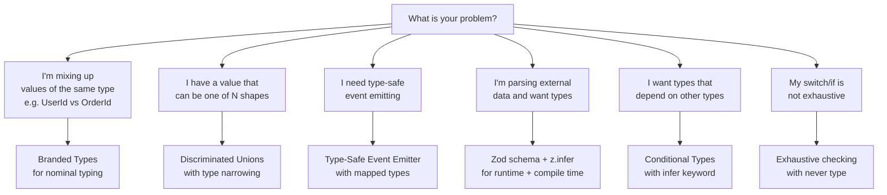

# TypeScript Advanced Patterns

Advanced type system patterns that eliminate runtime bugs by encoding constraints at compile time.

## When to Use

**Activate on:** "branded types", "nominal typing", "discriminated union", "template literal types", "conditional types", "infer keyword", "satisfies operator", "const assertion", "Zod inference", "exhaustive switch", "type-safe event emitter", "mapped types", "utility types", "generic constraints", "type narrowing", "as const"

**NOT for:** Basic TypeScript syntax | React component prop types | General JavaScript patterns

## Decision Tree: Which Advanced Pattern for Your Problem?



## Core Patterns

### 1. Branded Types (Nominal Typing)

TypeScript's structural type system means `UserId` and `string` are assignable to each other. Branded types add a phantom brand that makes them incompatible.

```typescript
// Without branding: these compile without error
function chargeUser(userId: string, amount: number) { /* ... */ }
const orderId = getOrderId();
chargeUser(orderId, 100); // Wrong! orderId passed as userId — TypeScript allows it

// With branding: compile-time protection
type Brand<T, B extends string> = T & { readonly __brand: B };

type UserId = Brand<string, 'UserId'>;
type OrderId = Brand<string, 'OrderId'>;
type EmailAddress = Brand<string, 'EmailAddress'>;
type Cents = Brand<number, 'Cents'>;  // Never pass raw numbers as money

// Constructor functions (only way to create branded values)
const UserId = (id: string): UserId => id as UserId;
const OrderId = (id: string): OrderId => id as OrderId;
const Cents = (n: number): Cents => {
  if (!Number.isInteger(n) || n < 0) throw new Error(`Invalid cents: ${n}`);
  return n as Cents;
};

// Usage: type error if you mix them up
function chargeUser(userId: UserId, amount: Cents) { /* ... */ }

const uid = UserId('user_123');
const oid = OrderId('order_456');

chargeUser(uid, Cents(1000));  // OK
chargeUser(oid, Cents(1000));  // Error: Argument of type 'OrderId' is not assignable to 'UserId'
chargeUser(uid, 1000);         // Error: Argument of type 'number' is not assignable to 'Cents'
```

See `references/branded-types.md` for Zod integration and database model patterns.

### 2. Discriminated Unions with Type Narrowing

The `kind` (or `type`, `tag`) field is the discriminant. TypeScript narrows the union when you check it.

```typescript
type ApiResult<T> =
  | { status: 'success'; data: T }
  | { status: 'error'; code: number; message: string }
  | { status: 'loading' };

function handleResult<T>(result: ApiResult<T>): T | null {
  switch (result.status) {
    case 'success': return result.data;        // TypeScript knows data exists here
    case 'error':   console.error(result.code, result.message); return null;
    case 'loading': return null;
  }
}
```

**With exhaustive checking** — if a new variant is added and the switch is not updated, it's a compile error:

```typescript
function assertNever(x: never): never {
  throw new Error(`Unexpected value: ${JSON.stringify(x)}`);
}

function handleResult<T>(result: ApiResult<T>): T | null {
  switch (result.status) {
    case 'success': return result.data;
    case 'error':   return null;
    // If 'loading' is not handled, TypeScript errors:
    // Argument of type '{ status: "loading" }' is not assignable to 'never'
    default: return assertNever(result);
  }
}
```

### 3. Template Literal Types

Combine string literals at type level to create precise types for string-based APIs:

```typescript
// Route path types — prevents typos in route definitions
type HttpMethod = 'GET' | 'POST' | 'PUT' | 'DELETE' | 'PATCH';
type ApiVersion = 'v1' | 'v2';
type Resource = 'users' | 'orders' | 'products';

type ApiEndpoint = `/${ApiVersion}/${Resource}`;
// Type: "/v1/users" | "/v1/orders" | "/v1/products" | "/v2/users" | ...

// CSS-in-JS property types
type CSSProperty = 'margin' | 'padding' | 'border';
type Side = 'top' | 'right' | 'bottom' | 'left';
type CSSPropertyWithSide = `${CSSProperty}-${Side}`;
// Type: "margin-top" | "margin-right" | ... | "border-left"

// Event name types
type DOMEventMap = {
  click: MouseEvent;
  keydown: KeyboardEvent;
  input: InputEvent;
};
type EventName = `on${Capitalize<keyof DOMEventMap>}`;
// Type: "onClick" | "onKeydown" | "onInput"
```

### 4. Conditional Types with infer

`infer` extracts a type from within another type during conditional type evaluation.

```typescript
// Extract the return type of an async function
type Awaited<T> = T extends Promise<infer U> ? U : T;

type UserFetch = () => Promise<{ id: string; name: string }>;
type User = Awaited<ReturnType<UserFetch>>;
// Type: { id: string; name: string }

// Extract the element type of an array
type ElementOf<T> = T extends (infer U)[] ? U : never;
type Names = ElementOf<string[]>;  // string
type Events = ElementOf<Array<{ id: number; type: string }>>;  // { id: number; type: string }

// Extract handler parameters from an event map
type HandlerParams<T extends (...args: any) => any> =
  T extends (...args: infer P) => any ? P : never;

// Deeply unwrap Promises
type DeepAwaited<T> = T extends Promise<infer U> ? DeepAwaited<U> : T;
type Result = DeepAwaited<Promise<Promise<string>>>;  // string
```

### 5. The satisfies Operator (TypeScript 4.9+)

`satisfies` validates a value against a type without widening it. You get both type checking AND the most specific inferred type.

```typescript
type Color = string | [number, number, number];

// Problem with 'as': loses specific type info
const colors = {
  red: [255, 0, 0] as Color,    // type is Color, not [255, 0, 0]
  blue: [0, 0, 255] as Color,
} as Record<string, Color>;

// Problem with annotation: same widening
const colors2: Record<string, Color> = {
  red: [255, 0, 0],   // type is Color
};

// satisfies: validates AND preserves specific type
const colors3 = {
  red: [255, 0, 0],
  blue: [0, 0, 255],
} satisfies Record<string, Color>;

colors3.red.map(x => x * 2);   // OK: TypeScript knows it's [number, number, number]
colors3.blue[0];                // OK: indexed access works

// Great for config objects
const config = {
  port: 3000,
  host: 'localhost',
  debug: false,
} satisfies {
  port: number;
  host: string;
  debug: boolean;
  timeout?: number;  // optional fields allowed to be absent
};

config.port.toFixed(0);   // OK: port is still `number`, not widened to `number | string`
```

### 6. Zod Schema Inference

Zod validates at runtime and provides TypeScript types for free. Never write a type + validator separately.

```typescript
import { z } from 'zod';

// Define schema once
const UserSchema = z.object({
  id: z.string().uuid(),
  email: z.string().email(),
  role: z.enum(['admin', 'user', 'moderator']),
  createdAt: z.coerce.date(),
  metadata: z.record(z.string(), z.unknown()).optional(),
});

// Extract type — no duplicate type definition
type User = z.infer<typeof UserSchema>;
// Type: { id: string; email: string; role: "admin" | "user" | "moderator"; createdAt: Date; metadata?: Record<string, unknown> }

// Parse with validation
function parseUser(raw: unknown): User {
  return UserSchema.parse(raw);  // throws ZodError with structured errors on failure
}

// Safe parse (returns Result type)
const result = UserSchema.safeParse(rawData);
if (result.success) {
  result.data.role;  // narrowed to User
} else {
  result.error.issues;  // structured validation errors
}

// Derive related schemas
const CreateUserInput = UserSchema.omit({ id: true, createdAt: true });
type CreateUserInput = z.infer<typeof CreateUserInput>;

const UpdateUserInput = UserSchema.partial().required({ id: true });
```

See `references/type-safe-patterns.md` for type-safe event emitters, builder pattern, and exhaustive checking utilities.

## Reference Files

| File | Contents |
|------|----------|
| `references/branded-types.md` | Branded primitives for IDs/currencies/emails, Zod integration, database patterns |
| `references/type-safe-patterns.md` | Exhaustive switch, builder pattern, type-safe event emitters, mapped type utilities |

## Anti-Patterns (Shibboleths)

### Anti-Pattern 1: `any` as an Escape Hatch Instead of Proper Generics

**Novice thinking**: "This is too complex to type, I'll just use `any` and come back to it later."

**Why wrong**: `any` disables all type checking for that value AND spreads to anything it touches. `any` is contagious — once a value is `any`, functions that receive it infer their return type as `any`, creating a type hole that grows over time. The "come back to it" never happens.

**Detection**: `as any` in a codebase almost always signals a type design problem, not a TypeScript limitation.

**Fix — Use generics with constraints:**
```typescript
// Bad: uses any to avoid figuring out the right type
function processItems(items: any[]): any[] {
  return items.filter(item => item.active);
}

// Good: generic with constraint
function processItems<T extends { active: boolean }>(items: T[]): T[] {
  return items.filter(item => item.active);
}

// Better: if you just need "has a property", use unknown and narrow
function getProperty(obj: unknown, key: string): unknown {
  if (typeof obj === 'object' && obj !== null && key in obj) {
    return (obj as Record<string, unknown>)[key];
  }
  return undefined;
}
```

**Fix — Use `unknown` instead of `any` for truly unknown data:**
```typescript
// Bad: any propagates
function parseData(raw: any) {
  return raw.user.id;  // No error, will crash if shape is wrong
}

// Good: unknown forces you to narrow
function parseData(raw: unknown) {
  if (
    typeof raw === 'object' &&
    raw !== null &&
    'user' in raw &&
    typeof (raw as any).user === 'object'
  ) {
    // Now you can access safely
  }
  // Better: use Zod
  return UserSchema.parse(raw);
}
```

**Shibboleth**: `any` means "I don't know and I don't want TypeScript to check." `unknown` means "I don't know, but I will check before using." Prefer `unknown` at API boundaries, never `any`.

---

### Anti-Pattern 2: Over-Engineering Types When Simpler Types Suffice

**Novice thinking (advanced TypeScript user)**: "I can encode this entire business rule in the type system using conditional types and template literals!"

**Why wrong**: Type complexity has a real cost. Conditional types with multiple `infer` levels produce error messages that take three minutes to parse. Junior engineers cannot maintain them. IDE autocomplete slows to a crawl. Types that take 200ms to compute create an unpleasant editing experience across the whole file.

**The calibration question**: Does the type complexity prevent a category of bug that would actually happen? If yes, it's worth it. If you're just proving you can do it, simplify.

**Examples of appropriate vs. over-engineered:**

```typescript
// APPROPRIATE: Branded types prevent real mixing bugs
type UserId = Brand<string, 'UserId'>;
type OrderId = Brand<string, 'OrderId'>;

// APPROPRIATE: Discriminated union encodes real state machine
type AuthState =
  | { status: 'logged_out' }
  | { status: 'logging_in' }
  | { status: 'logged_in'; user: User; token: string };

// OVER-ENGINEERED: Encoding HTTP method semantics in types
// Does this actually prevent bugs? Probably not.
type HttpMethodHasBody<M extends HttpMethod> =
  M extends 'POST' | 'PUT' | 'PATCH' ? true : false;

type RequestWithBody<M extends HttpMethod> =
  HttpMethodHasBody<M> extends true
    ? { method: M; body: unknown }
    : { method: M; body?: never };

// OVER-ENGINEERED: Recursive type for deeply nested access
// Causes slow compilation and unreadable errors
type DeepGet<T, Path extends string> =
  Path extends `${infer Head}.${infer Tail}`
    ? Head extends keyof T
      ? DeepGet<T[Head], Tail>
      : never
    : Path extends keyof T
      ? T[Path]
      : never;
// Use lodash.get + unknown return type instead
```

**Decision heuristic**: If you cannot explain the type in one sentence, it needs a comment. If you need more than two sentences, reconsider whether a simpler approach (runtime validation, a helper function) is more maintainable.

**Shibboleth**: Expert TypeScript engineers know when NOT to use advanced types. The goal is fewer bugs and better DX, not demonstrating mastery of the type system. Simple union types beat complex conditional types when both achieve the same bug prevention.

## Quality Checklist

```
[ ] No bare `any` types — unknown or generics used instead
[ ] Primitive values that must not be mixed are branded (IDs, money, emails)
[ ] Sum types use discriminated unions, not boolean flags
[ ] External data parsed through Zod schemas (never typed as a known type without validation)
[ ] Switch statements over union types use exhaustive checking
[ ] Conditional types include a comment explaining what they compute
[ ] No type aliases that just rename primitives without branding
[ ] Generic constraints are as specific as needed, no more
[ ] satisfies used for config objects instead of widening assertions
[ ] Type-level tests (expect-type) for complex utility types
```

## Output Artifacts

1. **Domain type module** — Branded types for all primitive domain values (IDs, money, emails)
2. **Zod schemas** — Schema definitions with exported `z.infer` types
3. **Discriminated union definitions** — State machines, API results, domain events
4. **Type-safe event emitter** — Generic EventEmitter with typed events map
5. **Utility types** — Reusable conditional type utilities for the project
