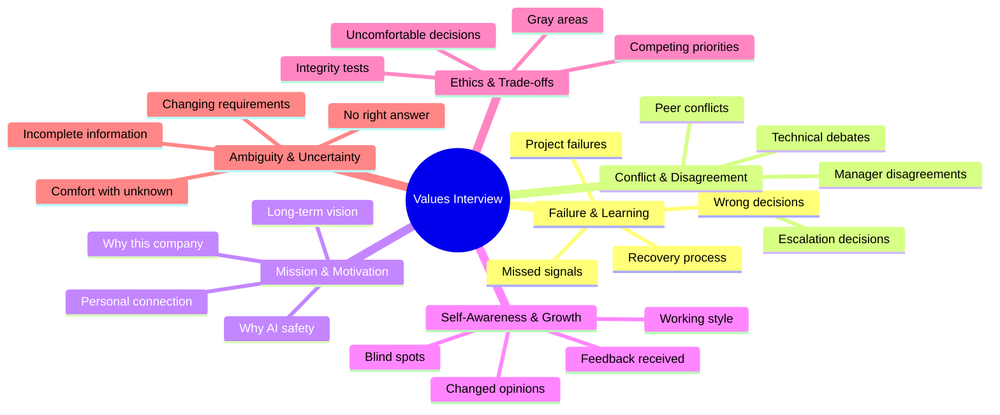
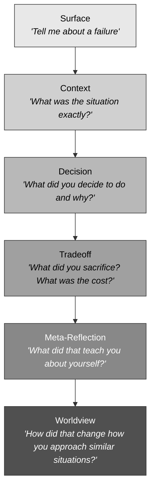

# Values & Behavioral Interview

Preparation system for behavioral and values-fit interview rounds at mission-driven AI companies, with particular depth on Anthropic's approach. These rounds are NOT standard "tell me about a time" STAR interviews. They go deeper: negative framing, 5-6 layers of follow-up, genuine self-awareness testing, and mission alignment probing.

The core insight: **interviewers are not listening to your story. They are listening to how you think about your story.**

---

## When to Use

**Use for:**
- Preparing for culture-fit or values rounds at any company
- Building a story bank with STAR-L structure (extended with Learning)
- Practicing negative-frame questions (failures, weaknesses, disagreements)
- Developing comfort with deep introspective follow-ups
- Aligning personal narrative with company mission
- Calibrating authenticity vs. preparation balance

**NOT for:**
- Coding interview practice (use `senior-coding-interview`)
- System design rounds (use `ml-system-design-interview`)
- Resume or CV creation (use `cv-creator`)
- Raw career story extraction (use `career-biographer`)
- Technical deep dive preparation (use `anthropic-technical-deep-dive`)

---

## Question Category Map



---

## The Follow-Up Ladder

Every strong values interviewer drills past your prepared surface answer. Expect 5-6 levels of depth on a single story. If your preparation only covers levels 1-3, you will be exposed.



**Preparation rule**: For every story in your bank, you must have a prepared (but natural) answer at each level. If you can only get to level 3, the story is not ready.

### Level-by-Level Preparation

| Level | What Interviewer Probes | What Strong Answers Include |
|-------|------------------------|-----------------------------|
| Surface | Can you identify a relevant experience? | Specific, time-bounded story with stakes |
| Context | Do you understand the forces at play? | Multiple stakeholders, constraints, timeline pressure |
| Decision | Did you act with agency? | Clear reasoning, alternatives considered, ownership |
| Tradeoff | Do you acknowledge costs? | What was lost, who was affected, what you would do differently |
| Meta-Reflection | Do you know yourself? | Genuine insight about a pattern, tendency, or blind spot |
| Worldview | Has experience shaped your judgment? | A principle or heuristic you now carry forward |

---

## STAR-L Format

Extend the standard STAR framework with **Learning** -- the layer that separates good answers from memorable ones.

| Component | Standard STAR | STAR-L Extension |
|-----------|--------------|------------------|
| **S**ituation | What happened | Same, but include emotional state and stakes |
| **T**ask | What was your job | Same, but include why it mattered and to whom |
| **A**ction | What you did | Same, but include what you considered and rejected |
| **R**esult | What happened | Same, but include costs and unintended consequences |
| **L**earning | (missing) | What changed in how you think, decide, or lead |

### STAR-L Example Structure

```
Situation: "In Q3 2024, our team shipped a recommendation model that
           performed well in A/B tests but created filter bubbles we
           didn't measure for..."

Task:      "As the tech lead, I owned the decision to ship or revert,
           with $2M/quarter in projected revenue on the line..."

Action:    "I proposed a middle path -- keep the model but add diversity
           constraints. My manager wanted to ship as-is. I escalated to
           the VP with a one-page analysis of downstream risks..."

Result:    "We shipped with constraints. Revenue impact was 60% of the
           unconstrained model. My manager was frustrated for weeks.
           The VP later cited it as the right call when a competitor
           got press coverage for their filter bubble problem..."

Learning:  "I learned that I default to quantitative arguments when the
           real issue is values-based. The revenue comparison was a
           crutch. The stronger argument was 'this is who we want to
           be as a company.' I now lead with values framing when the
           decision involves user welfare."
```

---

## Story Bank Requirements

Build a bank of **8-12 stories** that cover the full question category spread. Each story should be adaptable to multiple question types.

### Required Story Categories

| # | Category | Example Prompt | What It Tests |
|---|----------|---------------|---------------|
| 1 | Genuine project failure | "Tell me about something that failed" | Accountability, learning from loss |
| 2 | Manager/leadership disagreement | "When did you disagree with your boss?" | Courage, judgment, conflict style |
| 3 | Changed a deeply held opinion | "When were you wrong about something important?" | Intellectual humility, growth |
| 4 | Ethical trade-off | "When did you face a values conflict at work?" | Moral reasoning, integrity |
| 5 | Mentorship through difficulty | "Tell me about helping someone through a hard time" | Empathy, patience, investment in others |
| 6 | Operated in extreme ambiguity | "When did you have to act without enough information?" | Comfort with uncertainty, judgment |
| 7 | Someone else was right, you were wrong | "When did a teammate's idea prove better than yours?" | Ego management, collaborative instinct |
| 8 | Mission motivation | "Why do you want to work on AI safety?" | Authenticity, depth of conviction |

See `references/story-bank-template.md` for the full template with adaptation notes and follow-up preparation.

---

## Negative Framing Preparation

Values interviews at mission-driven companies deliberately use negative framing. They ask about failures, weaknesses, and conflicts -- not to trap you, but to see how you metabolize difficulty.

### Common Negative-Frame Patterns

**Direct negative**: "Tell me about a time you failed."
**Inverted positive**: "What's something you're still not great at?"
**Third-person probe**: "What would your harshest critic say about you?"
**Counterfactual**: "If you could redo one decision, which would it be?"
**Conflict escalation**: "Tell me about a time you fundamentally disagreed with leadership."

### Response Principles

1. **Name the real thing.** Not a weakness that is secretly a strength. A real weakness with real consequences.
2. **Own the timeline.** When did you notice? If late, say so. Self-awareness about delayed recognition is itself a signal.
3. **Show the cost.** What was lost? Who was affected? Minimizing consequences signals low self-awareness.
4. **Separate learning from damage control.** "I learned X" is different from "but it all worked out." Sometimes it did not work out. Say so.
5. **Connect to present behavior.** What do you do differently now? The learning must be operationalized, not abstract.

---

## Authenticity Calibration

The goal is **prepared but genuine** -- you have thought deeply about your stories, but you are not performing them.

### Signals of Authentic Preparation

- Pauses naturally when a follow-up makes you think
- Can deviate from the prepared narrative when asked a surprising angle
- Acknowledges complexity ("honestly, I'm still not sure that was the right call")
- Emotional register varies -- some stories have humor, some have weight
- Credits specific people by name and contribution

### Signals of Rehearsed Performance

- Every answer is exactly 2-3 minutes
- Transitions between STAR components feel scripted
- No genuine hesitation or uncertainty
- Every failure story has a neat resolution
- Deflects follow-up questions back to the prepared narrative

---

## Anti-Patterns

### Anti-Pattern: Humble Brag
**Novice**: Reframes every failure as a success. "My biggest weakness is that I care too much" or "The project failed but I was the one who caught it." Every negative story has an immediately positive outcome with no genuine discomfort.
**Expert**: Names a real failure with real consequences, then describes the specific learning without minimizing the damage. Sits with the discomfort of the failure before moving to resolution. Example: "We lost the client. That was on me. It took me three months to understand why my instinct was wrong."
**Detection**: Count the ratio of negative-to-positive beats. If every story follows the pattern [bad thing] -> [but actually good thing], the candidate has not done the real introspective work.

### Anti-Pattern: Rehearsed Authenticity
**Novice**: Stories sound scripted, hitting STAR beats mechanically. Same vocal energy for every question. Cannot deviate from the prepared narrative when asked an unexpected follow-up angle. "As I mentioned..." callbacks to previous structure.
**Expert**: Has prepared structure but delivers with natural variation. Pauses to think when follow-ups go deeper than expected. Acknowledges when a question surfaces something they had not considered: "That's a good question -- I haven't thought about it from that angle."
**Detection**: Ask a follow-up that is 90 degrees off their narrative. A rehearsed candidate will redirect back to their prepared story. A genuine candidate will engage with the new angle, even if it means admitting uncertainty.

### Anti-Pattern: Hero Narrative
**Novice**: Every story features them as the protagonist who saves the day, solves the problem, or has the critical insight. No story features them learning from a peer, being wrong, or changing their mind based on someone else's input.
**Expert**: Credits others specifically ("Sarah's insight about the cache invalidation pattern was better than my original approach"). Describes collaborative problem-solving where the outcome was better because of multiple perspectives. Includes at least 2-3 stories where someone else was the hero.
**Detection**: Map the character roles across all stories. If the candidate is always the protagonist and never the supporting character, learner, or person who was wrong -- the narrative is self-serving.

---

## Anthropic-Specific Preparation

Anthropic's behavioral round has distinctive characteristics. See `references/anthropic-values-research.md` for detailed research.

### Key Differentiators from FAANG Behavioral Rounds

| Dimension | FAANG Pattern | Anthropic Pattern |
|-----------|--------------|-------------------|
| Follow-up depth | 2-3 levels | 5-6 levels |
| Framing | Balanced positive/negative | Deliberately negative |
| What they evaluate | Leadership principles checklist | Genuine self-awareness |
| Right answer | Demonstrated LP alignment | No single right answer; authenticity |
| Ethics questions | Rare | Central |
| "Why here?" weight | Moderate | Very high; mission alignment is load-bearing |

### Themes That Recur in Anthropic Values Rounds

1. **Intellectual honesty** -- Can you say "I don't know" or "I was wrong"?
2. **Comfort with uncertainty** -- How do you operate when the right answer is unknowable?
3. **Collaborative rigor** -- Can you disagree productively and change your mind?
4. **Mission depth** -- Is your interest in AI safety genuine and specific, or generic?
5. **Ethical reasoning** -- How do you navigate gray areas without defaulting to rules?

---

## Practice Protocol

### Solo Preparation (Week 1-2)

1. Build story bank using `references/story-bank-template.md` (8-12 stories)
2. For each story, write out all 6 levels of the Follow-Up Ladder
3. Record yourself telling each story. Listen for rehearsed-sounding language
4. Have a trusted friend read your stories and ask "what's missing?"

### Drill Sessions (Week 2-3)

Use `references/follow-up-drills.md` for structured practice exercises:
- **5 Whys Drill**: Practice being asked "why?" 5 times in succession
- **Alternative Path Drill**: "What if you had done X instead?"
- **Critic Drill**: "That sounds like it might have been a mistake..."
- **Self-Awareness Drill**: "What does this reveal about your decision-making?"
- **Values Conflict Drill**: "What if the right technical decision conflicted with the team?"

### Mock Interviews (Week 3-4)

Use `interview-simulator` skill for realistic mock rounds with evaluation.

---

## Reference Files

| File | When to Consult |
|------|----------------|
| `references/story-bank-template.md` | Building or reviewing your bank of 8-12 career stories with STAR-L structure and adaptation notes |
| `references/anthropic-values-research.md` | Understanding Anthropic-specific values signals, culture, and what differentiates their behavioral round |
| `references/follow-up-drills.md` | Practicing deep follow-up handling with structured exercises; the 5 Whys, alternative path, critic, and values conflict drills |
